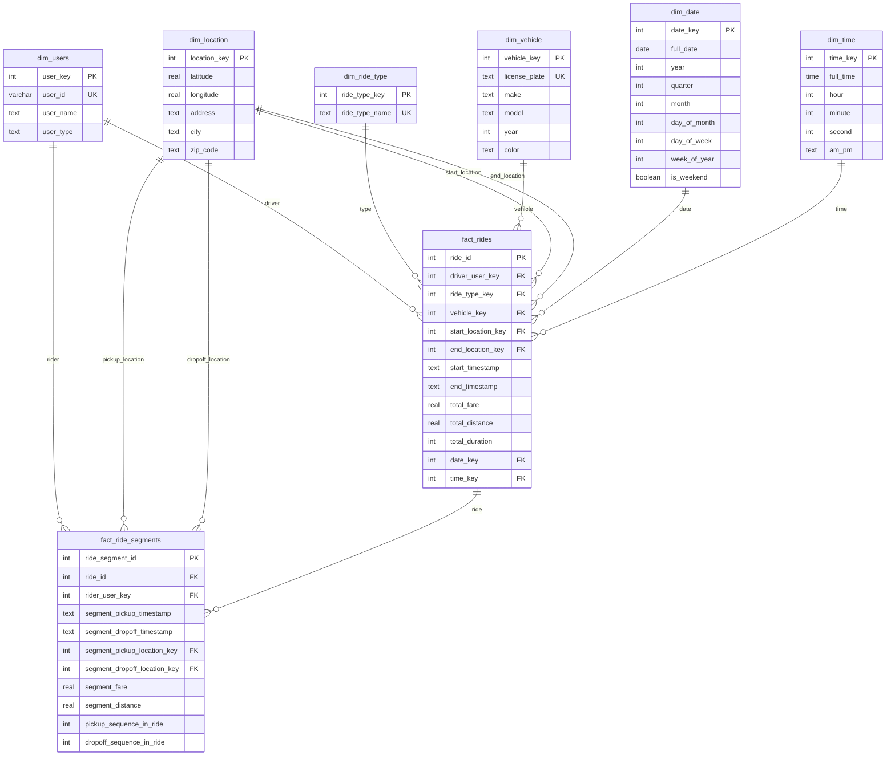

# Scenario 1: Ridesharing Data Model (Uber/Lyft) - Carpooling Feature

## Overview
This data model supports a ridesharing platform with carpooling capabilities, enabling tracking of both regular and carpool rides with detailed segment-level analysis.

## Core Design Principles
1. **Flexible Ride Types**: Support for Regular, Carpool, and Premium ride types
2. **Segment-Level Tracking**: Detailed tracking of individual passenger journeys within carpool rides
3. **Star Schema Design**: Optimized for analytical queries and reporting
4. **Time-Based Analysis**: Comprehensive date and time dimensions for temporal analysis

## Entity Relationship Diagram

## Table Specifications

### Dimension Tables

#### dim_users
- **Purpose**: User management for both riders and drivers
- **Key Fields**: 
  - `user_key`: Surrogate key for data warehouse operations
  - `user_id`: Business key for application integration
  - `user_type`: Distinguishes between 'rider' and 'driver'

#### dim_location
- **Purpose**: Geographic reference for pickup and dropoff locations
- **Key Fields**:
  - `latitude`, `longitude`: Precise coordinates for routing
  - `address`, `city`, `zip_code`: Human-readable location data

#### dim_ride_type
- **Purpose**: Classification of ride services
- **Values**: 'Regular', 'Carpool', 'Premium'

#### dim_vehicle
- **Purpose**: Vehicle details for operational tracking
- **Key Fields**: License plate as business identifier

#### dim_date & dim_time
- **Purpose**: Comprehensive temporal analysis capabilities
- **Features**: Pre-computed date/time attributes for efficient querying

### Fact Tables

#### fact_rides
- **Purpose**: High-level ride information and metrics
- **Granularity**: One record per ride (which may contain multiple passengers in carpool)
- **Key Metrics**: Total fare, distance, duration

#### fact_ride_segments
- **Purpose**: Individual passenger journey tracking within rides
- **Granularity**: One record per passenger per ride
- **Key Features**:
  - `pickup_sequence_in_ride`: Order of passenger pickups
  - `dropoff_sequence_in_ride`: Order of passenger dropoffs
  - Individual segment metrics for detailed analysis

## Key Business Rules

### Carpool Logic
1. **Single Driver per Ride**: Each ride has exactly one driver
2. **Multiple Passengers**: Carpool rides can have multiple segments (passengers)
3. **Sequential Tracking**: Pickup and dropoff sequences maintain ride flow integrity
4. **Fare Distribution**: Individual segment fares sum to total ride fare

### Data Integrity
1. **Foreign Key Constraints**: Maintain referential integrity across all tables
2. **Temporal Consistency**: Segment timestamps must fall within ride start/end times
3. **Sequence Validation**: Pickup/dropoff sequences must be logical and consistent

## Analytics Use Cases

### Carpool Performance Analysis
- Carpool adoption rates and penetration
- Average passengers per carpool ride
- Revenue per mile comparison (carpool vs regular)
- Driver efficiency metrics

### Operational Insights
- Peak demand analysis by time and location
- Route optimization opportunities
- Vehicle utilization rates
- Geographic performance patterns

### User Behavior Analysis
- Rider preference patterns (carpool vs regular)
- Driver participation in carpool programs
- Repeat usage patterns
- Seasonal and temporal trends

## Implementation Notes
- Uses SQLite-compatible syntax for development/testing
- Designed for easy migration to production data warehouses
- Supports both real-time operational queries and batch analytical processing
- Extensible for additional ride types and business features 