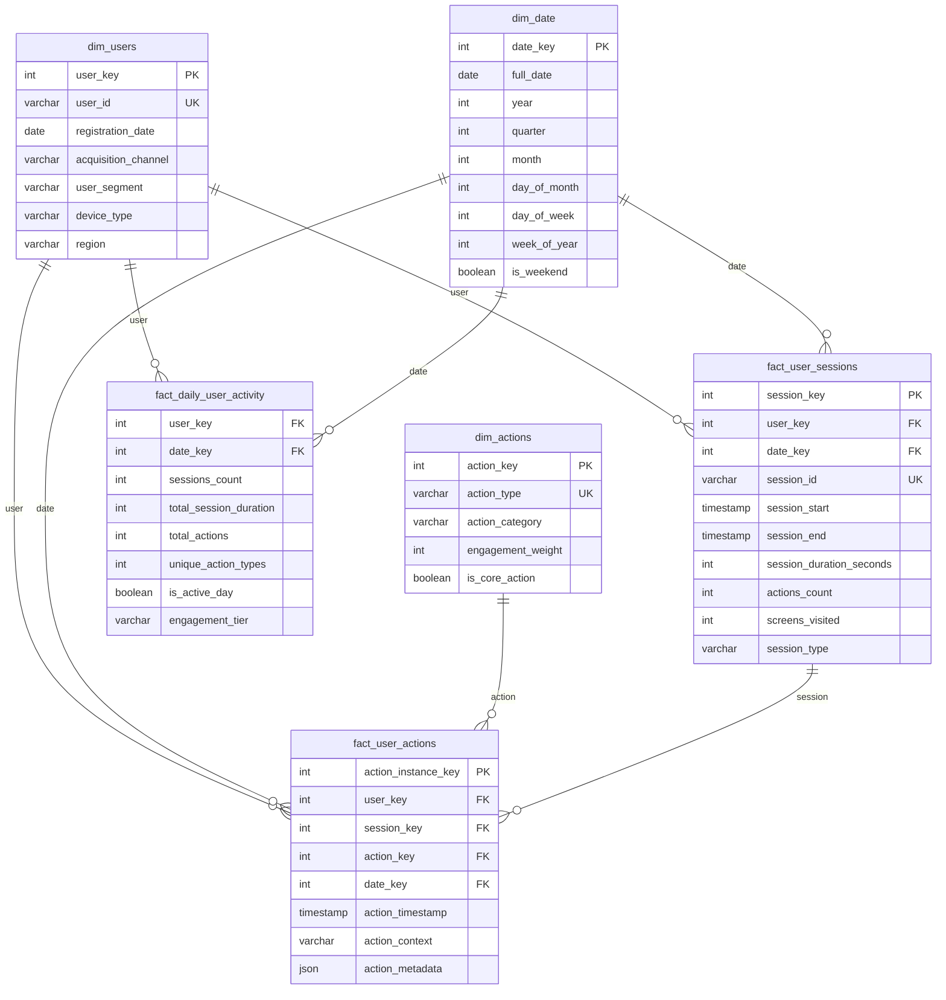

# Scenario 5: DAU/MAU Analysis - Data Model

## Overview
This data model supports comprehensive DAU/MAU analysis and user engagement tracking, enabling detailed stickiness analysis beyond simple ratios.

## Core Design Principles
1. **User Activity Tracking**: Detailed event-level tracking for accurate DAU/MAU calculation
2. **Engagement Depth**: Capture both frequency and depth of user interactions
3. **Segmentation Support**: Enable analysis across multiple user dimensions
4. **Time-Series Optimization**: Efficient querying for trend analysis and cohort studies

## Entity Relationship Diagram



## Table Specifications

### Dimension Tables

#### dim_users
- **Purpose**: User profiles with segmentation attributes
- **Key Fields**:
  - `user_key`: Surrogate key for data warehouse operations
  - `registration_date`: For cohort analysis
  - `acquisition_channel`: Attribution for engagement analysis
  - `user_segment`: Business-defined user categories

#### dim_date
- **Purpose**: Complete date dimension for time-series analysis
- **Key Features**: Pre-computed date attributes for efficient DAU/MAU queries

#### dim_actions
- **Purpose**: Catalog of all trackable user actions
- **Key Fields**:
  - `action_type`: Specific action (login, post_create, like, share)
  - `action_category`: Grouped actions (content_creation, social_interaction)
  - `engagement_weight`: Relative importance for engagement scoring
  - `is_core_action`: Critical actions for defining "active" users

### Fact Tables

#### fact_user_sessions
- **Purpose**: Session-level user activity tracking
- **Granularity**: One record per user session
- **Key Metrics**: Duration, action count, feature breadth

#### fact_user_actions
- **Purpose**: Detailed action-level tracking
- **Granularity**: One record per user action
- **Features**: Full event stream for behavior analysis

#### fact_daily_user_activity (Aggregated)
- **Purpose**: Pre-aggregated daily user metrics for fast DAU/MAU queries
- **Granularity**: One record per user per day
- **Benefits**: Optimized for dashboard queries and reporting

## Key Business Rules

### Active User Definition
1. **Daily Active User (DAU)**: User who performed at least one core action on a given day
2. **Monthly Active User (MAU)**: User who performed at least one core action in a 30-day window
3. **Session Definition**: Continuous activity with max 30-minute gap between actions

### Engagement Tiers
1. **Casual**: 1-5 active days per month
2. **Regular**: 6-15 active days per month  
3. **Core**: 16+ active days per month
4. **Power**: Core users with high action count per active day

## Analytics Use Cases

### DAU/MAU Analysis
- Stickiness ratios across user segments and time periods
- Distribution of active days per month (not just averages)
- Engagement tier transitions over time

### User Behavior Patterns
- Session frequency and duration analysis
- Action depth and feature breadth per user
- Content creation vs. consumption balance

### Cohort & Retention Analysis
- New user onboarding progression
- Cohort-based DAU/MAU trends
- Churn prediction and early warning indicators

### Segmentation Insights
- Engagement patterns by acquisition channel
- Geographic and demographic behavior differences
- Device-specific usage patterns

## SQL Query Examples

### Daily DAU/MAU Calculation
```sql
WITH daily_active_users AS (
    SELECT 
        date_key,
        COUNT(DISTINCT user_key) as dau
    FROM fact_daily_user_activity 
    WHERE is_active_day = TRUE
    GROUP BY date_key
),
monthly_active_users AS (
    SELECT 
        date_key,
        COUNT(DISTINCT user_key) as mau
    FROM fact_daily_user_activity fda
    JOIN dim_date dd ON fda.date_key = dd.date_key
    WHERE is_active_day = TRUE
      AND fda.date_key >= date_key - 29  -- 30-day window
    GROUP BY date_key
)
SELECT 
    d.date_key,
    d.dau,
    m.mau,
    ROUND(d.dau::DECIMAL / m.mau, 3) as dau_mau_ratio
FROM daily_active_users d
JOIN monthly_active_users m ON d.date_key = m.date_key
ORDER BY date_key;
```

### User Engagement Distribution
```sql
SELECT 
    engagement_tier,
    COUNT(DISTINCT user_key) as users,
    AVG(sessions_count) as avg_daily_sessions,
    AVG(total_actions) as avg_daily_actions
FROM fact_daily_user_activity
WHERE date_key >= CURRENT_DATE - 30
GROUP BY engagement_tier
ORDER BY 
    CASE engagement_tier 
        WHEN 'Power' THEN 1 
        WHEN 'Core' THEN 2 
        WHEN 'Regular' THEN 3 
        WHEN 'Casual' THEN 4 
    END;
```

## Implementation Considerations

### Performance Optimization
- Partitioning fact tables by date for efficient time-series queries
- Pre-aggregated daily summaries to avoid real-time session calculations
- Materialized views for common DAU/MAU dashboard queries

### Data Pipeline Architecture
- Real-time action tracking with batch session aggregation
- Daily ETL processes to update engagement tiers and calculate rolling metrics
- Data quality monitoring for session boundary detection

### Scalability Features
- Event-sourced architecture for action tracking
- Separate OLTP and OLAP systems for operational vs. analytical workloads
- Efficient data retention policies for detailed event data 