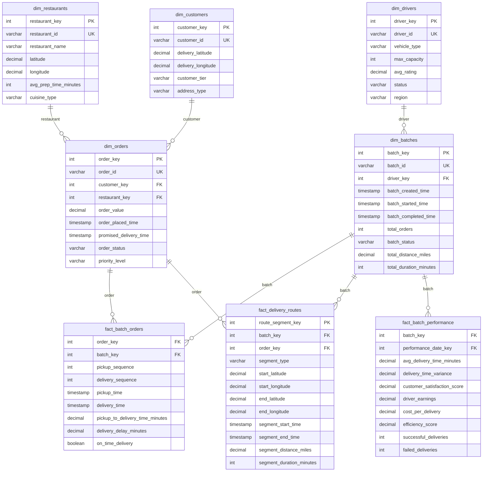

# Scenario 9: Order Batching (DoorDash) - Data Model

## Overview
This data model supports order batching analytics and optimization, enabling tracking of batch performance, delivery efficiency, and multi-stakeholder impact analysis.

## Core Design Principles
1. **Batch-Centric Design**: Track individual orders and their batch relationships
2. **Routing Analytics**: Detailed tracking of pickup and delivery sequences
3. **Performance Measurement**: Metrics across customer, driver, and business dimensions
4. **Real-Time Optimization**: Support for dynamic batching decisions

## Entity Relationship Overview

### Order-to-Batch-to-Delivery Flow

The data model captures the complete lifecycle from individual orders to batched delivery execution:

**1. Order Creation (dim_orders)**
- Individual customer orders are created and stored with delivery requirements
- Each order has specific constraints: location, promised delivery time, order value
- Orders exist independently before being assigned to any batch

**2. Batch Formation (dim_batches)**
- Multiple orders are grouped into batches based on optimization algorithms
- Each batch is assigned to a single driver with specific capacity constraints
- Batches track overall performance metrics: total distance, duration, order count

**3. Order-Batch Association (fact_batch_orders)**
- Bridge table linking individual orders to their assigned batch
- Captures sequence information: pickup_sequence, delivery_sequence
- Records performance at the order level within the batch context
- Tracks timing: actual pickup_time, delivery_time, delays

**4. Route Execution (fact_delivery_routes)**
- Granular tracking of actual route segments during delivery
- Each segment represents movement from one location to another
- Captures GPS-level data for route optimization and analysis
- Links both to the overall batch and individual orders being transported

### Key Relationships Explained

#### Orders ↔ Batches (Many-to-One via fact_batch_orders)
```
One Order → Belongs to One Batch (when batched)
One Batch → Contains Multiple Orders (typically 2-6)
```
- **Business Logic**: Orders can exist without being batched (single deliveries)
- **Data Integrity**: An order can only be in one active batch at a time
- **Performance Tracking**: Each order's delivery performance is measured within its batch context

#### Batches ↔ Routes (One-to-Many via fact_delivery_routes)
```
One Batch → Generates Multiple Route Segments
Each Route Segment → Belongs to One Batch
```
- **Route Segments**: Pickup-to-pickup, pickup-to-delivery, delivery-to-delivery movements
- **Sequencing**: Route segments follow the optimized pickup/delivery sequence
- **Real-time Tracking**: GPS data captured for each segment of the batch route

#### Orders ↔ Routes (Many-to-Many via fact_delivery_routes)
```
One Order → Generates Multiple Route Segments (pickup segment + delivery segment)
One Route Segment → May involve Multiple Orders (when carrying multiple orders)
```
- **Pickup Segments**: Route from driver location/previous stop to restaurant
- **Delivery Segments**: Route from current location to customer delivery address
- **Multi-Order Segments**: Driver carrying multiple orders between stops

### Batch Lifecycle States

**1. Batch Creation**
```sql
-- New batch created
INSERT INTO dim_batches (batch_id, driver_key, batch_status, batch_created_time)
VALUES ('B001', 123, 'created', '2024-01-01 10:00:00');

-- Orders assigned to batch
INSERT INTO fact_batch_orders (batch_key, order_key, pickup_sequence, delivery_sequence)
VALUES (1, 456, 1, 1), (1, 789, 2, 2);
```

**2. Route Execution**
```sql
-- Route segments logged as driver moves
INSERT INTO fact_delivery_routes (batch_key, order_key, segment_type, segment_start_time, segment_end_time)
VALUES 
  (1, 456, 'pickup', '2024-01-01 10:30:00', '2024-01-01 10:45:00'),
  (1, 789, 'pickup', '2024-01-01 10:45:00', '2024-01-01 11:00:00'),
  (1, 456, 'delivery', '2024-01-01 11:00:00', '2024-01-01 11:15:00');
```

**3. Performance Calculation**
```sql
-- Aggregate performance metrics calculated
INSERT INTO fact_batch_performance (batch_key, avg_delivery_time_minutes, efficiency_score)
SELECT batch_key, 
       AVG(delivery_delay_minutes),
       SUM(order_value) / SUM(segment_distance_miles)
FROM fact_batch_orders fbo
JOIN dim_orders do ON fbo.order_key = do.order_key;
```

## Design Decision: Addressing the Circular Relationship

### The Apparent "Circle"
```
Orders → Batches (via fact_batch_orders)
    ↓
Batches → Routes (via fact_delivery_routes)
    ↓
Routes → Orders (via order_key in fact_delivery_routes)
    ↑___________________|
```

### Why This Design is Justified

#### 1. **Different Relationship Purposes (Not Truly Circular)**

The relationships serve distinct business purposes at different operational stages:

- **Orders → Batches**: *Assignment/Planning relationship*
  - "Which batch is this order assigned to?"
  - Static once assigned, used for planning and optimization

- **Batches → Routes**: *Execution tracking relationship*
  - "What route segments occurred during this batch delivery?"
  - Dynamic, captures real-time driver movements

- **Routes → Orders**: *Granular performance relationship*
  - "Which specific orders were being transported during this route segment?"
  - Enables precise delivery time calculation and optimization analysis

#### 2. **Different Data Granularities**

```sql
-- ASSIGNMENT LEVEL (fact_batch_orders)
-- One record per order per batch - planning data
SELECT order_key, batch_key, pickup_sequence, delivery_sequence
FROM fact_batch_orders;

-- EXECUTION LEVEL (fact_delivery_routes)  
-- Multiple records per order - granular tracking data
SELECT batch_key, order_key, segment_type, start_time, end_time
FROM fact_delivery_routes;
```

#### 3. **Alternative Designs Considered**

**❌ Alternative 1: Single Fact Table**
```sql
-- Flattened approach - would lose granularity
fact_batch_delivery_everything (
    batch_key, order_key, route_segment_key,
    pickup_sequence, delivery_sequence,
    segment_start_time, segment_end_time, ...
)
```
*Problems*:
- Massive data duplication
- Mixed granularities make analysis complex
- Poor performance for different query patterns

**❌ Alternative 2: No Direct Order-Route Link**
```sql
-- Remove order_key from fact_delivery_routes
fact_delivery_routes (
    route_segment_key, batch_key, 
    segment_start_time, segment_end_time, ...
    -- NO order_key
)
```
*Problems*:
- Cannot determine which orders were being carried during specific route segments
- Impossible to calculate precise per-order delivery times
- No way to optimize routes based on order-specific constraints

**❌ Alternative 3: Purely Hierarchical**
```
Orders → Batches → Routes (no direct order-route link)
```
*Problems*:
- Cannot track which orders are in the vehicle during specific route segments
- Complex queries needed to determine order-specific performance metrics
- Poor support for real-time tracking and optimization

### Benefits of Current Design

#### 1. **Query Flexibility**
```sql
-- Planning queries (use fact_batch_orders)
SELECT batch_id, COUNT(order_key) as orders_in_batch
FROM dim_batches db
JOIN fact_batch_orders fbo ON db.batch_key = fbo.batch_key;

-- Real-time tracking (use fact_delivery_routes)
SELECT order_key, segment_type, segment_duration_minutes
FROM fact_delivery_routes 
WHERE batch_key = 123 AND segment_start_time >= '2024-01-01 10:00:00';

-- Performance analysis (join both)
SELECT 
    fbo.order_key,
    fbo.pickup_sequence,
    SUM(fdr.segment_duration_minutes) as total_delivery_time
FROM fact_batch_orders fbo
JOIN fact_delivery_routes fdr ON fbo.batch_key = fdr.batch_key 
                             AND fbo.order_key = fdr.order_key
GROUP BY fbo.order_key, fbo.pickup_sequence;
```

#### 2. **Real-World Accuracy**
- Captures that orders can be "carried together" during route segments
- Enables precise calculation of per-order delivery times
- Supports complex scenarios like order delivery out of pickup sequence

#### 3. **Optimization Support**
- Route optimization algorithms need order-specific constraints during execution
- Real-time re-routing requires knowing which orders are currently in vehicle
- Performance analysis requires linking route efficiency to specific orders

### Data Integrity Safeguards

To prevent issues from the complex relationships:

```sql
-- Constraint: Route segments can only reference orders in the same batch
ALTER TABLE fact_delivery_routes 
ADD CONSTRAINT route_order_batch_consistency
CHECK (
    (batch_key, order_key) IN (
        SELECT batch_key, order_key FROM fact_batch_orders
    )
);

-- Index for performance
CREATE INDEX idx_route_batch_order 
ON fact_delivery_routes (batch_key, order_key, segment_start_time);
```

### Conclusion

The apparent "circular" relationship is actually a **multi-dimensional relationship model** that captures the complex reality of order batching operations. Each relationship serves a distinct purpose:

- **Assignment relationships** for planning
- **Execution relationships** for real-time tracking  
- **Performance relationships** for optimization

This design enables both operational efficiency and analytical depth while maintaining data integrity through proper constraints and indexing.

## Entity Relationship Diagram



## Table Specifications

### Dimension Tables

#### dim_orders
- **Purpose**: Individual order tracking with delivery requirements
- **Key Fields**:
  - `order_value`: For priority and batching decisions
  - `promised_delivery_time`: SLA tracking
  - `priority_level`: 'standard', 'premium', 'urgent'

#### dim_batches
- **Purpose**: Batch metadata and performance tracking
- **Key Fields**:
  - `total_orders`: Batch size for efficiency analysis
  - `total_distance_miles`: Route efficiency metrics
  - `batch_status`: 'created', 'in_progress', 'completed', 'failed'

#### dim_drivers
- **Purpose**: Driver capabilities and performance tracking
- **Key Fields**:
  - `max_capacity`: Maximum orders per batch
  - `vehicle_type`: Impacts delivery capability

### Fact Tables

#### fact_batch_orders
- **Purpose**: Order-level performance within batches
- **Granularity**: One record per order per batch
- **Key Metrics**: Individual delivery performance and sequencing

#### fact_delivery_routes
- **Purpose**: Detailed route segment tracking
- **Granularity**: One record per route segment (pickup to delivery)
- **Features**: GPS-level tracking for optimization

#### fact_batch_performance (Aggregated)
- **Purpose**: Daily batch performance summaries
- **Benefits**: Fast dashboard queries and trend analysis

## Key Business Rules

### Batching Logic
1. **Maximum Batch Size**: 4-6 orders per batch depending on vehicle type
2. **Geographic Constraints**: All delivery locations within 2-mile radius
3. **Time Constraints**: Maximum 60 minutes total batch duration
4. **Priority Handling**: Premium orders get priority sequencing

### Performance Calculation
1. **Delivery Time**: From order placement to customer delivery
2. **Efficiency Score**: (Orders completed × Order value) / (Time × Distance)
3. **On-Time Performance**: Delivered within promised time window
4. **Customer Satisfaction**: Weighted by delivery time and accuracy

## Analytics Use Cases

### Batch Optimization
- Optimal batch size analysis by market and time
- Route efficiency improvement opportunities
- Driver capacity utilization tracking
- Geographic clustering effectiveness

### Performance Monitoring
- Customer satisfaction impact of batching
- Driver productivity and earnings analysis
- Cost efficiency vs. service quality trade-offs
- Real-time batch performance dashboards

### Predictive Analytics
- Demand forecasting for batch planning
- Delivery time prediction for customer communication
- Driver allocation optimization
- Dynamic pricing based on batching efficiency

## SQL Query Examples

### Batch Performance Analysis
```sql
WITH batch_metrics AS (
    SELECT 
        db.batch_id,
        db.total_orders,
        db.total_distance_miles,
        db.total_duration_minutes,
        AVG(fbo.delivery_delay_minutes) as avg_delay,
        COUNT(CASE WHEN fbo.on_time_delivery = TRUE THEN 1 END) / COUNT(*)::DECIMAL as on_time_rate,
        SUM(do.order_value) as total_batch_value
    FROM dim_batches db
    JOIN fact_batch_orders fbo ON db.batch_key = fbo.batch_key
    JOIN dim_orders do ON fbo.order_key = do.order_key
    WHERE db.batch_completed_time >= CURRENT_DATE - 7
    GROUP BY db.batch_id, db.total_orders, db.total_distance_miles, db.total_duration_minutes
)
SELECT 
    total_orders as batch_size,
    COUNT(*) as num_batches,
    AVG(avg_delay) as avg_delivery_delay,
    AVG(on_time_rate) as avg_on_time_rate,
    AVG(total_batch_value / total_distance_miles) as value_per_mile,
    AVG(total_orders / (total_duration_minutes / 60.0)) as orders_per_hour
FROM batch_metrics
GROUP BY total_orders
ORDER BY total_orders;
```

## Implementation Considerations

### Performance Optimization
- Partitioning fact tables by date for time-series queries
- Geospatial indexing for location-based batch analysis
- Real-time streaming for route tracking
- Pre-aggregated performance metrics

### Data Pipeline Architecture
- Real-time order ingestion for immediate batching decisions
- GPS tracking integration for accurate route analysis
- Batch ETL for daily performance calculations
- Machine learning feature engineering for optimization algorithms 