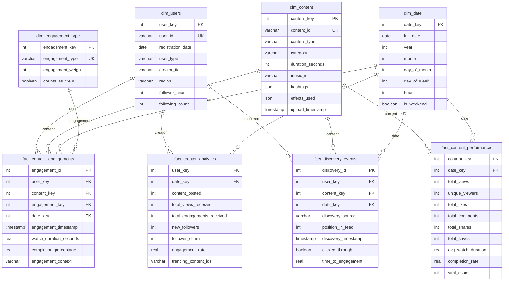

# Scenario 2: Short Video Platform (TikTok/Reels) - Data Model

## Overview
This data model supports a short-form video platform with focus on content creation, discovery, engagement, and recommendation systems.

## Core Design Principles
1. **Content-Centric Design**: Optimized for video content lifecycle tracking
2. **Engagement Analytics**: Detailed tracking of all user interactions
3. **Recommendation Support**: Data structures supporting algorithm optimization
4. **Creator Analytics**: Comprehensive creator performance tracking
5. **Real-Time Processing**: Support for immediate engagement processing

## Entity Relationship Diagram



## Table Specifications

### Dimension Tables

#### dim_users
- **Purpose**: User profiles including creators and consumers
- **Key Fields**:
  - `user_type`: 'creator', 'consumer', 'both'
  - `creator_tier`: 'casual', 'rising', 'established', 'top'
  - `follower_count`, `following_count`: Social graph metrics

#### dim_content
- **Purpose**: Short video content catalog
- **Key Fields**:
  - `content_type`: 'original', 'remix', 'duet', 'response'
  - `category`: Content classification (dance, comedy, education, etc.)
  - `duration_seconds`: Video length for analysis
  - `hashtags`: JSON array of associated hashtags
  - `effects_used`: JSON array of filters/effects applied

#### dim_engagement_type
- **Purpose**: Catalog of all possible user interactions
- **Values**: 'view', 'like', 'comment', 'share', 'save', 'follow', 'duet', 'remix'
- **Key Fields**:
  - `engagement_weight`: Relative importance for algorithm scoring
  - `counts_as_view`: Boolean flag for view calculation

### Fact Tables

#### fact_content_engagements
- **Purpose**: Detailed interaction tracking
- **Granularity**: One record per user-content interaction
- **Key Metrics**: Watch duration, completion percentage
- **Features**: Real-time processing support

#### fact_content_performance (Aggregated)
- **Purpose**: Daily content performance summaries
- **Granularity**: One record per content per day
- **Benefits**: Fast dashboard queries and trending analysis

#### fact_creator_analytics (Aggregated)
- **Purpose**: Creator performance tracking
- **Granularity**: One record per creator per day
- **Metrics**: Content output, audience growth, engagement rates

#### fact_discovery_events
- **Purpose**: Content discovery and recommendation tracking
- **Features**: Feed position tracking, conversion analysis
- **Use Cases**: Algorithm optimization, personalization

## Key Business Rules

### Content Performance
1. **View Definition**: Minimum 3 seconds of watch time
2. **Viral Threshold**: Content exceeding 10x creator's average engagement
3. **Trending Window**: 24-48 hour performance evaluation
4. **Creator Tiers**: Based on follower count and engagement consistency

### Engagement Scoring
1. **Weighted Interactions**: Share (10), Save (8), Comment (5), Like (3), View (1)
2. **Completion Bonus**: Additional weight for >80% completion rate
3. **Recency Factor**: Higher weight for recent engagements
4. **Creator Boost**: Established creators get algorithmic preference

## Analytics Use Cases

### Content Performance Analysis
- Viral content identification and pattern analysis
- Completion rate trends by content category
- Hashtag and effect performance tracking
- Content lifecycle analysis (growth, peak, decay)

### Creator Success Metrics
- Creator tier progression tracking
- Audience growth rates and retention
- Content strategy effectiveness
- Cross-platform creator comparison

### Algorithm Optimization
- Discovery source effectiveness (For You vs Following)
- Feed position impact on engagement
- Personalization algorithm performance
- A/B testing framework for recommendations

### Platform Health Monitoring
- Content diversity and echo chamber detection
- User retention and engagement trends
- Feature adoption rates (effects, music, hashtags)
- Moderation and safety metrics

## SQL Query Examples

### Trending Content Identification
```sql
WITH content_performance AS (
    SELECT 
        dc.content_id,
        dc.category,
        SUM(fcp.total_views) as total_views,
        SUM(fcp.total_likes + fcp.total_comments * 5 + fcp.total_shares * 10) as engagement_score,
        AVG(fcp.completion_rate) as avg_completion_rate
    FROM fact_content_performance fcp
    JOIN dim_content dc ON fcp.content_key = dc.content_key
    JOIN dim_date dd ON fcp.date_key = dd.date_key
    WHERE dd.full_date >= CURRENT_DATE - 2  -- Last 48 hours
    GROUP BY dc.content_id, dc.category
),
creator_baselines AS (
    SELECT 
        du.user_id,
        AVG(fca.total_views_received) as avg_views,
        AVG(fca.total_engagements_received) as avg_engagements
    FROM fact_creator_analytics fca
    JOIN dim_users du ON fca.user_key = du.user_key
    JOIN dim_date dd ON fca.date_key = dd.date_key
    WHERE dd.full_date >= CURRENT_DATE - 30
    GROUP BY du.user_id
)
SELECT 
    cp.content_id,
    cp.category,
    cp.total_views,
    cp.engagement_score,
    cp.avg_completion_rate,
    CASE 
        WHEN cp.engagement_score > cb.avg_engagements * 10 THEN 'Viral'
        WHEN cp.engagement_score > cb.avg_engagements * 5 THEN 'Trending'
        ELSE 'Normal'
    END as content_status
FROM content_performance cp
JOIN creator_baselines cb ON cp.creator_id = cb.user_id
ORDER BY cp.engagement_score DESC
LIMIT 100;
```

### Creator Tier Analysis
```sql
SELECT 
    du.creator_tier,
    COUNT(DISTINCT du.user_key) as creator_count,
    AVG(fca.total_views_received) as avg_daily_views,
    AVG(fca.engagement_rate) as avg_engagement_rate,
    AVG(fca.new_followers - fca.follower_churn) as avg_net_follower_growth
FROM fact_creator_analytics fca
JOIN dim_users du ON fca.user_key = du.user_key
JOIN dim_date dd ON fca.date_key = dd.date_key
WHERE dd.full_date >= CURRENT_DATE - 30
  AND du.user_type IN ('creator', 'both')
GROUP BY du.creator_tier
ORDER BY avg_daily_views DESC;
```

## Implementation Considerations

### Performance Optimization
- Partitioning fact tables by date for efficient time-series queries
- Indexing on content_key and user_key for fast lookups
- Pre-aggregated tables for dashboard performance
- Real-time streaming ingestion for engagement events

### Data Pipeline Architecture
- Event-driven architecture for real-time engagement processing
- Batch processing for creator analytics and performance summaries
- CDC (Change Data Capture) for dimension table updates
- Data quality monitoring for engagement event validation

### Scalability Features
- Horizontal partitioning for large engagement fact tables
- Caching layer for frequently accessed content metadata
- Efficient data archival for older engagement data
- Multi-region deployment for global content delivery

### Privacy & Compliance
- User consent tracking for analytics
- Data anonymization for aggregated reporting
- GDPR-compliant data retention policies
- Content moderation integration points 