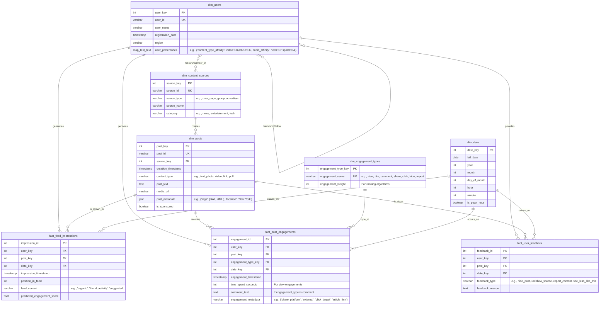

# Scenario 6: News Feed (Facebook/LinkedIn) - Data Model

## Overview
This data model supports a news feed system, focusing on content sources (users, pages, groups), user interactions, content ranking signals, and engagement analytics.

## Core Design Principles
1.  **User-Centric Feed**: Prioritize content relevance to individual users.
2.  **Diverse Content Sources**: Accommodate posts from friends, followed pages, groups, and sponsored content.
3.  **Rich Interaction Tracking**: Capture various engagement types (likes, comments, shares, clicks, time spent).
4.  **Ranking Algorithm Support**: Store features needed for content scoring and ranking.
5.  **Personalization**: Enable fine-grained personalization of the feed.

## Entity Relationship Diagram

## Table Specifications

### Dimension Tables

#### `dim_users`
-   **Purpose**: Stores information about users of the platform.
-   **Key Fields**:
    -   `user_key`: Surrogate key.
    -   `user_id`: Natural key for the user.
    -   `user_preferences`: Stores serialized user preferences (e.g., affinities for content types, topics) used for personalization.

#### `dim_content_sources`
-   **Purpose**: Represents entities that create posts (users, pages, groups, advertisers).
-   **Key Fields**:
    -   `source_key`: Surrogate key.
    -   `source_id`: Natural key for the content source.
    -   `source_type`: Type of the content source.
    -   `category`: Broad classification of the source.

#### `dim_posts`
-   **Purpose**: Stores individual posts that can appear in a news feed.
-   **Key Fields**:
    -   `post_key`: Surrogate key.
    -   `post_id`: Natural key for the post.
    -   `source_key`: Foreign key to `dim_content_sources`.
    -   `content_type`: Type of media or content in the post.
    -   `post_metadata`: JSON field for flexible storage of additional post attributes like tags, location, etc.
    -   `is_sponsored`: Boolean flag indicating if the post is an advertisement.

#### `dim_engagement_types`
-   **Purpose**: A lookup table for different types of engagements.
-   **Key Fields**:
    -   `engagement_name`: The name of the engagement (e.g., "like", "comment").
    -   `engagement_weight`: A numerical weight assigned for ranking or scoring purposes.

#### `dim_date`
-   **Purpose**: Standard date dimension for time-based analysis, extended to hour/minute for feed dynamics.
-   **Key Fields**:
    -   `is_peak_hour`: Boolean to flag if the time falls within typical peak usage hours.

### Fact Tables

#### `fact_feed_impressions`
-   **Purpose**: Records each time a post is shown to a user in their feed.
-   **Granularity**: One record per user per post impression.
-   **Key Fields**:
    -   `user_key`, `post_key`, `date_key`: Foreign keys to respective dimensions.
    -   `position_in_feed`: The rank/position of the post when it was displayed.
    -   `feed_context`: The reason this post was surfaced (e.g., organic, due to friend's activity).
    -   `predicted_engagement_score`: The score assigned by the ranking algorithm at the time of impression.

#### `fact_post_engagements`
-   **Purpose**: Records specific user interactions with posts.
-   **Granularity**: One record per user per engagement on a post.
-   **Key Fields**:
    -   `user_key`, `post_key`, `engagement_type_key`, `date_key`: Foreign keys.
    -   `time_spent_seconds`: Duration of engagement, particularly for views or media consumption.
    -   `comment_text`: Stores the actual comment if the engagement is a comment.
    -   `engagement_metadata`: JSON for additional details specific to the engagement type.

#### `fact_user_feedback`
-   **Purpose**: Captures explicit negative feedback or preferences users provide on posts.
-   **Granularity**: One record per user feedback action on a post.
-   **Key Fields**:
    -   `user_key`, `post_key`, `date_key`: Foreign keys.
    -   `feedback_type`: Type of feedback (e.g., "hide_post", "unfollow_source").
    -   `feedback_reason`: Optional user-provided reason.

## Key Business Rules & Considerations

1.  **Impression vs. Engagement**: An impression means the content was displayed; engagement means the user interacted.
2.  **Time Spent Calculation**: `time_spent_seconds` on `fact_post_engagements` could be derived from client-side event logging (e.g., video view duration, time on screen for an article).
3.  **Ranking Score**: `predicted_engagement_score` in `fact_feed_impressions` is crucial for analyzing and iterating on the feed ranking algorithm.
4.  **User Preferences**: `dim_users.user_preferences` is dynamic and updated based on user activity and explicit feedback.
5.  **Friendship/Follow Model**: A separate relationship table (e.g., `user_relationships`) would define connections between users, and between users and content sources, which is implicitly referenced in the ERD.

## Analytics Use Cases
-   **Feed Performance Analysis**: Track overall engagement rates, time spent, and content consumption patterns.
-   **Ranking Algorithm Effectiveness**: Measure if high-scored posts lead to higher engagement. Compare different ranking models.
-   **Content Source Performance**: Identify which users, pages, or groups create the most engaging content.
-   **Personalization Impact**: Analyze how well the feed is tailored to individual user preferences.
-   **Negative Feedback Analysis**: Understand reasons for hides/reports to improve content quality and relevance.
-   **A/B Testing Feed Changes**: Compare performance metrics between different feed algorithm versions or UI presentations.
-   **Sponsored Content Performance**: Measure engagement and ROI for ads.

## Implementation Notes
-   High volume tables like `fact_feed_impressions` and `fact_post_engagements` will require partitioning (e.g., by date) and careful indexing for performance.
-   Real-time data ingestion pipelines will be necessary for timely updates to user preferences and for near real-time analytics on feed performance.
-   The `user_preferences` map could be complex and might be better stored in a dedicated NoSQL store for flexibility if it becomes too unwieldy for a relational column. 