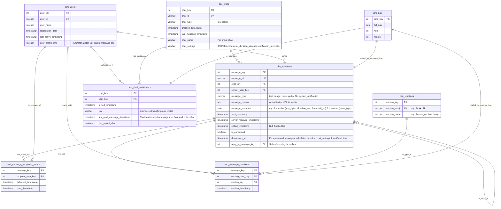

# Scenario 8: Messenger (WhatsApp/Telegram) - Data Model

## Overview
This data model supports a messaging application, focusing on users, chats (1:1 and group), messages, read statuses, reactions, and settings like ephemeral messaging.

## Core Design Principles
1.  **Scalability**: Handle a large volume of users, messages, and interactions.
2.  **Flexibility**: Accommodate different message types (text, media, system messages).
3.  **Real-time Features**: Support for read receipts, typing indicators (though not explicitly modeled here, schema should allow it).
4.  **User Privacy**: Design with privacy considerations for ephemeral messages and user data.
5.  **Feature Extensibility**: Allow for new features like reactions, replies, and polls.

## Entity Relationship Diagram

## Table Specifications

### Dimension Tables

#### `dim_users`
-   **Purpose**: Stores information about registered users.
-   **Key Fields**:
    -   `last_active_timestamp`: For presence and activity analysis.
    -   `user_profile_info`: Flexible JSON for profile details.

#### `dim_chats`
-   **Purpose**: Represents a conversation, either 1:1 or group.
-   **Key Fields**:
    -   `chat_type`: Distinguishes between 1:1 and group conversations.
    -   `chat_settings`: JSON field to store chat-specific settings like ephemeral message duration, custom notifications.

#### `dim_messages`
-   **Purpose**: Stores individual messages sent within chats.
-   **Key Fields**:
    -   `message_type`: Type of content in the message.
    -   `message_content`: Text or link to media.
    -   `message_metadata`: Additional structured info about the message.
    -   `is_ephemeral`, `disappears_at`: Manages disappearing messages.
    -   `reply_to_message_key`: Links a message to the one it replies to.

#### `dim_reactions`
-   **Purpose**: Lookup table for available reaction types.

#### `dim_date`
-   **Purpose**: Standard date dimension for time-based analysis.

### Fact Tables

#### `fact_chat_participants`
-   **Purpose**: Links users to the chats they are part of.
-   **Granularity**: One record per user per chat.
-   **Key Fields**:
    -   `role`: User's role in group chats.
    -   `last_read_message_timestamp`: Essential for unread counts and read receipts.

#### `fact_message_recipients_status`
-   **Purpose**: Tracks the delivery and read status of each message for each recipient.
-   **Granularity**: One record per message per recipient.
-   **Key Fields**:
    -   `delivered_timestamp`, `read_timestamp`: Core for read receipts.

#### `fact_message_reactions`
-   **Purpose**: Records user reactions to messages.
-   **Granularity**: One record per user per reaction type on a message.

## Key Business Rules & Considerations

1.  **Ephemeral Message Logic**: The `disappears_at` timestamp in `dim_messages` would be calculated based on `dim_chats.chat_settings` (ephemeral duration) and either `dim_messages.sent_timestamp` or `fact_message_recipients_status.read_timestamp` for the relevant user(s).
2.  **Read Receipts**: `fact_message_recipients_status.read_timestamp` is the source for 'seen' status. For group chats, this means all participants who have read it.
3.  **Unread Counts**: Can be derived by comparing `fact_chat_participants.last_read_message_timestamp` with `dim_messages.sent_timestamp` within a chat.
4.  **System Messages**: `dim_messages.message_type = 'system_notification'` can be used for events like "User X joined the group", "Chat name changed".
5.  **Scalability of `fact_message_recipients_status`**: This table can grow very large. Partitioning by date or chat_key might be necessary. For very large groups, individual read receipts might be sampled or aggregated.

## Analytics Use Cases
-   **User Activity**: Daily/monthly active users, message sending frequency, session duration.
-   **Chat Engagement**: Messages per chat, participant activity in groups, popular group sizes.
-   **Feature Adoption**: Usage of reactions, replies, ephemeral messaging.
-   **Message Lifecycle**: Time to deliver, time to read, lifespan of ephemeral messages.
-   **Reaction Analysis**: Popular reactions, impact of reactions on reply rates.
-   **Notification Effectiveness**: If system message events are analyzed.
-   **Churn Indicators**: Decreased activity, leaving groups.

## Implementation Notes
-   Timestamps should be stored in UTC.
-   Consider using NoSQL databases for `dim_messages` or `fact_message_recipients_status` if extreme write scalability or flexible schemas are needed, though this model is relational.
-   Indexing will be critical on foreign keys, timestamps, and `chat_id`