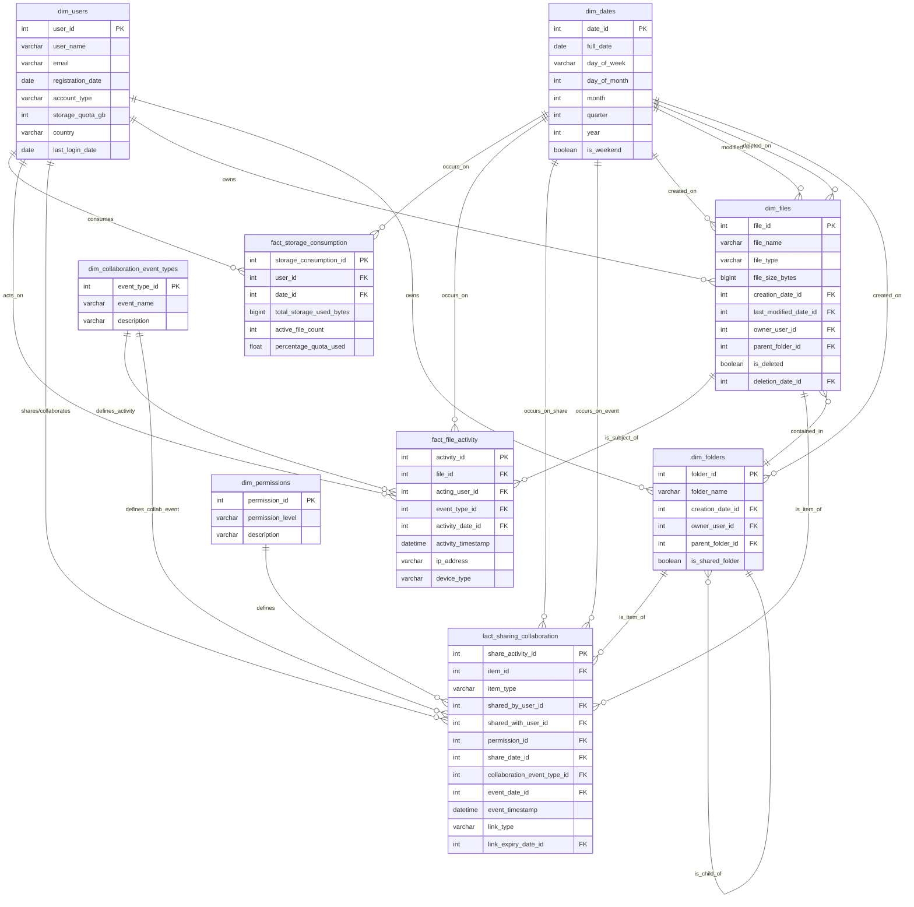

# Scenario 4: Cloud Storage (Dropbox/Google Drive) - Data Model

## Overview
This data model supports a cloud storage service, emphasizing file and folder structures, user ownership, sharing permissions, collaboration features (versions, comments), and storage usage analytics.

## Core Design Principles
1.  **Hierarchical Structure**: Model files within a folder hierarchy.
2.  **Granular Permissions**: Support for various sharing levels (view, edit, own) for users and groups.
3.  **Collaboration Tracking**: Capture file versions, comments, and other collaborative activities.
4.  **Storage Analytics**: Enable tracking of storage consumption by user, file type, etc.
5.  **Auditability**: Log significant events related to files and sharing.

## Entity Relationship Diagram

```mermaid
erDiagram
    dim_users {
        int user_key PK
        varchar user_id UK
        varchar user_name
        varchar email UK
        timestamp registration_date
        bigint storage_quota_bytes
        bigint current_storage_used_bytes
        varchar account_type "free, personal_pro, business_tier_1"
    }

    dim_files_folders {
        int item_key PK
        varchar item_id UK "Unique ID for any file or folder"
        int parent_folder_key FK "Self-referencing: Null for root folder of a user"
        int owner_user_key FK
        varchar item_name
        varchar item_type "file, folder"
        timestamp creation_timestamp
        timestamp last_modified_timestamp
        boolean is_deleted
        timestamp deletion_timestamp
    }

    dim_file_versions {
        int file_version_key PK
        int file_item_key FK "References item_key in dim_files_folders where item_type='file'"
        int version_number
        bigint size_bytes
        varchar file_format "e.g., pdf, docx, jpg, txt"
        varchar checksum "MD5/SHA256 of the file content for this version"
        int modified_by_user_key FK
        timestamp modification_timestamp
        varchar storage_path "Internal path to the actual file blob"
    }

    dim_permissions {
        int permission_key PK
        varchar permission_level UK "e.g., view, edit, comment_only, own, restricted_view"
        text description
    }

    dim_date {
        int date_key PK
        date full_date
        int hour
        int minute
    }

    fact_item_sharing {
        int item_key FK "File or folder being shared"
        int shared_with_user_key FK "User it's shared with (can be extended to groups)"
        int permission_key FK
        int shared_by_user_key FK
        timestamp shared_timestamp
        timestamp access_revoked_timestamp "Null if still active"
        PRIMARY KEY (item_key, shared_with_user_key)
    }

    fact_file_comments {
        int comment_key PK
        int file_item_key FK
        int commenting_user_key FK
        int parent_comment_key FK "For threaded comments, references comment_key"
        text comment_text
        timestamp comment_timestamp
        boolean is_resolved
    }
    
    fact_activity_log {
        int log_entry_key PK
        int user_key FK "User performing the action"
        int item_key FK "File/Folder action is on (optional, can be account level)"
        int date_key FK
        timestamp event_timestamp
        varchar action_type "e.g., file_upload, file_download, file_delete, folder_create, share_created, permission_changed, comment_added"
        json event_details "e.g., {shared_with_user_id: 'X', old_permission: 'view', new_permission: 'edit'}"
    }
    
    dim_users ||--o{ dim_files_folders : "owns"
    dim_files_folders }o--o{ dim_files_folders : "contains_parent_of" (via parent_folder_key)
    dim_files_folders ||--o{ dim_file_versions : "has_versions_if_file"
    dim_users ||--o{ dim_file_versions : "modified_by"
    
    dim_files_folders ||--o{ fact_item_sharing : "is_shared_item"
    dim_users ||--o{ fact_item_sharing : "is_shared_with_user"
    dim_users ||--o{ fact_item_sharing : "is_shared_by_user"
    dim_permissions ||--o{ fact_item_sharing : "has_permission"

    dim_files_folders ||--o{ fact_file_comments : "has_comments_if_file"
    dim_users ||--o{ fact_file_comments : "commented_by"
    fact_file_comments }o--o{ fact_file_comments : "is_reply_to"

    dim_users ||--o{ fact_activity_log : "performs_action"
    dim_files_folders ||--o{ fact_activity_log : "action_on_item"
    dim_date ||--o{ fact_activity_log : "occurs_on_date"

```

## Table Specifications

### Dimension Tables

#### `dim_users`
-   **Purpose**: Information about users and their storage account status.
-   **Key Fields**:
    -   `storage_quota_bytes`, `current_storage_used_bytes`: For usage tracking.

#### `dim_files_folders`
-   **Purpose**: Represents all files and folders in the system.
-   **Key Fields**:
    -   `item_id`: A globally unique ID for any file or folder.
    -   `parent_folder_key`: Foreign key to itself, establishing the hierarchy. Null for a user's root folder.
    -   `owner_user_key`: The primary owner of the item.
    -   `item_type`: 'file' or 'folder'.
    -   `is_deleted`, `deletion_timestamp`: For soft deletes and recovery.

#### `dim_file_versions`
-   **Purpose**: Tracks different versions of a file.
-   **Key Fields**:
    -   `file_item_key`: Links to the specific file in `dim_files_folders`.
    -   `version_number`: Sequential version identifier.
    -   `checksum`: To verify integrity and identify identical file versions.
    -   `storage_path`: Internal pointer to the blob storage location.

#### `dim_permissions`
-   **Purpose**: Lookup table for predefined permission levels.

#### `dim_date`
-   **Purpose**: Standard date dimension.

### Fact Tables

#### `fact_item_sharing`
-   **Purpose**: Records how files/folders are shared with other users.
-   **Granularity**: One record per item shared per user.
-   **Key Fields**:
    -   `item_key`: The file or folder being shared.
    -   `shared_with_user_key`: The recipient of the share.
    -   `permission_key`: The level of access granted.

#### `fact_file_comments`
-   **Purpose**: Stores comments made on files.
-   **Granularity**: One record per comment.
-   **Key Fields**:
    -   `parent_comment_key`: For threaded replies.
    -   `is_resolved`: Status for actionable comments.

#### `fact_activity_log`
-   **Purpose**: Audits significant actions performed by users on items or their account.
-   **Granularity**: One record per logged action.
-   **Key Fields**:
    -   `action_type`: Categorizes the event.
    -   `event_details`: JSON for flexible storage of action-specific metadata.

## Key Business Rules & Considerations

1.  **Ownership vs. Sharing**: `dim_files_folders.owner_user_key` denotes primary ownership. `fact_item_sharing` handles collaborative access.
2.  **Folder Hierarchy Traversal**: Requires recursive CTEs or similar SQL capabilities to navigate parent-child relationships in `dim_files_folders`.
3.  **Storage Calculation**: `dim_users.current_storage_used_bytes` would be updated based on the sum of `dim_file_versions.size_bytes` for all non-deleted, owned files. Shared files typically count against the owner's quota.
4.  **Implicit Permissions**: Permissions on a folder can implicitly grant permissions on its contents, unless overridden by explicit item-level sharing.

## Analytics Use Cases
-   **Storage Usage Analysis**: By user, account type, file type. Identifying users nearing quota.
-   **Collaboration Patterns**: Most shared files/folders, most active collaborators, common permission settings.
-   **File Versioning Insights**: Frequency of new versions, storage consumed by old versions.
-   **Feature Adoption**: Usage of commenting, sharing, versioning features.
-   **Audit & Security**: Tracking file access, permission changes, deletions for security and compliance.
-   **User Activity Trends**: Upload/download frequency, folder creation patterns.
-   **Identifying orphaned or unshared content** to prompt for organization or collaboration.

## Implementation Notes
-   `fact_activity_log` can become very large; consider partitioning and TTL/archival strategies.
-   Calculating `current_storage_used_bytes` in real-time can be intensive. May require periodic batch updates or trigger-based calculations.
-   Consider a separate `dim_groups` table if sharing with user groups is a feature, which would then link to `fact_item_sharing`. 

# Data Modeling for Cloud Storage (Dropbox/Google Drive)

This document outlines the data model for a cloud storage service, focusing on entities like users, files, folders, sharing mechanisms, collaboration activities, and storage metrics.

## Core Entities and Relationships

The primary entities in a cloud storage system include:

1.  **Users**: Individuals who own and interact with files and folders.
2.  **Files**: The actual documents, images, videos, etc., stored by users.
3.  **Folders**: Containers used to organize files and other folders.
4.  **Shares/Permissions**: Rules defining how files and folders are shared and what actions can be performed by whom.
5.  **Collaboration Activities**: Events such as comments, version history, and file recovery.
6.  **Storage Metrics**: Data related to storage consumption, quotas, and usage patterns.

## Star Schema for Analytics

For analytical purposes, a star schema is proposed to efficiently query and analyze cloud storage data.

### Dimensions

*   **`dim_users`**:
    *   `user_id` (PK): Unique identifier for the user.
    *   `user_name`: User's display name.
    *   `email`: User's email address.
    *   `registration_date`: Date when the user registered.
    *   `account_type`: Type of account (e.g., free, personal_pro, business_basic, business_advanced).
    *   `storage_quota_gb`: User's total storage quota in GB.
    *   `country`: User's country.
    *   `last_login_date`: Date of the user's last login.

*   **`dim_files`**:
    *   `file_id` (PK): Unique identifier for the file.
    *   `file_name`: Name of the file.
    *   `file_type`: Extension or MIME type of the file (e.g., pdf, docx, jpg, mp4).
    *   `file_size_bytes`: Size of the file in bytes.
    *   `creation_date_id` (FK to `dim_dates`): Date the file was created.
    *   `last_modified_date_id` (FK to `dim_dates`): Date the file was last modified.
    *   `owner_user_id` (FK to `dim_users`): User who owns the file.
    *   `parent_folder_id` (FK to `dim_folders`): Folder containing the file (can be NULL for root files if allowed, or point to a user's root folder).
    *   `is_deleted`: Boolean flag indicating if the file is in a deleted state.
    *   `deletion_date_id` (FK to `dim_dates`): Date of deletion, if applicable.

*   **`dim_folders`**:
    *   `folder_id` (PK): Unique identifier for the folder.
    *   `folder_name`: Name of the folder.
    *   `creation_date_id` (FK to `dim_dates`): Date the folder was created.
    *   `owner_user_id` (FK to `dim_users`): User who owns the folder.
    *   `parent_folder_id` (FK to `dim_folders`): Parent folder ID, for nesting (can be NULL for root folders).
    *   `is_shared_folder`: Boolean flag indicating if this folder is a shared workspace.

*   **`dim_permissions`**:
    *   `permission_id` (PK): Unique identifier for the permission type.
    *   `permission_level`: (e.g., 'view', 'comment', 'edit', 'owner', 'manage_members').
    *   `description`: Textual description of the permission level.

*   **`dim_collaboration_event_types`**:
    *   `event_type_id` (PK): Unique identifier for the collaboration event type.
    *   `event_name`: Name of the event (e.g., 'comment_added', 'version_created', 'file_restored', 'user_added_to_file', 'user_removed_from_file').
    *   `description`: Details about the event type.

*   **`dim_dates`**:
    *   `date_id` (PK): Unique identifier for the date (e.g., YYYYMMDD).
    *   `full_date`: The actual date (e.g., YYYY-MM-DD).
    *   `day_of_week`: Day of the week (e.g., Monday, Tuesday).
    *   `day_of_month`: Day number of the month.
    *   `month`: Month number.
    *   `quarter`: Calendar quarter.
    *   `year`: Calendar year.
    *   `is_weekend`: Boolean flag.

### Facts

*   **`fact_storage_consumption`**: Tracks storage usage by users over time.
    *   `storage_consumption_id` (PK): Unique identifier for the record.
    *   `user_id` (FK to `dim_users`): User whose storage is being measured.
    *   `date_id` (FK to `dim_dates`): Date of the measurement.
    *   `total_storage_used_bytes`: Total storage used by the user on that date.
    *   `active_file_count`: Number of active files owned by the user.
    *   `percentage_quota_used`: (total_storage_used_bytes / (storage_quota_gb * 1024^3)) * 100.

*   **`fact_file_activity`**: Captures significant events related to files.
    *   `activity_id` (PK): Unique identifier for the activity.
    *   `file_id` (FK to `dim_files`): The file involved in the activity.
    *   `acting_user_id` (FK to `dim_users`): The user performing the action.
    *   `event_type_id` (FK to `dim_collaboration_event_types`): Type of activity (e.g., create, modify, delete, restore, view, download).
    *   `activity_date_id` (FK to `dim_dates`): Date of the activity.
    *   `activity_timestamp`: Precise timestamp of the activity.
    *   `ip_address`: IP address from which the activity originated.
    *   `device_type`: Device used (e.g., web, mobile, desktop_client).

*   **`fact_sharing_collaboration`**: Tracks how files/folders are shared and collaborated on.
    *   `share_activity_id` (PK): Unique identifier.
    *   `item_id` (FK, polymorphic - could be `file_id` or `folder_id`): The shared item.
    *   `item_type`: ('file', 'folder').
    *   `shared_by_user_id` (FK to `dim_users`): User who initiated the share or is the owner.
    *   `shared_with_user_id` (FK to `dim_users`): User with whom the item is shared (can be a group_id if sharing with groups).
    *   `permission_id` (FK to `dim_permissions`): Permission level granted.
    *   `share_date_id` (FK to `dim_dates`): Date the share was established or modified.
    *   `collaboration_event_type_id` (FK to `dim_collaboration_event_types`): Type of collaboration (e.g., comment, version).
    *   `event_date_id` (FK to `dim_dates`): Date of the specific collaboration event.
    *   `event_timestamp`: Precise timestamp of the collaboration event.
    *   `link_type`: If shared via link (e.g., 'public_view', 'company_edit').
    *   `link_expiry_date_id` (FK to `dim_dates`): Expiry date for shared links.

## Mermaid Diagram



## Key Considerations

*   **Granularity**: Facts are generally at the user-item-event-time level. `fact_storage_consumption` could be a daily snapshot.
*   **Polymorphic Keys**: `fact_sharing_collaboration.item_id` can refer to either `dim_files.file_id` or `dim_folders.folder_id`. An `item_type` column is used to distinguish.
*   **Version History**: File versioning details can be an extension of `dim_files` (if keeping all versions as separate file entries with a `version_of_file_id` link) or a separate dimension linked to `fact_file_activity` for 'version_created' events. For simplicity here, it's an event type.
*   **Sharing with Groups**: `shared_with_user_id` could also point to a `dim_groups` if group sharing is a feature.
*   **Storage Calculation**: `fact_storage_consumption` needs careful calculation logic, especially considering shared files (who "owns" the storage cost?). Typically, the owner bears the storage.
*   **Data Volume**: For large systems, fact tables can grow immense. Aggregation strategies and partitioning will be crucial.

This model provides a comprehensive view for analyzing user behavior, storage trends, collaboration patterns, and overall service health. 