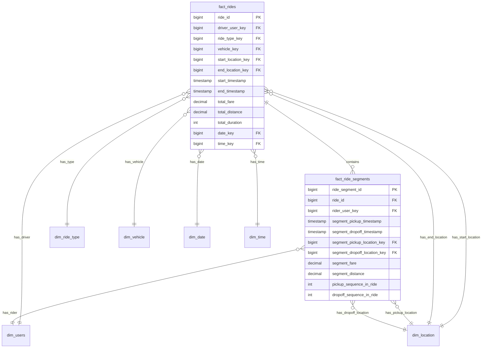
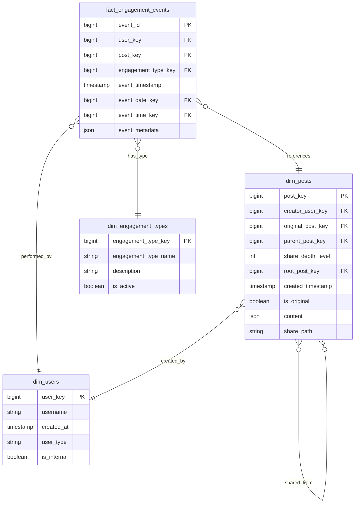
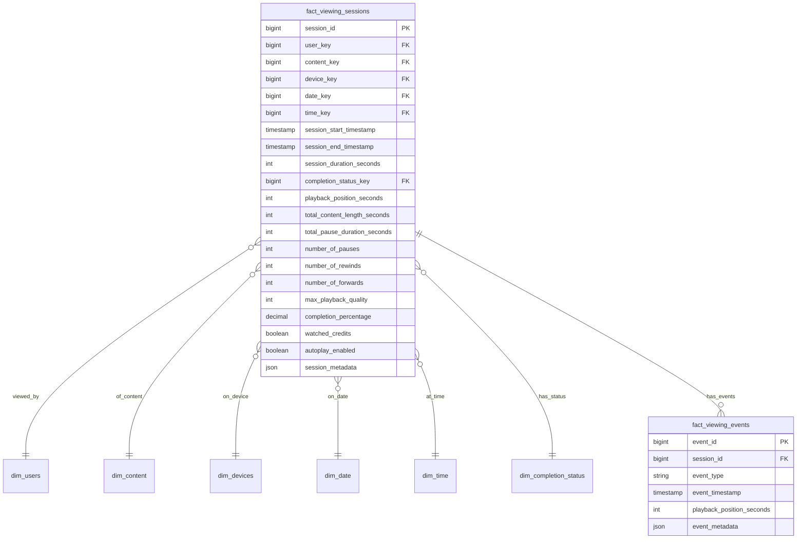
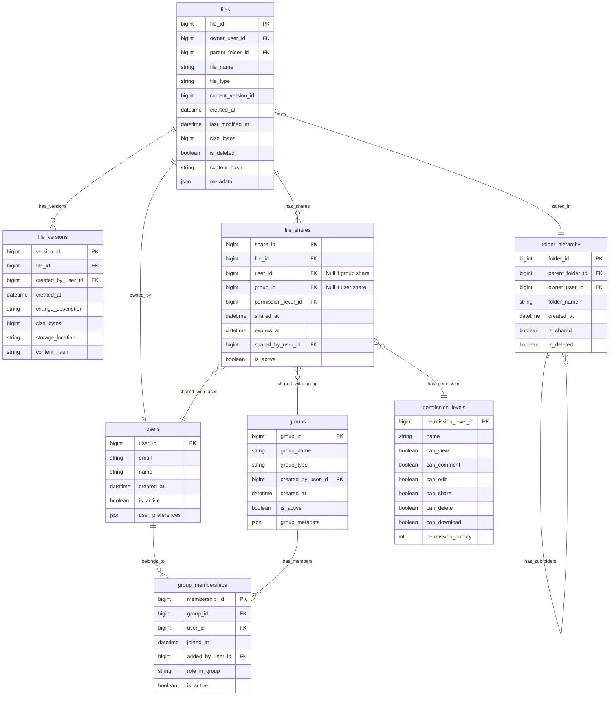
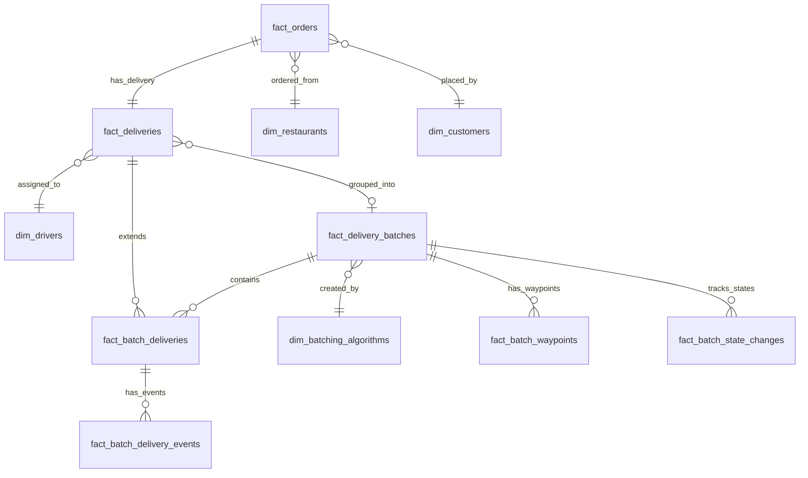

# Product Sense Questions

This document contains product sense questions from the study guide, organized by scenario.

# Scenario 1: Ride Sharing (Uber/Lyft) - Carpooling Feature

### Question 1.1.1: Value Proposition & Mission Alignment

**Interviewer:** "Why would a large tech company invest in a carpooling feature for its ride-sharing service? How does it align with the company's mission (e.g., connecting people, building community)?"

**Candidate Answer (Structured Bullet Points):**

"Investing in a carpooling feature aligns with a ride-sharing company's core mission and provides value across multiple dimensions. Here's how I see it:

*   **I. Value Proposition:**
    *   **For Riders:**
        *   **Lower Price Point:** Offers a more affordable transportation option, potentially expanding the user base to more price-sensitive segments.
        *   **Potential for Faster Pickups (in some cases):** If a carpooling vehicle is already nearby.
    *   **For Drivers:**
        *   **Increased Earnings Potential:** Opportunity for more fares per trip if multiple riders are picked up along a similar route, potentially leading to higher earnings per hour or per mile driven.
        *   **Higher Utilization:** Reduced idle time between single fares.
    *   **For the Platform:**
        *   **Increased Overall Ride Volume:** Attracts more riders due to lower prices and potentially drivers due to better earnings.
        *   **Improved Fleet Efficiency:** More passengers transported per vehicle mile, making better use of the existing driver network.
        *   **Competitive Differentiation:** Can be a key feature to attract and retain users compared to competitors without robust carpooling.
    *   **For the Community/City:**
        *   **Reduced Traffic Congestion:** Fewer individual cars on the road if carpooling is successful.
        *   **Reduced Emissions & Environmental Impact:** Contributes to sustainability goals.
        *   **Better Utilization of Infrastructure:** More efficient use of road networks.

*   **II. Mission Alignment (e.g., connecting people, building community, sustainable transportation):**
    *   **Connecting People:** Literally brings people together in the same vehicle, potentially fostering brief interactions.
    *   **Building Community (Indirectly):** By making transportation more accessible and affordable, it enables people to participate more in community activities.
    *   **Efficiency & Sustainability:** Directly aligns with missions related to creating more efficient transportation systems and reducing environmental impact.
    *   **Accessibility:** Makes transportation accessible to a wider range of people due to lower costs.

In essence, carpooling can enhance the core ride-sharing offering by making it more affordable, efficient, and environmentally friendly, while also opening up new avenues for growth and positive community impact."

### Question 1.1.2: Tracking Performance

**Interviewer:** "Imagine you launched the Carpool feature. How would you track its performance? What are the key metrics, and how would you slice the data?"

**Candidate Answer (Structured Bullet Points):**

"To track the performance of a new Carpool feature, I'd focus on metrics across adoption, efficiency, economics, and user experience. It's crucial to understand if the feature is meeting the needs of riders, drivers, and the platform.

*   **I. Adoption & Usage Metrics:** (Is it being used?)
    *   **Carpool Ride Penetration:** `(Number of Carpool rides) / (Total number of rides on the platform)`.
        *   *Goal:* See this grow to a significant share.
    *   **Carpool Request Success Rate:** `(Number of successful Carpool matches) / (Number of Carpool requests made)`.
        *   *Goal:* High success rate indicates good matching and availability.
    *   **Active Users Utilizing Carpool:** Number of unique riders and drivers participating in Carpool rides (daily, weekly, monthly).
    *   **New User Acquisition via Carpool:** Percentage of new platform users whose first ride is a Carpool ride (if trackable).

*   **II. Efficiency & Economics Metrics:** (Is it working well and financially viable?)
    *   **Average Fill Rate (Occupancy):** Average number of riders per Carpool vehicle during the carpooled portion of a trip.
        *   *Goal:* Maximize this to improve efficiency.
    *   **Average Detour Time/Distance per Rider:** Additional time or distance added to a rider's trip due to picking up/dropping off other Carpool passengers.
        *   *Goal:* Minimize this to maintain a good rider experience.
    *   **Driver Earnings Impact:**
        *   Average earnings per hour/per mile for drivers on Carpool trips vs. standard trips.
        *   Change in overall driver earnings for those who opt into Carpool.
    *   **Platform Revenue & Margin:**
        *   Revenue per Carpool ride vs. standard ride.
        *   Overall impact on platform take rate and profitability per ride.
    *   **Reduction in Per-Passenger-Mile Cost:** For the platform.

*   **III. User Experience Metrics:** (Are users happy with it?)
    *   **Rider Satisfaction (CSAT/NPS):** Specifically for Carpool rides. Compare with standard ride satisfaction.
        *   *Key Questions:* Are riders satisfied with price, travel time, co-passengers?
    *   **Driver Satisfaction (DSAT/NPS):** Specifically for Carpool trips.
        *   *Key Questions:* Are drivers satisfied with earnings, ease of managing multiple pickups/dropoffs, clarity of instructions?
    *   **Cancellation Rate for Carpool Rides:** By riders or drivers. Compare to standard rides.
        *   *High rates might indicate:* Poor ETAs, long wait times, issues with matching.
    *   **Complaints Related to Carpool:** Track specific categories (e.g., detour too long, uncomfortable co-passenger experience, safety concerns).

*   **IV. Slicing Dimensions for Deeper Insights:**
    *   **Time-Based:** Hour of day, day of week, weekday vs. weekend (to understand peak demand and performance).
    *   **Geographical:** City, specific zones/neighborhoods, route corridors (to identify where Carpool is most/least effective).
    *   **User Segments:**
        *   Riders: New vs. existing users, demographics, price sensitivity, commute vs. leisure trips.
        *   Drivers: Tenure, vehicle type, rating, opt-in frequency for Carpool.
    *   **Ride Characteristics:** Trip distance, time of day, number of matched passengers in a batch.

By monitoring these metrics and slicing them effectively, we can understand the feature's overall health, identify areas for improvement in the matching algorithm, rider/driver experience, and pricing strategy, ensuring Carpool delivers on its value proposition for all parties involved."

# Solution to Question 1: Rideshare Schema Data Model

## Question

How should the data model be designed to support carpool rides where a single ride (ride_id) can involve multiple passengers picked up and dropped off at potentially different locations and times within the same driver's trip? Discuss trade-offs.

## Solution

The data model provided is a well-designed star schema for rideshare data with specific support for carpooling, where multiple passengers can share a single ride. Let me explain the key aspects and trade-offs:

### Core Structure

The model uses two fact tables with a one-to-many relationship:

1. **fact_rides**: Represents the overall trip taken by the driver with a single record per ride.
   - Contains driver-level metrics (total_fare, total_distance, total_duration)
   - Links to driver information, vehicle, overall start/end locations, and time dimensions
   - Each record has a unique ride_id

2. **fact_ride_segments**: Represents individual passenger journeys within a carpool ride.
   - Multiple segments can belong to a single ride_id (one-to-many relationship)
   - Each segment has its own pickup/dropoff locations and timestamps
   - Tracks segment-specific metrics (segment_fare, segment_distance)
   - Includes pickup_sequence_in_ride and dropoff_sequence_in_ride to track ordering

### Dimension Tables

- **dim_users**: Contains both riders and drivers (user_type can distinguish between them)
- **dim_location**: Stores all location information (both ride and segment levels)
- **dim_ride_type**: Identifies the type of ride (e.g., 'Carpool', 'Regular')
- **dim_vehicle**, **dim_date**, **dim_time**: Standard dimensions for analytics

### Benefits of This Approach

1. **Proper Normalization**: The separation of fact_rides and fact_ride_segments follows database normalization principles, avoiding data redundancy.

2. **Analytical Flexibility**: This model allows for analyzing both overall ride metrics and individual passenger experiences.

3. **Query Efficiency**: 
   - Easy to query "how many people shared a ride" (count segments per ride_id)
   - Simple to analyze individual passenger behavior (via fact_ride_segments)
   - Enables driver-focused queries (via fact_rides)

4. **Temporal Analysis**: The segment timestamps allow for analyzing pickup/dropoff patterns within carpool rides.

5. **Scalability**: The model handles any number of passengers in a carpool without structural changes.

### Trade-offs and Considerations

1. **Query Complexity**: Some analyses require joining both fact tables, which can add complexity and potentially impact performance for very large datasets.

2. **Storage Efficiency vs. Query Performance**: 
   - This normalized structure uses less storage but may require more joins for certain queries
   - A denormalized approach (e.g., arrays of passenger details in fact_rides) would use more storage but potentially simplify some queries

3. **Alternative Approach - JSON/Array Fields**:
   - Some databases support JSON or array fields that could store passenger details directly in fact_rides
   - While this might simplify some queries, it would:
     - Make it harder to query or index individual passenger segment details
     - Limit standard SQL operations on passenger data
     - Potentially create update anomalies
     - Reduce analytical flexibility

4. **Sequence Fields vs. Timestamps**:
   - The model includes both explicit sequence fields (pickup_sequence_in_ride) and timestamps
   - This redundancy adds clarity but requires maintaining consistency between these fields

5. **Foreign Key Structure**:
   - Direct link between fact_ride_segments and dim_users (rider_user_key) makes rider queries simple
   - Alternative would be a bridge table for rider-segment relationships, which would add flexibility for multiple riders per segment but at the cost of more complexity

### Implementation in Mermaid Syntax



### Conclusion

This data model represents a standard star schema approach with a bridge table (fact_ride_segments) to handle the many-to-many relationship between rides and riders. The model effectively balances analytical flexibility with reasonable query performance. 

While alternative approaches using arrays or JSON could reduce joins for some queries, they would significantly limit analytical capabilities. For a data warehouse supporting business intelligence and analytics, this normalized approach is generally superior, especially as data volumes grow. 

# Scenario 2: Short Video (TikTok/Reels) - Sharing Focus

### Question 2.1.1: Measuring Success

**Interviewer:** "You are launching Reels/Shorts. What are the key metrics for platform health and user engagement?"

**Candidate Answer (Structured Bullet Points):**

"Launching a short-form video feature like Reels/Shorts aims to boost user engagement, attract new users, and open monetization channels. To measure its success, I'd track metrics across several key areas:

*   **I. Content Creation Metrics:** (Are users making content?)
    *   **Volume & Frequency:**
        *   **Number of Reels/Shorts Created (per day/week):** Overall content pipeline.
        *   **Average Creations per Creating User:** Depth of creator engagement.
        *   *Critical Question:* Is creation concentrated among a few power users or widely distributed?
    *   **Creator Activation & Onboarding:**
        *   **Creator Activation Rate:** `% of active platform users creating their first Reel/Short within X days`.
        *   **Time to Create First Reel/Short:** Measures ease of use of creation tools.
    *   **Tool Usage & Creation Quality:**
        *   **Adoption Rate of Creative Tools (filters, sounds, effects):** Which tools are valuable?
        *   **Drafts Started vs. Published Ratio:** High ratio might indicate friction in finalizing content.
        *   **Content Diversity (Qualitative/Topic Modeling):** Is content varied or homogenous?

*   **II. Content Consumption Metrics:** (Are users watching and engaging?)
    *   **Overall Consumption:**
        *   **Reels/Shorts Views per User (per day/week).**
        *   **Total Time Spent in Reels/Shorts Tab/Feed per User (per day/week).**
            *   *Critical Question:* Is this time additive to platform time, or cannibalizing other features?
    *   **Engagement per Video:**
        *   **Average View Duration per Reel/Short & Completion Rate (% watched to end).**
        *   **Rewatch Rate:** How often are users re-watching content?
        *   **Engagement Rate per Reel/Short:** `(Likes + Comments + Shares + Saves) / Views`.
            *   *Consideration:* Weight different interactions (e.g., a 'save' or 'share' is often more valuable than a 'like').
    *   **Session Behavior:**
        *   **Scroll Depth / Number of Swipes per Session in Feed.**
    *   **Content Discovery Effectiveness:**
        *   **Impressions from "For You" Page (FYP) vs. Following Feed:** Measures algorithm effectiveness.
        *   **CTR on Reels/Shorts from other surfaces (e.g., stories, main feed).**

*   **III. User Retention & Growth Metrics:** (Is it keeping users and attracting new ones?)
    *   **Feature-Specific Activity:**
        *   **DAU/MAU of Reels/Shorts Users.**
    *   **Impact on Overall Retention:**
        *   **Retention Rate of Reels/Shorts Users vs. Non-Users (Cohort Analysis).**
        *   **Churn Rate of Reels/Shorts Non-Users vs. Users.**
    *   **User Acquisition:**
        *   **New User Acquisition Attributed to Reels/Shorts** (via surveys, referral tracking if possible).
        *   **Resurrection Rate:** Are inactive users returning due to Reels/Shorts?

*   **IV. Platform Health & Monetization Metrics:** (Broader impact)
    *   **Impact on Other Features (Guardrail Metrics):**
        *   **Cannibalization Analysis:** Monitor engagement changes (time spent, interaction rates) in primary feed, stories, DMs post-Reels launch. Requires A/B testing or careful pre/post analysis.
        *   **Halo Effect Analysis:** Is Reels driving increased engagement in *other* parts of the app?
    *   **Content Moderation & Safety:**
        *   **Volume of Reported Content/Violations in Reels/Shorts.**
    *   **Monetization (If applicable):**
        *   **Ad Impressions & CTR in Reels/Shorts feed.**
        *   **Advertiser Demand & CPMs for Reels/Shorts inventory.**
    *   **Technical Performance:**
        *   **Server Load, Latency, Crash Rates within the Reels/Shorts experience.**

*   **V. Slicing Dimensions for All Metrics:**
    *   **User Segment:** New vs. Existing, Demographics (Age, Location), Creator vs. Consumer.
    *   **Content Category/Genre (if identifiable).**
    *   **Device Type/OS.**
    *   **Time (hour of day, day of week, seasonality).**
    *   **Creator Tier (professional, casual).**

*   **VI. Critical Success Factors & Trade-offs to Monitor:**
    *   **Creator vs. Consumer Experience Balance.**
    *   **Content Quality vs. Quantity (especially early on).**
    *   **Impact of Monetization on User Experience.**
    *   **Recommendation Algorithm Performance (vital for discovery and satisfaction).**

By comprehensively tracking these areas, we can assess the true impact of Reels/Shorts and iterate towards a successful and healthy feature."

**Data Engineering & Product Analytics Perspective:**

*   **Data Engineering Considerations:**
    *   **Instrumentation:** Defining and implementing client-side (app) and server-side events for every interaction: reel creation start/publish/draft, tool usage, view events (start, progress milestones like 25%/50%/75%/100% completion, re-watches), likes, comments, shares, saves, scrolls, FYP impressions vs. explicit follows. This requires robust event schemas and versioning.
    *   **Data Ingestion & Pipelines:** Building scalable data pipelines (e.g., using Kafka, Spark Streaming, Flink) to handle high-volume event streams from millions of users. ETL processes to clean, transform, and aggregate data into data warehouses (e.g., Snowflake, BigQuery, Redshift) or data lakes.
    *   **Data Modeling:** Designing star/snowflake schemas or denormalized tables optimized for analytical queries on these metrics. Fact tables for views, engagements, creations; dimension tables for users, content, time, creative tools. Consider pre-aggregations for dashboards.
    *   **Scalability & Reliability:** Ensuring the data infrastructure can scale with user growth and feature usage. Implementing data quality checks, monitoring for pipeline failures, and ensuring data freshness/accuracy. For instance, view counts need to be eventually consistent but also quickly updated for user-facing displays.
    *   **Attribution Logic:** Developing systems to correctly attribute views/engagements to specific Reels, creators, and recommendation algorithms (e.g., was the view from FYP or a followed creator?). This is complex for share chains.
    *   **Cost Management:** Optimizing data storage and compute costs associated with processing and storing vast amounts of interaction data.

*   **Product Analytics Contributions:**
    *   **Dashboarding & Reporting:** Creating dashboards (e.g., in Tableau, Looker, Superset) to visualize these KPIs for stakeholders, enabling real-time monitoring of feature performance.
    *   **A/B Testing Framework:** Designing and analyzing A/B tests for new creative tools, UI changes in the Reels feed, or algorithm tweaks. Determining statistical significance and providing actionable recommendations.
    *   **Deep Dive Analysis:**
        *   **Segmentation:** Analyzing how different user segments (e.g., new vs. tenured, by demographics, by creator/consumer status) adopt and engage with Reels.
        *   **Funnel Analysis:** For creator tools (from opening editor to publishing) to identify drop-off points. For consumer engagement (from impression to like/share/follow).
        *   **Cannibalization/Halo Effect Analysis:** Using causal inference methods (e.g., diff-in-diff with control groups if full A/B test wasn't possible) to rigorously assess Reels' impact on other features.
        *   **Content Analysis:** Partnering with data science to understand what types of content (sounds, topics, formats) drive the most engagement or retention.
    *   **Forecasting & Goal Setting:** Using historical data to forecast future growth and help set realistic targets for Reels adoption and engagement.
    *   **Strategic Insights:** Answering questions like: "What are the characteristics of creators who go viral?", "Does high consumption of Reels lead to better long-term platform retention?", "How does ad load impact Reels consumption and user churn?"

*   **Stand-Out as a Data Engineer Candidate:**
    *   Discuss the challenges of building a near real-time view counting system for Reels versus a batch-processed aggregation for daily reporting.
    *   Mention the importance of a robust event tracking schema and how data contracts between client and backend teams are crucial.
    *   Talk about data lineage for these metrics – how can you trace back a KPI on a dashboard to its raw event sources?
    - Highlight the need for efficient sessionization logic to calculate "time spent in Reels tab" accurately, especially with app backgrounding/foregrounding.
    *   Emphasize the importance of data quality validation at each stage of the pipeline to ensure trust in these critical product metrics.

### Question 2.1.2: User Location Changes

**Interviewer:** "How would you track if a user significantly changes their 'regular' location (e.g., moves cities) based on their activity?"

**Candidate Answer (Structured Bullet Points):**

"Tracking a significant change in a user's 'regular' location is valuable for personalizing experiences and understanding user mobility. My approach would involve collecting various signals, defining what constitutes a 'regular location,' and then establishing rules for detecting a 'significant change'.

*   **I. Data Signals for Location Inference:**
    *   **Explicit Signals:**
        *   **GPS Data (with user permission):** High accuracy, but requires consent and can be battery intensive.
        *   **User-Provided Location in Profile:** Explicit, but may not be current.
        *   **Location Tags on Content/Check-ins:** High intent for being at a location at a specific time, but sporadic.
    *   **Implicit Signals:**
        *   **IP Address:** Readily available, but less accurate (city/region level), affected by VPNs/mobile IPs.
        *   **Network Signals (Wi-Fi SSID/BSSID, Cell Tower Info):** Can be accurate with permissions, but variable coverage.
    *   **Activity-Based Inferred Signals:**
        *   **Content Engagement:** Interacting with local news, businesses, events from a specific area.
        *   **Language Settings/Localized Content Consumption.**
        *   **Search Queries for Local Services.**
        *   **Changes in Social Graph Interactions:** Predominantly interacting with users from a new city.

*   **II. Defining a 'Regular' Location:** (Primary area of activity over a period)
    *   **Methodology:**
        *   **Historical Location Aggregation:** Collect and aggregate signals over a trailing window (e.g., 30-90 days).
        *   **Clustering & Dominant Location:** Identify the most frequent or highest confidence location cluster (city/region).
        *   **Time-Weighted Analysis:** Give more weight to recent signals.
        *   **Filtering Transients:** Develop logic to differentiate short trips (vacations) from permanent moves (e.g., based on duration and consistency of new location signals).

*   **III. Detecting a 'Significant Change':**
    *   **Threshold-Based Rules:**
        *   **Distance:** New dominant location is X miles/km away from the previous regular location.
        *   **Duration & Consistency:** User consistently appears in the new location (across multiple signal types) for Y consecutive days/weeks.
    *   **State Machine Model:** User transitions through states like `[Known_Regular_Location]`, `[Possible_Travel]`, `[Candidate_New_Location]`, `[Confirmed_New_Regular_Location]` based on signal persistence.
    *   **Confidence Scoring:** Assign a confidence score to a potential move based on the strength, consistency, and number of corroborating signals.

*   **IV. Implementation & System Monitoring:**
    *   **User Location Profile:** Maintain a dynamic profile storing current/historical inferred locations and confidence scores.
    *   **Processing:** Combination of batch (for historical aggregation) and near real-time updates (for some signals like IP).
    *   **System Performance Metrics:**
        *   **Accuracy of Detection:** (Hard to get ground truth) Validate against user-confirmed moves or profile updates.
        *   **Latency of Change Detection:** How quickly is a move identified?
        *   **False Positive/Negative Rates:** Incorrectly flagging travel as a move, or missing an actual move.
        *   **Coverage:** For what % of users can we determine a regular location?

*   **V. Critical Considerations & Challenges:**
    *   **User Privacy:** Paramount. Ensure transparency, user control, and compliance with regulations (GDPR, CCPA).
    *   **Signal Sparsity & Inaccuracy:** Rely on diverse signals; not all users provide strong or accurate location data.
    *   **Differentiating Travel from Relocation:** Core challenge. Look for sustained shifts in *multiple* behavioral patterns associated with the new location.
    *   **Cold Start Problem:** Difficult for new users with limited activity history.

By combining these signals and methodologies carefully, we can effectively track significant shifts in user location while respecting privacy."

**Data Engineering & Product Analytics Perspective:**

*   **Data Engineering Considerations:**
    *   **Instrumentation & Data Sources:** Ensuring reliable collection of IP addresses (from server logs), GPS data (from client apps, with consent), user profile updates (CDC from production DBs), location tags on content, Wi-Fi signals. Each source needs its own ingestion path.
    *   **GeoIP Databases & Services:** Integrating and maintaining up-to-date GeoIP databases for IP-to-location mapping. Managing API calls to third-party geo-services if used.
    *   **Location Data Processing Pipeline:** Building pipelines to:
        *   Cleanse and standardize location data (e.g., lat/long precision, city name normalization).
        *   Aggregate location signals per user over time windows (e.g., daily, weekly dominant IP location, GPS clusters).
        *   Enrich user profiles with inferred 'current regular location' and 'previous regular location'. This often involves batch jobs (e.g., Spark) for historical analysis and near real-time updates for some signals.
    *   **User Location Profile Store:** Designing a scalable and queryable store (e.g., NoSQL database like Cassandra or a dedicated user profile service) for storing current and historical location states, confidence scores, and supporting signals.
    *   **Change Detection Logic:** Implementing the state machine or rule-based system to flag significant location changes. This might involve complex event processing or scheduled batch jobs comparing current inferred location to the last known 'regular' location.
    *   **Privacy by Design:** Implementing data anonymization/ pseudonymization where possible, access controls, and automated data retention/deletion policies for sensitive location data.

*   **Product Analytics Contributions:**
    *   **Algorithm Validation & Tuning:**
        *   Designing experiments or using heuristics to estimate the accuracy of the location change detection (e.g., comparing with users who manually update their profile location after a detected move).
        *   Analyzing false positives/negatives to refine thresholds (distance, duration) and signal weighting.
    *   **Impact Analysis:** Quantifying how detected location changes affect user engagement with localized content, ad targeting effectiveness, or churn rates.
    *   **Segmentation:** Analyzing mobility patterns for different user segments (e.g., students moving for university, remote workers, frequent travelers).
    *   **Dashboarding:** Creating dashboards to monitor the volume of detected location changes, the performance of the detection algorithm (accuracy, latency), and the distribution of users by inferred region.
    *   **Supporting Product Features:** Providing data feeds of users with recent significant location changes to personalize their experience (e.g., welcome to new city, suggest local groups/pages).
    *   **Fraud/Anomaly Detection:** Using significant, unexpected location changes as a potential signal for account takeover investigations.

*   **Stand-Out as a Data Engineer Candidate:**
    *   Discuss the trade-offs between batch processing for historical location aggregation vs. stream processing for near real-time IP changes.
    *   Mention the challenges of joining sparse GPS data with more frequent but less accurate IP-based location data.
    *   Talk about building a system to generate a "location confidence score" based on the recency, type, and agreement of different location signals.
    *   Address how to handle location data for users who use VPNs frequently – can you detect VPN usage and treat those IPs differently?
    *   Emphasize the importance of a robust testing framework for location detection algorithms, perhaps using simulated user data or a manually curated ground truth set.

### Question 2.1.3: Engagement Comparison

**Interviewer:** "How would you compare the engagement (e.g., likes) of original content versus content that is shared (i.e., a re-share of an original post)? What insights would this provide?"

**Candidate Answer (Structured Bullet Points):**

"Comparing engagement on original content (OC) versus shared content (SC) is key to understanding content virality, the value of sharing, and how information flows. Here's my approach:

*   **I. Definitions & Attribution:**
    *   **Original Content (OC):** The first instance of content posted by its creator.
    *   **Shared Content (SC):** A re-post/re-share of OC by another user (sharer) to their audience or via DM.
    *   **Crucial Prerequisite:** A robust system to clearly link every SC instance back to its root OC for accurate attribution.

*   **II. Key Engagement Metrics for Comparison (Track for both OC & SC):**
    *   **On Original Content (OC):**
        *   **Direct Engagements:** Likes, comments, saves, views received *directly on the OC post*.
        *   **Indirect/Attributed Engagements:** Total engagements received by *all SC instances originating from this OC*. (Measures total reach/impact of OC).
        *   **Velocity of Engagement on OC.**
        *   **Creator Follow Rate from OC Viewers.**
    *   **On Shared Content (SC - per specific share instance):**
        *   **Engagements on the Share Itself:** Likes, comments, views received *on that specific SC instance* by the sharer's audience.
        *   **Click-Through to Original (OC or OC Creator Profile) from SC.**
        *   **Engagement Rate on SC:** `(Likes_on_share + Comments_on_share) / Views_on_share`.
        *   **Sharer Follow Rate from SC Viewers (following the *sharer*).**

*   **III. Comparative Analysis & Ratios:**
    *   **Engagement per View (OC vs. SC):**
        *   E.g., `Likes_per_view_OC` vs. `Likes_per_view_SC`.
        *   *Insight:* Does engagement intensity change when content is shared? (Depends on sharer's audience relevance, added context by sharer).
    *   **Virality Score / Share Uplift for OC:**
        *   E.g., `(Total Engagements from All Shares of an OC) / (Direct Engagements on OC)`.
        *   *Insight:* Quantifies sharing's amplification effect.
    *   **Engagement Decay Across Share Generations:** How does engagement change for a share of a share, etc.?
    *   **Audience Overlap Analysis:** % of users engaging with SC who also engaged with OC or already followed the OC creator.
        *   *Insight:* Is sharing reaching new audiences?
    *   **Performance by Sharer Characteristics:** Compare SC engagement based on sharer's influence (follower count, typical engagement).
    *   **Performance by Content Type:** Do certain content types (news, memes) perform better as OC vs. SC?

*   **IV. Potential Insights from This Comparison:**
    *   **Understand Content Virality Drivers:** Identify characteristics of highly shareable and engaging content.
    *   **Quantify Value of Sharing Feature:** Measure its contribution to overall discovery and platform engagement.
    *   **Inform Creator Recognition/Rewards:** Acknowledge total impact of OC, including downstream engagement.
    *   **Identify Influential Sharers ("Super-Spreaders").**
    *   **Optimize Share Experience:** If SC underperforms, investigate presentation of shared content (e.g., lack of context).
    *   **Detect Low-Quality/Misleading Shares:** High SC views but very low/negative engagement might signal issues.

*   **V. Critical Considerations:**
    *   **Attribution Complexity:** Ensuring accurate tracking, especially across platforms or for re-uploads.
    *   **Defining "Engagement":** Consistency or clear distinction if comparing different interaction types.
    *   **Context of Share:** Commentary added by sharer can significantly impact SC engagement (hard to capture systematically).
    *   **Negative Virality:** High engagement on shares can also be for negative reasons; pair with sentiment analysis or reports.

By systematically comparing these patterns, we can gain deep insights into content dynamics and social features."

**Data Engineering & Product Analytics Perspective:**

*   **Data Engineering Considerations:**
    *   **Share Event Instrumentation:** Defining distinct events for sharing actions (e.g., `share_button_click`, `share_to_feed_success`, `share_to_dm_success`). These events must capture `original_content_id`, `sharer_user_id`, `shared_instance_id`, and `timestamp`.
    *   **Engagement Event Enrichment:** All engagement events (likes, comments, views) on a shared post instance must be linkable to both the `shared_instance_id` and the `original_content_id`.
    *   **Graph Data Model (Potentially):** For multi-generational shares (share of a share), representing the share chain might benefit from a graph database or graph processing capabilities to trace lineage and impact.
    *   **Attribution Logic Pipeline:** Building robust batch or stream processing jobs to:
        *   Identify OC and link all subsequent SC instances to it.
        *   Aggregate engagement metrics for OC (direct) and SC (indirect, attributed to OC).
        *   Handle edge cases like deleted OC or deleted shares.
    *   **Data Structures for Aggregation:** Storing aggregated engagement counts per OC (direct vs. indirect via shares), and per SC instance. This might involve fact tables for engagements joined with dimension tables for content (marking OC vs. SC status) and share lineage.
    *   **Latency for Virality Tracking:** For features like "trending" or real-time virality scores, low-latency aggregation of share and engagement signals is crucial.

*   **Product Analytics Contributions:**
    *   **Defining Virality Metrics:** Developing and validating metrics like K-factor (average number of additional users brought in by one user sharing) or share uplift scores.
    *   **Share Funnel Analysis:** Understanding the drop-off from viewing content -> clicking share -> completing share -> share receiving engagement.
    *   **Content Analysis for Shareability:** Identifying features of content (topic, format, sentiment, creator attributes) that correlate with high share rates and high engagement on shares.
    *   **Sharer Segmentation:** Identifying "super-sharers" or influencers whose shares drive disproportionate engagement. Understanding their motivations.
    *   **A/B Testing Share Features:** Evaluating the impact of changes to the share button UI, share flow, or how shared content is presented in feeds.
    *   **Audience Insights:** Analyzing if shared content primarily reaches the sharer's existing followers or effectively taps into new audience segments for the original creator.
    *   **ROI of Sharing:** Estimating the value generated (e.g., in terms of new user acquisition, increased overall engagement) by the sharing ecosystem.

*   **Stand-Out as a Data Engineer Candidate:**
    *   Discuss the challenge of accurately attributing engagement across multiple share generations, especially if content can be shared across different platforms (e.g., share from app to WhatsApp).
    *   Mention the complexity of handling content modifications in shares (e.g., a user shares a video but trims it or adds their own commentary overlay – is it still the same content for attribution?).
    *   Talk about building a de-duplication system if users can share the same OC multiple times, or if content is re-uploaded instead of truly shared.
    *   Propose how to design a data model that efficiently allows querying for "total engagement for an OC including all its children shares."
    *   Consider the real-time data processing needs for identifying rapidly spreading content versus batch processing for historical share analytics.

### Question 2.1.4: Dashboard Visualization

**Interviewer:** "How would you design a dashboard visualization to show how the launch of Reels is affecting engagement with other platform features (e.g., standard posts, image uploads, long-form videos)?"

**Candidate Answer (Structured Bullet Points):**

"To visualize Reels' impact on other features, I'd design a dashboard focused on identifying cannibalization, halo effects, and shifts in user behavior, aiming for clarity and actionability.

*   **I. Dashboard Objectives:**
    *   Monitor overall platform health post-Reels launch.
    *   Pinpoint features gaining/losing engagement due to Reels.
    *   Understand how different user segments are shifting behavior.
    *   Provide data for strategic decisions (promotion, development).

*   **II. Key Sections & Visualizations:**

    *   **A. Executive Summary (Platform Level Overview):**
        *   **Overall Engagement Trend:** Line chart (Total Platform Time Spent, DAU/MAU, Composite Engagement Score) with Reels launch marked. *Include pre-launch baseline.*
        *   **Reels Adoption vs. Overall Active Users:** Stacked area chart (Total Active Users, with segment for Reels Active Users).
        *   **High-Level Impact KPIs:** % change pre/post Reels for: Time Spent (Reels vs. Feature X), Content Creation (Reels vs. Feature X), Engagement Rate (Reels vs. Feature X). *Use clear color-coding (green/red/yellow) and up/down arrows.*

    *   **B. Feature-by-Feature Impact Analysis (Core Section):**
        *   *For each existing key feature (e.g., Standard Posts, Stories, Long-Form Video):*
            *   **Time Spent Comparison:** Grouped line chart (Time on [Existing Feature] vs. Time on Reels). Segment by users of both, only existing, only Reels.
            *   **Content Creation/Interaction Volume:** Bar chart (Daily/weekly average posts created, stories viewed etc. for the feature) comparing pre-Reels, post-Reels (all users), and post-Reels (Reels users vs. non-Reels users).
            *   **Engagement Rate Trends:** Line chart (Engagement rate for existing feature over time) with Reels launch marked.
            *   **User Flow/Transition (Advanced):** Sankey diagram (From Main Feed -> Reels, Reels -> Main Feed, etc.) comparing pre/post launch flows.

    *   **C. User Segment Deep Dive:**
        *   *Allow filtering dashboard/charts by:* New vs. Existing Users, Heavy vs. Light Users (of existing features), Demographics, Creators vs. Consumers.
        *   *Visualization:* Replicate charts from Section B with dynamic filtering or side-by-side segment comparisons.

    *   **D. Leading Indicators & Health Metrics:**
        *   **Feature-Specific Churn/Retention:** Cohort retention curves for users of existing features (compare pre/post Reels cohorts). Are Reels adopters more/less retained on other features?
        *   **Cross-Feature Usage Frequency:** Heatmap (% of users using Feature X also using Feature Y, N times/week). Compare pre/post launch.

*   **III. Dashboard Interactivity & Design Principles:**
    *   Date Range Selection (essential for pre/post).
    *   Filterable Dimensions (user segment, country, device).
    *   Clear Labels, Annotations, Marked Events.
    *   Emphasis on Relative Changes (% change from baseline).
    *   Thresholds & Alerts for critical metric changes.
    *   Drill-Down Capability.
    *   Avoid Clutter: Focus on most important metrics.

*   **IV. Critical Considerations for Interpretation:**
    *   **Correlation vs. Causation:** Acknowledge confounding factors if not using A/B test data.
    *   **Novelty Effect:** Monitor long-term trends beyond initial Reels surge.
    *   **Consistent Definitions:** Ensure comparable metrics across features.
    *   **Segmentation is Key:** Aggregates can hide vital segment-specific shifts.

This dashboard would be a central tool for understanding the interplay between Reels and the existing platform ecosystem."

**Data Engineering & Product Analytics Perspective:**

*   **Data Engineering Considerations:**
    *   **Unified Event Schema:** Ensuring that engagement events (time spent, views, creations, likes, etc.) are instrumented consistently across all platform features (Reels, Standard Posts, Stories, etc.) with common dimensions like `user_id`, `session_id`, `feature_name`, `content_id`, `timestamp`.
    *   **Data Aggregation Layer:** Building robust and efficient data pipelines (e.g., Spark, dbt) to aggregate raw event data into summary tables per user, per feature, per day (or other granularities). These tables would power the dashboard.
        *   Example aggregates: `daily_time_spent_per_user_per_feature`, `daily_creations_per_user_per_feature`.
    *   **Sessionization Logic:** Accurately calculating "time spent" requires robust sessionization of user activity, handling app backgrounding/foregrounding and inactivity timeouts consistently across features.
    *   **Data Lineage & Definitions:** Maintaining a clear data dictionary and lineage for all metrics displayed on the dashboard. Ensuring business logic (e.g., definition of "active user" for a feature) is consistently applied.
    *   **Performance Optimization:** Dashboard queries need to be fast. This might involve pre-calculating metrics, using materialized views, or optimizing the underlying data models in the warehouse (e.g., Redshift, BigQuery, Snowflake).
    *   **Historical Data Management:** Ensuring historical data (pre-Reels launch) is available and comparable with post-launch data, accounting for any schema changes or metric definition updates over time.

*   **Product Analytics Contributions:**
    *   **Defining Key Comparative Metrics:** Deciding *which* engagement aspects are most critical to compare across features (e.g., time spent, creation volume, specific interaction rates).
    *   **Causal Inference for Impact Assessment:** Beyond pre/post comparisons, using techniques like Difference-in-Differences (if a clean control group of non-Reels users can be identified or if rollout was staggered) or propensity score matching to better isolate the causal impact of Reels on other features.
    *   **Segmentation Strategy:** Identifying the most insightful user segments (e.g., "Heavy Feed Users who adopted Reels" vs. "Heavy Feed Users who didn't") to understand differential impacts.
    *   **User Journey Analysis (Sankey Diagrams):** Designing and interpreting Sankey diagrams to visualize how users navigate between Reels and other features. Are they getting stuck in Reels, or is it a gateway to other content?
    *   **Threshold Setting & Alerting:** Defining meaningful thresholds for changes in metrics (e.g., a 10% drop in Feed time spent post-Reels launch for a specific user segment) that would trigger alerts or further investigation.
    *   **Narrative & Storytelling:** Translating the data on the dashboard into a clear narrative for product and leadership teams, highlighting key trends, risks (cannibalization), and opportunities (halo effects).

*   **Stand-Out as a Data Engineer Candidate:**
    *   Discuss the challenges of ensuring consistent sessionization logic across different client platforms (iOS, Android, Web) and features to get comparable "time spent" metrics.
    *   Mention how to design data models in a warehouse to efficiently support queries that compare user activity across multiple features and user segments over time (e.g., using window functions, CTEs).
    *   Talk about the importance of backfilling data or recomputing metrics if the definition of an engagement event or a feature boundary changes.
    *   Suggest methods for handling A/B testing data for such a dashboard – how do you ensure only the control/treatment group data for a specific experiment is shown when analyzing that experiment's impact, while also seeing overall trends?
    *   Emphasize the data governance aspect: ensuring that all teams agree on the definitions of shared metrics like "active user" or "engagement rate" when they are compared across different product surfaces.

# Solution to Question 2.2.1: Engagement Events Model

## Question

Design a data model for engagement events (like, comment, share, view) that can efficiently handle posts shared potentially thousands or millions of times, across multiple layers (User A shares Post P -> User B shares A's share -> User C shares B's share, etc.). The model must support efficiently counting total shares per original post and identifying the original poster and post time.

## Solution

### Core Structure

I propose a data model that efficiently handles viral content sharing while maintaining share chain relationships. The model consists of these core tables:

1. **fact_engagement_events**: The central fact table tracking all user engagement
2. **dim_posts**: Dimension containing all posts (both original and shared)
3. **dim_users**: User information
4. **dim_engagement_types**: Types of engagement actions

### Table Definitions



### Key Design Features

1. **Share Chain Tracking**:
   - **original_post_key**: References the original root post
   - **parent_post_key**: Direct parent in the share chain (who you shared from)
   - **share_depth_level**: Integer indicating how deep in the share chain (0 for originals)
   - **share_path**: Stores the full path of post keys in the sharing chain (e.g., "1/5/12/45")

2. **Efficient Aggregations**:
   - The model allows for efficient counting of total engagement events by post
   - Can easily identify the original post for any share using original_post_key
   - Supports hierarchy queries through the share_path field

3. **Metadata Flexibility**:
   - JSON fields allow storing additional metadata without schema changes
   - Different engagement types can store different attributes

### Data Access Patterns

1. **Total Shares for Original Post**:
   ```sql
   SELECT COUNT(*)
   FROM dim_posts
   WHERE original_post_key = [target_post_key]
   AND is_original = false;
   ```

2. **Viral Share Chain Analysis**:
   ```sql
   SELECT share_depth_level, COUNT(*) as shares_at_level
   FROM dim_posts
   WHERE original_post_key = [target_post_key]
   GROUP BY share_depth_level
   ORDER BY share_depth_level;
   ```

3. **Finding the Share Path**:
   ```sql
   SELECT share_path
   FROM dim_posts
   WHERE post_key = [shared_post_key];
   ```

4. :
    ```sql
    WITH PostsCreatedToday AS (
    SELECT
        p.post_key,
        DATE(p.created_timestamp) AS creation_date -- Extract date part for comparison
    FROM
        dim_posts_shortvideo p
    WHERE
        DATE(p.created_timestamp) = DATE('now') -- Filter for posts created "today"
        -- For testing with fixed data, replace DATE('now') with a specific date string e.g., '2023-03-17'
    ),
    ReactionsToday AS (
    SELECT DISTINCT -- A post only needs one reaction to count
        fee.post_key
    FROM
        fact_engagement_events_shortvideo fee
    JOIN
        PostsCreatedToday pct ON fee.post_key = pct.post_key -- Join with posts created today
    JOIN
        dim_engagement_types_shortvideo det ON fee.engagement_type_key = det.engagement_type_key
    WHERE
        det.engagement_type_name = 'reaction' -- Filter for 'reaction' type events
        AND DATE(fee.event_timestamp) = pct.creation_date -- Ensure reaction happened on the same day as creation
    ),
    CommentsToday AS (
    SELECT DISTINCT -- A post only needs one comment to be excluded
        fee.post_key
    FROM
        fact_engagement_events_shortvideo fee
    JOIN
        PostsCreatedToday pct ON fee.post_key = pct.post_key -- Join with posts created today
    JOIN
        dim_engagement_types_shortvideo det ON fee.engagement_type_key = det.engagement_type_key
    WHERE
        det.engagement_type_name = 'comment' -- Filter for 'comment' type events
        AND DATE(fee.event_timestamp) = pct.creation_date -- Ensure comment happened on the same day as creation
    ),
    EligiblePosts AS (
    -- Posts created today that have at least one reaction today AND no comments today
    SELECT
        rt.post_key
    FROM
        ReactionsToday rt
    LEFT JOIN
        CommentsToday ct ON rt.post_key = ct.post_key
    WHERE
        ct.post_key IS NULL -- This ensures no comments were found for the post that had a reaction
    )
    SELECT
    CASE
        WHEN (SELECT COUNT(*) FROM PostsCreatedToday) = 0 THEN 0.0 -- Avoid division by zero if no posts created today
        ELSE (
            (SELECT COUNT(*) FROM EligiblePosts) * 100.0 / 
            (SELECT COUNT(*) FROM PostsCreatedToday)
        )
    END AS percentage_posts_reaction_no_comment;
    ```
### Trade-offs and Considerations

1. **Storage vs. Query Performance**:
   - Storing redundant information (original_post_key, share_depth_level) uses more storage but dramatically improves query performance
   - Denormalized approach avoids expensive recursive CTEs or multiple self-joins

2. **Alternative Approaches**:
   - **Adjacency List Model**: Simple parent-child relationships without redundant fields would save space but require recursive queries
   - **Materialized Path**: The share_path field uses this pattern for efficient hierarchy traversal
   - **Graph Database**: For extremely viral content, a specialized graph database might be more suitable

3. **Scalability Considerations**:
   - Partitioning fact_engagement_events by date reduces query time for recent data
   - Indexing on original_post_key accelerates viral content analysis
   - For extreme scale, summary tables by time periods could further optimize

4. **Event Processing**:
   - When a post is shared, both original_post_key and parent_post_key must be correctly propagated
   - The share_path can be constructed by appending the new post_key to the parent's path

### Implementation Notes

1. **Indexing Strategy**:
   - Index fact_engagement_events on (post_key, engagement_type_key)
   - Index dim_posts on original_post_key, parent_post_key, and share_path
   - Consider partial indexes for is_original=false posts for share analysis

2. **Additional Dimensions**:
   - dim_date and dim_time support time-based analysis
   - dim_platform could track which platform the engagement occurred on
   - dim_content_type could categorize post content (video, image, etc.)

This model provides an excellent balance of storage efficiency and query performance while accommodating the viral nature of shared content. The materialized path approach allows for both upward and downward traversal of the share hierarchy without requiring expensive recursive queries. 
```python

def process_event(event, buffer, totals, test_users):
    """
    Process a single engagement event, buffer it by session_id, and update 
    aggregate counts for non-internal sessions upon session_end.
    
    Args:
        event (dict): An engagement event dictionary
        buffer (dict): Session buffer to store events by session_id 
        totals (dict): Running counts of engagement types
        test_users (set): Set of internal test user IDs to exclude
        
    Returns:
        None (updates buffer and totals in-place)
    """

    if not event: 
        return 
    
    if not all(i in event for i in ['session_id','user_id','event_type']):
        return 
    
    session_id = event.get('session_id')
    user_id = event.get('user_id')
    event_type = event.get('event_type')
    if event_type!= 'session_end':
        if session_id not in buffer:
            buffer[session_id] = {user_id:[]}
        if user_id not in buffer[session_id]:
            buffer[session_id][user_id]=[]
        buffer[session_id][user_id].append(event_type)

    else: 
        if session_id in buffer:
            print(buffer[session_id][user_id])
            for users,users_event in buffer[session_id].items():
                if users not in test_users:

                    current_event_type = users_event
                    for event in current_event_type:
                        totals[event]+=1

            del buffer[session_id]
    ```


    ```python
    
    
    def process_fixed_buffer_stream(event_item, buffer, buffer_size, totals_engagement, totals_view_seconds, test_users):
    """
    Process a stream item through a fixed-size buffer, updating totals when items are displaced.
    
    Args:
        event_item (dict): The event to process
        buffer (list): The fixed-size buffer (list of dicts, with each dict containing 'data' and 'is_test')
        buffer_size (int): Maximum size of the buffer
        totals_engagement (int): Running count of engagement events (passed by reference)
        totals_view_seconds (float): Running total of view duration in seconds (passed by reference)
        test_users (set): Set of test user IDs to exclude from aggregation
        
    Note: totals_engagement and totals_view_seconds are expected to be mutable objects
    that will be updated in-place (e.g., a list with a single element: [0], [0.0])
    """

    if not event_item or buffer_size<=0:
        return 
    
    if not all(i in event_item for i in ['user_id','event_type','post_id']):
        return 

    user_id = event_item['user_id']
    event_type = event_item['event_type']
    post_id = event_item['post_id']

    if len(buffer)<buffer_size:
        test_user =   user_id in test_users
        buffer.append({'data':event_type,'is_test':test_users})
    else:
        processed = buffer.pop(0)
        if processed['data']=='view':
            totals_view_seconds+processed['data']
        else:
            totals_engagement+=1
        

def flush_fixed_buffer(buffer, totals_engagement, totals_view_seconds, test_users):
    """
    Process all remaining items in the buffer and update totals.
    
    Args:
        buffer (list): The fixed-size buffer to flush
        totals_engagement (int): Running count of engagement events (passed by reference)
        totals_view_seconds (float): Running total of view duration in seconds (passed by reference)
        test_users (set): Set of test user IDs to exclude from aggregation
    """

    
```

# Scenario 3: Streaming Platform (Netflix/Hulu)

### Question 3.1.1: User Engagement Tracking

**Interviewer:** "For a video streaming platform, what are the different types of user engagement you could track? Define key metrics at the Platform, User, and Video levels."

**Candidate Answer (Structured Bullet Points):**

"For a streaming platform, user engagement is multi-faceted. I'd track it at the platform, user, and individual video levels to get a comprehensive view.

*   **I. Platform-Level Engagement Metrics:** (Overall health & activity)
    *   **User Base Activity:**
        *   **Daily Active Users (DAU) / Monthly Active Users (MAU).**
        *   **DAU/MAU Ratio (Stickiness):** How consistently users return.
    *   **Consumption Volume:**
        *   **Total Streaming Hours (per day/week/month).**
            *   *Critical Question:* Is this driven by a few heavy users or broad participation?
        *   **Average Session Duration.**
        *   **Number of Sessions per User (per day/week).**
    *   **Content Library Interaction:**
        *   **Content Library Utilization Rate:** `% of available content viewed by at least one user over a period.` (Highlights popular vs. cold content).
    *   **Subscription Health:**
        *   **Subscription Growth Rate (New subscribers vs. Churned subscribers).**
        *   **Churn Rate (& reasons, if captured).**
        *   **Conversion Rate (Trial to Paid).**
    *   **Feature Adoption:**
        *   **Adoption Rate of features like profiles, downloads, watchlist, parental controls.**
    *   **Overall Satisfaction:**
        *   **Platform CSAT/NPS Scores.**

*   **II. User-Level Engagement Metrics:** (Individual user behavior & preferences)
    *   **Individual Consumption:**
        *   **Average Watch Time per User (per day/week/month).**
        *   **Content Diversity per User (Breadth of Viewing):** Number of unique shows/movies/genres watched. (Explore vs. narrow focus).
    *   **Viewing Patterns:**
        *   **Binge-Watching Behavior:**
            *   Frequency of Binge Sessions (e.g., 3+ episodes of a series in 24 hrs).
            *   Average Binge Length (episodes per binge).
        *   **Completion Rate of Series/Movies Started by a user.**
            *   User-level Series Completion: % of series where user watches >X% of episodes.
    *   **Interaction with Platform Features:**
        *   **Watchlist/My List Usage:** Items added, conversion from watchlist to view, stale watchlist items.
        *   **Content Discovery Patterns:** How users find content (browse, search, recommendations); CTR on recommendations.
        *   **Rating/Review Activity frequency.**
        *   **Profile Usage (active profiles per account).**
    *   **Recency & Device:**
        *   **Last Active Date / Recency (key for churn prediction).**
        *   **Primary Devices Used for Streaming.**

*   **III. Video/Content-Level Engagement Metrics:** (Performance of individual titles)
    *   **Reach & Viewership:**
        *   **Total Views/Streams (define "view" clearly, e.g., >30 seconds played).**
        *   **Unique Viewers per title.**
    *   **Consumption Quality:**
        *   **Average View Duration (AVD) & Percentage Completion (AVD / Total Length).**
        *   **Audience Retention Curve (Drop-off Analysis):** % of viewers still watching at each point. (Crucial for identifying engaging vs. boring parts).
        *   **Rewatch Rate for a title.**
    *   **In-Video Interactions & Signals:**
        *   **Skip/Seek Behavior (intros, credits, specific scenes).**
        *   **Explicit Signals: Likes/Dislikes, Shares (if applicable), Adds to Watchlist (from content page).**
    *   **Series-Specific Metrics:**
        *   **Time to Completion (for series):** Average time between viewing consecutive episodes.
        *   **"Hook Rate" / 1st Episode Completion Rate:** % of users finishing the pilot. (Critical for series pickup).
    *   **Discovery & Promotion:**
        *   **Conversion from Trailer/Preview to Full View.**
        *   **Source of Views (search, browse, recommendation, external).**

*   **IV. Slicing & Context for All Metrics:**
    *   By Genre, Content Age (New Release vs. Library), Production Type (Original vs. Licensed).
    *   By User Demographics (Age, Region - if available & privacy-compliant).
    *   By Subscription Tier.
    *   By Time (Trend analysis, seasonality).
    *   During A/B Tests (e.g., for new UI or recommendation algorithms).

*   **V. Critical Considerations for Metric Definition & Interpretation:**
    *   **Consistent Definition of a "View" across content types.**
    *   **Accurate Attribution of views, especially for series and multiple profiles.**
    *   **Impact of Promotions on initial viewership vs. sustained engagement.**
    *   **Avoiding Over-Optimization on a Single Metric:** E.g., total hours might promote longer, less satisfying content. Holistic view is key.

Tracking these varied metrics allows for data-driven decisions on content investment, product features, and personalization to maximize user satisfaction and retention."

**Data Engineering & Product Analytics Perspective:**

*   **Data Engineering Considerations:**
    *   **Playback Event Instrumentation (Client-side):** Critical for detailed video-level metrics. Events like `playback_start`, `playback_pause`, `playback_resume`, `playback_progress` (e.g., every 15 seconds or at 1%, 5%, 25%, 50%, 75%, 90%, 100% milestones), `playback_seek`, `playback_complete`, `playback_error`. These events need `user_id`, `profile_id`, `content_id`, `session_id`, `device_id`, `timestamp`, `current_playback_position`.
    *   **High-Volume Event Ingestion:** Playback events generate massive data volumes. Requires scalable ingestion (Kafka, Kinesis) and stream processing (Spark Streaming, Flink) for near real-time aggregations (e.g., concurrent viewers) and batch processing for detailed analytics.
    *   **Data Models for Playback:** Storing raw playback data can be costly. Often, data is aggregated into user-content-session summaries. For audience retention curves, need to store fine-grained progress or specific milestone completion data.
        *   Example: A fact table of `playback_sessions` with total watch time, completion status, and start/end timestamps. Another table for `playback_milestones_reached`.
    *   **Content Metadata Integration:** Joining engagement data with rich content metadata (genre, actors, release year, series/episode structure) is crucial for analysis. This metadata might come from a separate CMS.
    *   **User Profile Management:** Handling multiple profiles under one account accurately for personalized metrics and recommendations.
    *   **Scalable Aggregation for Reporting:** Pre-calculating DAU, streaming hours, completion rates at various granularities (platform, user, content) to power dashboards efficiently.

*   **Product Analytics Contributions:**
    *   **Defining Key Performance Indicators (KPIs) for Content:** E.g., "Engagement Score" per title based on completion rate, rewatch rate, and ratings.
    *   **Audience Retention Analysis:** Generating and interpreting retention curves for individual videos to provide feedback to content teams (e.g., "Viewers consistently drop off at the 10-minute mark of this episode").
    *   **Binge Watching Pattern Analysis:** Identifying what content characteristics or user types lead to binge-watching. How does binging impact long-term retention?
    *   **Recommendation Algorithm Effectiveness:** Measuring CTR on recommended content, and whether viewing recommended content leads to higher overall watch time or satisfaction.
    *   **Content Valuation & Acquisition Strategy:** Using engagement data to model the ROI of different content acquisitions or original productions. Identifying content gaps in the library.
    *   **Churn Prediction & Prevention:** Building models to predict which users are at risk of churning based on declining engagement (e.g., reduced watch time, fewer active days, not completing series).
    *   **A/B Testing UI/UX for Discovery:** Testing different layouts for content browsing, search result presentation, or how recommendations are displayed.

*   **Stand-Out as a Data Engineer Candidate:**
    *   Discuss the challenges of processing and storing massive volumes of granular playback beacon data, including late-arriving data or out-of-order events from client devices.
    *   Talk about designing a system to accurately calculate "total unique viewers" for a show across multiple episodes and user profiles within an account, handling potential deduplication issues.
    *   Mention the data pipeline requirements for generating personalized recommendations in near real-time based on recent viewing activity versus batch-updated recommendations.
    *   Address how to handle content versioning (e.g., different cuts of a movie, dubbed versions) in engagement tracking.
    *   Explain the engineering effort to build a reliable system for tracking "Content Library Utilization," which requires knowing all available content and all view events.


### Solution to Question 3.2.1: Viewing Sessions Table

## Question

Design the fact_viewing_sessions table. What are its key measures and foreign keys? How would you handle tracking view duration, pauses, and completion status?

## Solution

### Core Structure

For a streaming platform like Netflix or Hulu, the `fact_viewing_sessions` table is central to understanding user engagement and content performance. This table records each discrete viewing session of content, capturing detailed metrics about how users interact with videos.

### Table Schema



### Key Measures (Facts)

1. **Duration Metrics**:
   - `session_duration_seconds`: Total time the viewing session lasted
   - `total_content_length_seconds`: Full length of the content
   - `playback_position_seconds`: Where the user stopped watching
   - `completion_percentage`: Calculated as playback_position/total_length
   - `total_pause_duration_seconds`: Cumulative time spent paused

2. **Engagement Metrics**:
   - `number_of_pauses`: How often the user paused
   - `number_of_rewinds`: How often the user rewound
   - `number_of_forwards`: How often the user fast-forwarded
   - `watched_credits`: Whether the user watched the end credits

3. **Technical Metrics**:
   - `max_playback_quality`: Highest quality level achieved (e.g., 4K, HD)
   - `autoplay_enabled`: Whether autoplay was enabled during the session

### Foreign Keys (Dimensions)

1. **Core Dimensions**:
   - `user_key`: References dim_users (who watched)
   - `content_key`: References dim_content (what was watched)
   - `device_key`: References dim_devices (how it was watched)
   - `date_key`, `time_key`: References dim_date and dim_time (when it was watched)

2. **Status Dimensions**:
   - `completion_status_key`: References dim_completion_status (e.g., completed, abandoned)

### Handling Specific Requirements

1. **Tracking View Duration**:
   - `session_duration_seconds` captures total viewing time
   - `session_start_timestamp` and `session_end_timestamp` provide absolute time references
   - For aggregate analysis, pre-calculated `completion_percentage` simplifies queries

2. **Handling Pauses**:
   - `total_pause_duration_seconds` captures cumulative pause time
   - `number_of_pauses` tracks pause frequency
   - For detailed pause analysis, each pause is also recorded in fact_viewing_events

3. **Tracking Completion Status**:
   - `completion_status_key` links to a dimension with standardized status values
   - `playback_position_seconds` provides the exact stopping point
   - `completion_percentage` offers a normalized measure across content of different lengths

### Detailed Event Tracking

For granular analysis, the companion table `fact_viewing_events` records every event:

```
fact_viewing_events {
    event_id PK
    session_id FK (links to fact_viewing_sessions)
    event_type (play, pause, seek, quality_change, etc.)
    event_timestamp
    playback_position_seconds
    event_metadata (JSON)
}
```

This allows detailed reconstruction of the viewing session when needed, while keeping the main fact table optimized for aggregate queries.

### Trade-offs and Considerations

1. **Granularity vs. Storage**:
   - This model balances summary metrics in fact_viewing_sessions with detailed events in fact_viewing_events
   - For extremely high-volume platforms, consider further partitioning by time periods

2. **Alternative Approaches**:
   - **Event-only Model**: Store only events and calculate all metrics at query time (more storage-efficient but higher query costs)
   - **Heavily Denormalized**: Pre-calculate more metrics (faster queries but more storage and less flexibility)
   - **Hybrid Time-series**: Use specialized time-series databases for event data and maintain summary facts in a traditional warehouse

3. **Handling Long-running Series**:
   - For episodic content, link to both the specific episode (content_key) and the series (series_key)
   - Add series completion metrics for binge-watching analysis

### Implementation Notes

1. **Indexing Strategy**:
   - Create indexes on commonly filtered dimensions (user_key, content_key, date_key)
   - Consider partial indexes for recent data to optimize current viewing analysis

2. **Processing Logic**:
   - When sessions are active, maintain state in a session store
   - On session end, calculate summary metrics and insert into fact_viewing_sessions
   - For abandoned sessions (app closed unexpectedly), use a timeout mechanism to close sessions

3. **Analytical Queries**:
   ```sql
   -- Content popularity by completion percentage
   SELECT c.content_name, 
          AVG(vs.completion_percentage) as avg_completion,
          COUNT(*) as session_count
   FROM fact_viewing_sessions vs
   JOIN dim_content c ON vs.content_key = c.content_key
   WHERE vs.date_key BETWEEN [start_date] AND [end_date]
   GROUP BY c.content_name
   ORDER BY avg_completion DESC;
   ```

This design provides a robust foundation for streaming analytics, balancing performance needs with analytical flexibility. The combination of summary metrics and detailed event tracking enables both high-level dashboards and deep-dive analyses. 

```sql


WITH DailyUserViewSummary AS (
    SELECT
        fvs.user_id,
        SUM(fvs.view_duration_seconds) AS daily_total_view_time
    FROM
        fact_viewing_sessions fvs
    WHERE
        fvs.session_date = (CURRENT_DATE - INTERVAL '1 day') -- Process for yesterday's data
    GROUP BY
        fvs.user_id
)
-- 3. Use MERGE (PostgreSQL 15+) or INSERT ON CONFLICT for atomicity

-- Using MERGE (PostgreSQL 15+ example)
/*
MERGE INTO user_cumulative_snapshot snap
USING DailyUserViewSummary delta
ON snap.user_id = delta.user_id
WHEN MATCHED THEN
    UPDATE SET 
        total_view_time_seconds = snap.total_view_time_seconds + delta.daily_total_view_time,
        last_updated_date = (CURRENT_DATE - INTERVAL '1 day')
WHEN NOT MATCHED THEN
    INSERT (user_id, total_view_time_seconds, last_updated_date)
    VALUES (delta.user_id, delta.daily_total_view_time, (CURRENT_DATE - INTERVAL '1 day'));
*/

-- Using INSERT ... ON CONFLICT DO UPDATE (Common PostgreSQL approach prior to MERGE)
INSERT INTO user_cumulative_snapshot (user_id, total_view_time_seconds, last_updated_date)
SELECT
    delta.user_id,
    delta.daily_total_view_time,
    (CURRENT_DATE - INTERVAL '1 day') AS last_updated_date -- Corrected alias to match column name
FROM
    DailyUserViewSummary delta
ON CONFLICT (user_id) DO UPDATE SET
    total_view_time_seconds = user_cumulative_snapshot.total_view_time_seconds + EXCLUDED.total_view_time_seconds,
    last_updated_date = EXCLUDED.last_updated_date;

```


# Scenario 4: Cloud File Storage (Dropbox/Google Drive)

### Question 4.1.1: Feature Impact Analysis

**Interviewer:** "You're considering adding a new "Quick Access" feature that uses ML to predict which files a user might need next. How would you measure the success of this feature? What metrics would you track?"

**Candidate Answer (Structured Bullet Points):**

"The success of an ML-powered 'Quick Access' feature in cloud storage hinges on its ability to accurately predict needs, save time, and improve user satisfaction. I'd measure its success using these key metric categories:

*   **I. Prediction Accuracy & Relevance (ML Model Quality):**
    *   **Interaction with Suggestions:**
        *   **Click-Through Rate (CTR) on Quick Access Suggestions:** `(Clicks on suggested files) / (Times Quick Access suggestions were shown)`.
            *   *Critical Consideration:* Ensure CTR isn't inflated by overly prominent UI distracting from other navigation.
        *   **Time to First Click on Suggestion:** How quickly users interact after suggestions appear.
    *   **Ranking Quality (if multiple files suggested):**
        *   **Mean Reciprocal Rank (MRR):** Measures if relevant files are ranked higher.
        *   **Normalized Discounted Cumulative Gain (nDCG):** Similar to MRR, considers position of relevant items.
    *   **Suggestion Utility:**
        *   **Suggestion Freshness/Coverage:** Are suggestions timely and diverse? Does it provide suggestions often enough?
    *   **User Feedback (if available):**
        *   Explicit feedback (thumbs up/down, "not relevant") on suggestions.

*   **II. User Efficiency & Time Savings:** (Primary goal)
    *   **Reduced Manual Effort:**
        *   **Reduction in Manual Search Queries:** Compare search volume for users with/without Quick Access (A/B test).
        *   **Reduction in Navigation Steps/Time to Open Target File:** Compare user journeys for files accessed via Quick Access vs. other methods.
    *   **Task-Specific Improvements:**
        *   **Task Completion Rate/Time for file-related tasks (e.g., attach, share, edit):** Are Quick Access users faster?
    *   **Feature Usage Frequency:**
        *   **Frequency of Use of Quick Access per Session/User.**

*   **III. User Engagement & Adoption:**
    *   **Initial Uptake:**
        *   **Adoption Rate:** `(Users clicking a Quick Access suggestion at least once) / (Total users exposed to feature)`.
    *   **Sustained Usage:**
        *   **Active Usage (DAU/MAU) of Quick Access feature.**
        *   **Feature Stickiness:** `(DAU of Quick Access) / (MAU of Quick Access)`.
    *   **Impact on Overall Platform Retention:**
        *   **Retention of Quick Access Users:** Do users adopting Quick Access show higher overall platform retention? (Cohort analysis).

*   **IV. User Satisfaction:**
    *   **Direct Feedback:**
        *   **CSAT/NPS Scores:** Compare for heavy Quick Access users vs. non-users/light users.
        *   **In-App Feedback Surveys:** Specific questions about Quick Access usefulness and accuracy.
    *   **Indirect Indicators:**
        *   **Reduction in Support Tickets related to finding files.**

*   **V. System Performance (Technical Health):**
    *   **Latency of Quick Access Suggestions:** How quickly are suggestions displayed?
    *   **Computational Cost:** Resources to run the ML model and generate suggestions.

*   **VI. Measurement Strategy & Experimental Design:**
    *   **A/B Testing:** Crucial. Control (no Quick Access) vs. Treatment (with Quick Access). Compare efficiency, search volume, task completion.
    *   **Phased Rollout:** Introduce to a small user percentage initially for monitoring and feedback.
    *   **Detailed Logging:** Impressions of Quick Access, suggestions made, clicks, subsequent user actions.
    *   **User Cohort Analysis:** Track behavior of Quick Access adopters over time.

*   **VII. Slicing Data for Deeper Insights:**
    *   **User Segment:** New vs. existing, free vs. paid, individual vs. business, heavy vs. light file users.
    *   **File Type/Characteristics:** Recently edited, frequently accessed, specific file types.
    *   **Context:** Time of day, platform (desktop, mobile, web).

*   **VIII. Critical Considerations & Potential Pitfalls:**
    *   **User Privacy:** Transparency and control over data used for predictions.
    *   **Filter Bubbles:** Balance showing frequently accessed files with enabling discovery of others.
    *   **Cold Start Problem:** Difficulty predicting for new users or those with limited activity.
    *   **Prediction Quality Bar:** Bad predictions can be worse than none; set a high bar for relevance.
    *   **UI Intrusiveness:** Suggestions should be helpful, not cluttering.

Success is more than high CTR; it's a demonstrable improvement in user efficiency and satisfaction, validated through rigorous testing."

**Data Engineering & Product Analytics Perspective:**

*   **Data Engineering Considerations:**
    *   **Feature Vector Generation:** Engineering the pipeline to collect and process signals for the ML model. This includes: file access patterns (recency, frequency), file metadata (type, name, owner), user activity context (current app, time of day), collaborative signals (files shared with user, recently edited by collaborators). This requires joining data from various sources.
    *   **ML Model Serving Infrastructure:** Deploying the ML model for real-time inference with low latency. This might involve setting up a model serving endpoint (e.g., using SageMaker, Kubeflow, or a custom solution) and ensuring it can handle the request load.
    *   **Instrumentation for Quick Access:** Logging impressions of the Quick Access module, each suggested file (`file_id`, `rank_in_list`), clicks on suggestions, and subsequent user actions (e.g., if the clicked file was actually opened, or if the user ignored suggestions and searched manually).
    *   **Feedback Loop for Model Retraining:** Building pipelines to feed interaction data (clicks, skips, explicit feedback) back to the ML team for model retraining and improvement. This involves creating datasets of positive and negative examples.
    *   **A/B Testing Infrastructure for ML Models:** Supporting the ability to A/B test different versions of the prediction model or different feature sets within Quick Access, ensuring proper bucketing and consistent user experience.
    *   **Data Storage for Suggestions & Interactions:** Storing historical suggestions and user interactions with them for performance analysis, model debugging, and generating training data.

*   **Product Analytics Contributions:**
    *   **Defining Success Metrics for ML:** Working with data scientists to define appropriate offline (e.g., precision@k, recall@k, nDCG) and online (CTR, conversion to open) metrics for the ML model itself.
    *   **A/B Test Design & Analysis:** Critically important for Quick Access. Designing experiments to measure the impact of Quick Access on user efficiency (time to find files, reduction in search), satisfaction, and overall engagement. This includes defining primary and guardrail metrics.
    *   **Segmentation of Performance:** Analyzing how Quick Access performs for different user segments (e.g., users with many files vs. few, users in collaborative teams vs. individual users), on different platforms (web, mobile), and for different file types.
    *   **Funnel Analysis:** Tracking user interaction from seeing Quick Access suggestions -> hovering/exploring -> clicking a suggestion -> successfully opening the file.
    *   **Longitudinal Studies:** Tracking how the perceived utility of Quick Access changes over time for users. Does it improve as the model learns more about them? Is there a novelty effect?
    *   **Qualitative Insights:** Combining quantitative metrics with user surveys or usability studies to understand *why* users click or don't click on suggestions, and how they feel about the feature.

*   **Stand-Out as a Data Engineer Candidate:**
    *   Discuss the challenges of real-time feature engineering for the ML model (e.g., incorporating the user's very last action into the prediction).
    *   Mention the complexity of building a low-latency feature store that can serve fresh user and file features to the ML model at scale.
    *   Talk about the data pipeline for near real-time monitoring of the Quick Access CTR and model performance, to quickly detect if a newly deployed model is underperforming.
    *   Address the data requirements for an MLOps framework around this feature: data versioning, model versioning, experiment tracking, and automated retraining pipelines.
    *   Consider how to handle the "cold start" problem from a data perspective: what default suggestions or heuristics can be shown when there isn't enough data to power the ML model for a new user?

# Solution to Question 4.2.1: File Sharing Model

## Question

Design a data model for a file sharing system that supports different permission levels (view, comment, edit) and both individual and group-based sharing. The model should efficiently support queries like "show all files shared with me" and "who has access to this file?"

## Solution

### Core Structure

For a cloud file storage system like Dropbox or Google Drive, an effective file sharing data model must balance flexibility with query performance. The model below provides a comprehensive approach to managing permissions at both individual and group levels.

### Table Definitions



### Key Design Features

1. **Flexible Permission Model**:
   - `permission_levels` table defines standardized permission sets
   - Granular permissions (view, comment, edit, share, delete, download)
   - Permission priority allows resolving conflicts when multiple permissions apply

2. **Dual Sharing Mechanisms**:
   - `file_shares` supports both user-based and group-based sharing
   - Nullable foreign keys (`user_id` OR `group_id`) allow distinguishing share types
   - `is_active` flag enables quick revocation without deleting records

3. **Folder Hierarchy**:
   - Self-referencing `folder_hierarchy` table tracks parent-child relationships
   - Files reference their containing folder with `parent_folder_id`
   - Enables permission inheritance from parent folders

4. **Versioning Support**:
   - `file_versions` tracks all versions of each file
   - `current_version_id` in the files table points to the latest version
   - Each version has its own storage metadata and content hash

### Query Patterns

1. **"Files Shared With Me" Query**:
   ```sql
   -- Direct shares to user
   SELECT f.*
   FROM files f
   JOIN file_shares fs ON f.file_id = fs.file_id
   WHERE fs.user_id = [current_user_id]
   AND fs.is_active = true
   AND (fs.expires_at IS NULL OR fs.expires_at > CURRENT_TIMESTAMP)
   
   UNION
   
   -- Shares via group membership
   SELECT f.*
   FROM files f
   JOIN file_shares fs ON f.file_id = fs.file_id
   JOIN group_memberships gm ON fs.group_id = gm.group_id
   WHERE gm.user_id = [current_user_id]
   AND fs.is_active = true
   AND gm.is_active = true
   AND (fs.expires_at IS NULL OR fs.expires_at > CURRENT_TIMESTAMP);
   ```

2. **"Who Has Access to This File" Query**:
   ```sql
   -- Direct user access
   SELECT u.user_id, u.name, u.email, pl.name as permission_level,
          'direct' as access_type
   FROM users u
   JOIN file_shares fs ON u.user_id = fs.user_id
   JOIN permission_levels pl ON fs.permission_level_id = pl.permission_level_id
   WHERE fs.file_id = [target_file_id]
   AND fs.is_active = true
   
   UNION
   
   -- Group-based access
   SELECT u.user_id, u.name, u.email, pl.name as permission_level,
          g.group_name as access_via_group
   FROM users u
   JOIN group_memberships gm ON u.user_id = gm.user_id
   JOIN groups g ON gm.group_id = g.group_id
   JOIN file_shares fs ON g.group_id = fs.group_id
   JOIN permission_levels pl ON fs.permission_level_id = pl.permission_level_id
   WHERE fs.file_id = [target_file_id]
   AND fs.is_active = true
   AND gm.is_active = true;
   ```

### Trade-offs and Considerations

1. **Performance vs. Flexibility**:
   - This model handles both individual and group permissions with good query efficiency
   - For very large systems, additional indexes or denormalization may be needed
   - Consider materialized views for common access patterns in high-scale systems

2. **Alternative Approaches**:
   - **ACL-Based Model**: Simpler but less flexible than the permission levels approach
   - **Role-Based Access Control**: Could add a roles table for more complex organizational structures
   - **Inheritance-Only Model**: Relying entirely on folder permissions would be simpler but less flexible

3. **Scalability Considerations**:
   - For large organizations with many groups, the group-based sharing queries may become expensive
   - Consider adding a denormalized `effective_permissions` table that is updated through triggers or batch processes
   - Partition large tables by creation date or owner to improve query performance

4. **Handling Folder Permissions**:
   - This model allows shares at both file and folder levels
   - When determining effective permissions, both must be considered
   - Effective permission is typically the highest permission level from all applicable shares

### Implementation Notes

1. **Indexing Strategy**:
   - Create composite indexes on file_shares (file_id, user_id, is_active)
   - Index group_memberships on (user_id, is_active)
   - Index files on parent_folder_id to optimize folder browsing

2. **Data Integrity**:
   - Ensure only one of user_id OR group_id is set in file_shares (check constraint)
   - Cascade deletes carefully to avoid orphaned records
   - Consider soft deletes throughout for audit history

3. **Security Considerations**:
   - Always verify permissions at the application layer before operations
   - Consider storing a denormalized "last_accessed" timestamp for security monitoring
   - Maintain an access log table for sensitive files

This model provides a robust foundation for cloud file storage systems with sophisticated sharing requirements. It balances normalized design for flexibility with strategic denormalization for query performance. 


# Scenario 5: DAU/MAU Analysis

### Question 5.1.1: Stickiness Metrics

**Interviewer:** "Besides the DAU/MAU ratio, what other metrics would you use to measure user stickiness and engagement for a social media platform?"

**Candidate Answer (Structured Bullet Points):**

"While DAU/MAU is a good high-level indicator of stickiness, a deeper understanding for a social media platform requires looking at the quality and depth of engagement. I'd use these additional metrics:

*   **I. Enhanced Frequency & Recency Metrics:**
    *   **Granular Activity Windows:**
        *   **WAU (Weekly Active Users), 3-day Active Users:** To smooth daily fluctuations and capture different activity patterns.
    *   **Distribution of Active Days:**
        *   **Histogram of Active Days per Month (for MAU):** Shows % of users active 1 day, 2 days, ..., 30 days. Reveals casual vs. power user spectrum beyond the DAU/MAU average.
    *   **Session Behavior:**
        *   **Session Frequency per User (per day/week):** Are users returning multiple times daily?
        *   **Time Between Sessions (Inter-Session Interval):** Shorter intervals often mean higher stickiness.
    *   **Short-Term Retention:**
        *   **Lness or Open Rate (e.g., L7):** `DAU today / Users active 7 days ago`. Measures retention of recently active cohorts.

*   **II. Depth of Engagement Metrics:**
    *   **Time Spent:**
        *   **Time Spent per Active User per Day.**
            *   *Critical Consideration:* Balance with quality; high time spent isn't always positive (could be frustration).
    *   **Content Interaction (Consumption & Creation):**
        *   **Average Posts/Videos/Stories Viewed per User per Session/Day.**
        *   **Scroll Depth in Feeds.**
        *   **Completion Rates for Video/Story Content.**
        *   **Percentage of DAU/MAU Creating Content (Posts, Comments, Stories).**
        *   **Average Creations per Creating User.** (Healthy creator ecosystem is key).
    *   **Social Interaction:**
        *   **Percentage of DAU/MAU Interacting Socially (Liking, Commenting, Sharing, DMing).**
        *   **Average Social Interactions per User per Day.**
        *   **Network Density/Connectivity Growth:** Are users forming more connections (friends/followers)?
        *   **Ratio of Private (DMs) to Public Interactions.**

*   **III. Feature Adoption & Usage Breadth:**
    *   **Core Feature Adoption:**
        *   **% of DAU/MAU using key features (feed, stories, messaging, groups).**
    *   **Usage Diversity:**
        *   **Number of Distinct Features Used per User per Week/Month.** (Breadth of integration into user's life).
    *   **Feature-Specific Retention:**
        *   **Are users adopting Feature X more sticky overall? (Cohort Analysis).**

*   **IV. Granular Retention & Churn Insights:**
    *   **Standard Cohort Retention:**
        *   **Day N Retention (D1, D7, D30):** % of new users returning. D1/D7 are crucial for PMF/onboarding.
    *   **Activity-Based Retention:**
        *   **Rolling Retention / N-Day Window Retention:** % of users active in period X also active in period X+1.
    *   **Re-Engagement:**
        *   **Resurrection Rate:** % of previously churned users becoming active again.
    *   **Engagement Tiers & Flow:**
        *   **Power User Curve:** Segment users (Power, Core, Casual, Dormant) by activity levels (e.g., active days/month). Track movement between these tiers.

*   **V. Qualitative Indicators (to complement quantitative metrics):**
    *   **User Surveys (CSAT, NPS).**
    *   **Usability Testing Feedback.**
    *   **App Store Reviews & Social Media Sentiment.**

*   **VI. Critical Considerations for Using These Metrics:**
    *   **Segmentation:** Slice all metrics by demographics, acquisition source, tenure, device.
    *   **Correlation with Long-Term Value:** Analyze which detailed engagement metrics best predict long-term retention and LTV.
    *   **Avoid Vanity Metrics:** Focus on metrics reflecting genuine value.
    *   **Balance & Context:** A healthy platform balances creation, consumption, and interaction. A drop in one metric might be acceptable if a more valuable one increases.

Using this richer set of metrics provides a more holistic view of user stickiness and engagement, enabling better product decisions."

**Data Engineering & Product Analytics Perspective:**

*   **Data Engineering Considerations:**
    *   **Robust Event Instrumentation:** Ensuring all relevant user actions (app open, content view, like, comment, share, post creation, feature usage, session start/end) are accurately logged with consistent `user_id`, `session_id`, `timestamp`, and event-specific attributes.
    *   **Sessionization Logic:** Implementing reliable sessionization logic is critical for many of these metrics (session frequency, time spent, inter-session interval). This involves handling app background/foreground events, inactivity timeouts, and cross-platform sessions if applicable.
    *   **User Activity Aggregation Pipelines:** Building scalable batch (e.g., daily Spark jobs) and potentially stream processing pipelines to compute these varied metrics at user level and platform level. For example, daily jobs to calculate active days per month for each user, average interactions, feature usage flags.
    *   **Data Warehouse Modeling:** Designing schemas in the data warehouse (e.g., Snowflake, BigQuery) to store these aggregated metrics efficiently. User dimension tables enriched with activity summaries (e.g., `avg_daily_sessions_last_30d`, `features_used_last_7d`).
    *   **Defining "Active":** Ensuring a consistent definition of "active" for DAU, WAU, MAU, and feature-specific activity. This definition must be clearly documented and implemented in ETL.
    *   **Historical Data Recalculation:** If the definition of a metric or a session changes, having the ability to reprocess historical raw event data to recalculate metrics is important for trend consistency.

*   **Product Analytics Contributions:**
    *   **Defining Engagement Tiers:** Using metrics like active days, session frequency, and interaction depth to create data-driven user engagement segments (e.g., Power Users, Core Users, Casual, At-Risk).
    *   **Cohort Analysis:** Tracking retention (D1, D7, D30) and the evolution of engagement patterns for different user cohorts (e.g., users acquired via different channels, users who joined during a specific marketing campaign).
    *   **Feature Impact on Stickiness:** Analyzing if users who adopt certain key features exhibit higher long-term retention or progress to higher engagement tiers.
    *   **Leading Indicators of Churn:** Identifying patterns in these engagement metrics that are leading indicators of user churn. For instance, a sudden drop in session frequency or content creation for a previously active user.
    *   **A/B Testing for Engagement Loops:** Designing and analyzing experiments aimed at improving specific engagement loops (e.g., new onboarding flow to improve D7 retention, new notification strategy to increase session frequency).
    *   **Understanding "Quality Engagement":** Moving beyond simple counts to understand what patterns of usage correlate with long-term value and user satisfaction (e.g., are 5 short sessions better than 1 long one? Does creating content lead to more stickiness than just consuming?).

*   **Stand-Out as a Data Engineer Candidate:**
    *   Discuss the technical challenges of building an accurate and efficient sessionization pipeline from raw client-side event logs, considering edge cases like intermittent connectivity or clock skew.
    *   Explain how you would design a data model to support calculating the "distribution of active days per month" efficiently for millions of users.
    *   Talk about the trade-offs in data freshness for these metrics – which ones need to be near real-time versus daily batch updates?
    *   Address the data infrastructure needed to support cohort analysis across multiple dimensions and timeframes without queries timing out.
    *   Mention the importance of data validation and anomaly detection for these core engagement metrics to ensure product teams are making decisions based on correct data (e.g., a sudden dip in DAU could be a tracking bug).

# Scenario 6: News Feed

### Question 6.1.1: Feed Optimization

**Interviewer:** "If you were to optimize the News Feed algorithm, what metrics would you track to ensure a good user experience? How would you balance content diversity with engagement?"

**Candidate Answer (Structured Bullet Points):**

"Optimizing a News Feed algorithm requires balancing user satisfaction, engagement, and content diversity. Here's how I'd approach tracking and balancing:

*   **I. Core User Experience & Engagement Metrics:** (Is the feed enjoyable and engaging?)
    *   **Time & Interaction:**
        *   **Time Spent in Feed per Session/Day.**
            *   *Critical Consideration:* Quality of time spent (enjoyment vs. frustration/doom-scrolling).
        *   **Scroll Depth & Velocity:** Fast scrolling might indicate users aren't finding interesting content.
        *   **Content Dwell Time:** Average time spent on a specific post (above a threshold to filter passive scrolls).
    *   **Explicit Engagement:**
        *   **Likes, Comments, Shares, Saves per Item Shown/Viewed.**
        *   **Click-Through Rates (CTR) on Posts, Links, Profiles within the feed.**
    *   **Negative Feedback (Crucial for UX):**
        *   **"See Less Like This" / "Hide Post" / "Unfollow" / "Report Post" Rates.**
        *   **Mute User/Source Rate.**
    *   **Overall Satisfaction:**
        *   **Session Satisfaction (Post-Session Survey, if feasible).**
        *   **Return Frequency (Sessions per User per Day/Week):** Good feed experience should drive returns.

*   **II. Content Relevance & Personalization Metrics:** (Is the content right for the user?)
    *   **Implicit Engagement Signals:**
        *   **Profile Clicks from Feed (interest in author).**
        *   **Expanding Truncated Posts ("See More").**
        *   **Pausing on Video/Image for X seconds.**
    *   **User-Level Diversity Consumption:**
        *   **Number of Unique Topics/Sources Engaged With per Week.** (Avoids echo chambers).
        *   **Entropy of Topics Consumed (formal measure of diversity).**
    *   **Content Freshness:** Age of content engaged with.

*   **III. Balancing Content Diversity with Engagement:** (The core challenge)
    *   **A. Metrics for Measuring Diversity:**
        *   **Source Diversity:** Number of unique content creators/sources a user sees/engages with.
            *   *Guardrail Metric:* Ensure this doesn't drop below a threshold.
        *   **Topic/Format Diversity:** Variety of content types (text, image, video) and topics seen/engaged with.
        *   **Serendipity/Exploration Score:** Measure engagement with content outside typical interests (discovery).
            *   *Proxy:* Engagement with content from new sources/topics.
    *   **B. Strategies for Balancing:**
        *   **Algorithmic Goals:** Include diversity as an objective in the ML ranking model (e.g., using Maximal Marginal Relevance - MMR), not just engagement.
        *   **Dedicated "Exploration" Slots:** Reserve some feed inventory for diverse/new content, even if predicted short-term engagement is lower.
        *   **User Controls:** Allow users to explicitly indicate interests or request more/less of topics/sources.
        *   **Long-Term Optimization:** Optimize for engagement over a longer horizon (e.g., weekly satisfaction) which might naturally incorporate more diversity.
        *   **A/B Testing Diversity Features:** Test algorithms/heuristics for injecting diversity and measure impact on short-term engagement AND long-term retention/satisfaction.

*   **IV. Counter-Metrics & Negative Outcomes to Monitor:**
    *   **Increased Negative Feedback (hides, reports).**
    *   **User Complaints about Echo Chambers/Boredom (surveys, app store reviews).**
    *   **Creator Complaints about Reduced Reach (if diversity efforts impact them negatively).**
    *   **Promotion of Polarization/Sensationalism/Clickbait (if algorithm misinterprets engagement).**
    *   **Impact on User Well-being (Proxy metrics: session length at late hours, user-reported time well spent).**

*   **V. Iteration & Experimentation Strategy:**
    *   **Rigorous A/B Testing Framework for all algorithm changes.**
    *   **Holdback Groups (Control with simpler/older algorithm) to measure true lift.**
    *   **Regular Qualitative and Quantitative Feed Audits.**

A successful News Feed algorithm finds the right balance between exploiting known user preferences and exploring new content to keep users engaged, informed, and satisfied long-term."

# Scenario 7: Photo Upload (Instagram-like)

### Question 7.1.1: Upload Experience

**Interviewer:** "How would you measure the quality of the photo upload experience for users? What metrics would help identify friction points in the process?"

**Candidate Answer (Structured Bullet Points):**

"Measuring the photo upload experience quality is crucial for a visual platform, as it directly impacts content creation. I'd focus on success rates, speed, error analysis, and feature engagement, broken down by the key phases of uploading.

*   **Phases of Photo Upload for Metric Grouping:**
    1.  Initiation (e.g., taps '+')
    2.  Source Selection (gallery/camera)
    3.  Camera Experience (if used)
    4.  Editing & Filtering
    5.  Captioning & Tagging
    6.  Upload Process (data transfer)
    7.  Confirmation & Post-Upload State

*   **I. Success & Completion Rates (Overall Health):**
    *   **Overall Upload Success Rate:** `(Successfully completed uploads) / (Upload attempts started)`.
        *   *Critical:* Top-line indicator; low rates need immediate attention.
    *   **Upload Funnel Abandonment Rate:** Measure drop-off at each key phase (e.g., `Initiated > Media Selected > Editor Opened > Caption Screen > Upload Started > Succeeded`).
        *   *Insight:* Pinpoints specific friction steps.

*   **II. Speed & Performance Metrics (User Perception & Technical Health):**
    *   **End-to-End Upload Time:** From initiation to seeing the post live.
        *   *Segmentation is Key:* Analyze by file size, network type (Wi-Fi, 3G/4G/5G), region, device.
    *   **Duration of Key Steps:**
        *   Time to load gallery/camera.
        *   Time to apply filters/edits (client-side processing time).
        *   Time for actual data transmission (upload speed in kbps/mbps).
        *   *Insight:* Identifies specific bottlenecks (e.g., slow filter application vs. slow network transfer).
    *   **App Responsiveness During Upload:**
        *   Frame drop rates, ANR (Application Not Responding) rates during the upload flow.

*   **III. Error & Failure Analysis (Diagnosing Problems):**
    *   **Error Rate per Step in the Funnel.**
    *   **Error Categorization:** Network timeout, server error, media format unsupported, out of storage, permission denied, etc.
        *   *Insight:* Prioritizes bug fixes and improvements.
    *   **Retry Attempts & Success:** How often do users retry? Do retries succeed?
    *   **Crash Rate During Upload Flow.**

*   **IV. Engagement with Upload Features (Ease of Use & Value):**
    *   **Adoption of Editing Tools:** `% of uploads using filters, cropping, adjustments.`
        *   *Low adoption of a tool:* May indicate poor discoverability, usability, or value.
    *   **Usage of Metadata Features:** Captioning, tagging people, tagging location.
    *   **Drafts Feature Usage (if available):** High draft saves followed by low posting might indicate issues in final steps or user indecision.

*   **V. User Effort & Qualitative Feedback:**
    *   **Number of Taps/Clicks to Complete Upload (Proxy for effort).**
    *   **Task Success Rate for Sub-Tasks (e.g., successfully tagging a user).**
    *   **Direct User Feedback:**
        *   Usability Testing observations.
        *   In-App Surveys (post-upload): "How easy was it to upload?"
        *   App Store Reviews/Support Tickets mentioning upload problems.

*   **VI. Post-Upload Quality & Issues:**
    *   **Photo Quality Degradation:** Complaints about compression artifacts.
    *   **Successful Display on Feed:** Is the photo immediately and correctly visible post-upload?

*   **VII. Identifying Friction Points - Summary:**
    *   **Funnel Drop-offs:** Sharp declines at specific steps.
    *   **High Error Rates / Long Durations at specific steps.**
    *   **Low Adoption of useful editing/metadata features.**
    *   **Correlation of Negative Outcomes with specific segments (e.g., older devices, poor networks).**

Continuous monitoring and segmenting these metrics, combined with qualitative feedback, will help identify and address friction points effectively."

# Scenario 8: FB Messenger

### Question 8.1.1: Engagement Patterns

**Description:**  
What metrics would you use to analyze messaging patterns and identify highly engaged users versus users at risk of churning?

**Answer:**
For a messaging platform like Facebook Messenger, analyzing engagement patterns is key to understanding user behavior, identifying valuable users, and proactively detecting users at risk of churn. Highly engaged users are the backbone of the platform, while churn-risk users need intervention strategies.

**I. Core Engagement Metrics (User Level):**
    - **Message Volume:**
        - **Number of Messages Sent per User per Day/Week (MSU - Messages Sent per User).**
        - **Number of Messages Received per User per Day/Week.**
        - **Ratio of Sent to Received Messages:** A very low sent ratio might indicate passive consumption or difficulty initiating conversations.
    - **Session Activity:**
        - **Number of Active Days (Messaging) per Week/Month.**
        - **Session Frequency & Duration (specifically for messaging activity).**
    - **Conversation Breadth & Depth:**
        - **Number of Unique Conversations (Threads) Active per User per Week.**
            - *Insight:* Are users talking to many people or just a few?
        - **Average Number of Turns (Messages) per Conversation.**
        - **Number of New Conversations Initiated by the User vs. Received.**
    - **Rich Media Usage:**
        - **Frequency of Sending/Receiving: Images, Videos, Voice Notes, GIFs, Stickers, Reactions.**
        - *Insight:* Rich media often indicates deeper engagement and expressiveness.
    - **Feature Adoption:** 
        - Usage of group chats, calls (voice/video), polls, games, payments, etc.

**II. Identifying Highly Engaged Users:**
Highly engaged users typically exhibit patterns of frequent, consistent, and rich interaction.
    - **High Message Volume (Sent & Received):** Consistently above a certain percentile.
    - **High Number of Active Days:** E.g., active 5+ days a week.
    - **Diverse Conversations:** Interacting with multiple distinct users/groups regularly.
    - **High Usage of Rich Media & Reactions:** Signifies expressive and interactive communication.
    - **Initiates Conversations Regularly.**
    - **Active in Group Chats (if a key feature).**
    - **Uses a Variety of Messenger Features:** Beyond just text.
    - **Low Latency in Responding (where measurable and appropriate without being intrusive):** Engaged users often respond faster.
    - **Positive Network Effects:** Users whose activity also prompts engagement from their contacts.

    - **Composite Engagement Score:** Develop a scoring system based on weighted values of the above metrics to rank users by engagement level. This allows for tiered segmentation (e.g., Power Users, Highly Engaged, Moderately Engaged).

**III. Identifying Users at Risk of Churn:**
Churn risk is often indicated by a *decline* in previously established engagement patterns or consistently low engagement.
    - **Declining Activity Metrics (Trend Analysis):**
        - **Significant Drop in Messages Sent/Received week-over-week or month-over-month.**
        - **Decreasing Number of Active Days.**
        - **Reduction in Number of Active Conversations or Unique Contacts Messaged.**
        - **Shift from Rich Media to Text-Only (or cessation of rich media).**
    - **Consistently Low Activity:**
        - **Below a certain threshold for messages sent/active days for an extended period.**
        - **Primarily a Receiver, Rarely Initiates:** Could indicate fading interest or social graph decay.
    - **Unanswered Incoming Messages / High Read Latency:** If a user stops opening messages or takes very long to read them.
    - **Reduction in Feature Usage:** Stopped using features they previously used (e.g., stopped making calls, left group chats).
    - **Negative Feedback (if available):** Complaints, low satisfaction scores if surveyed.
    - **Changes in Reciprocal Engagement:** If their contacts stop messaging them as frequently, it might reduce their incentive to use the app.
    - **Session Length Reduction:** Shorter, less involved sessions.
    - **Last Seen / Last Active Date:** A user not active for X days (e.g., 7, 14, 30 days) is a strong churn indicator.

**IV. Analyzing Messaging Patterns (Beyond Individual User Metrics):**
    - **Network Analysis:**
        - **User Connectivity / Graph Density:** How interconnected are users? Dense clusters can indicate strong communities.
        - **Bridge Users:** Users connecting different clusters – their churn could fragment the network.
    - **Conversation Dynamics:** 
        - **Average Conversation Length (time and messages).**
        - **Reciprocity:** Are conversations balanced, or one-sided?
        - **Use of @mentions in groups.**
    - **Temporal Patterns:** 
        - Peak usage times (hour of day, day of week).
        - Impact of external events (holidays, news) on messaging volume.
    - **Group Chat Dynamics:**
        - **Number of Active Group Chats vs. Dormant ones.**
        - **Average Number of Active Members per Group Chat.**
        - **Message distribution within groups (even vs. dominated by a few).**

**V. Methodologies & Critical Considerations:**
    - **Segmentation:** Analyze patterns for different user segments (age, region, tenure, acquisition source).
    - **Cohort Analysis:** Track engagement patterns of user cohorts over time to see how behavior evolves.
    - **Predictive Modeling:** Use machine learning to build churn prediction models based on historical data and the metrics above. This allows for proactive intervention.
    - **Baseline Establishment:** Define what constitutes "normal" or "healthy" engagement for different user types before flagging deviations.
    - **Privacy:** Messaging content is highly private. Analysis should focus on metadata and aggregated patterns, not reading actual message content, unless explicitly for features like spam detection and with user consent where applicable.
    - **A/B Testing Interventions:** For users identified as churn risks, A/B test re-engagement strategies (e.g., notifications, feature highlights) and measure their effectiveness.
    - **Context Matters:** A user might reduce activity due to a vacation, not because they are churning. Look for sustained trends and multiple indicators.

By combining these metrics and analytical approaches, a messaging platform can gain deep insights into how users engage, identify who is thriving and who is drifting away, and ultimately take steps to improve user retention and overall platform health.

# Scenario 9: Food Delivery (DoorDash) - Order Batching

### Question 9.1.1: Batch Order Optimization

**Interviewer:** "How would you measure the success of a new order batching algorithm for a food delivery platform? What metrics would you track from the customer, driver, and platform perspectives?"

**Candidate Answer (Structured Bullet Points):**

"Measuring the success of a new order batching algorithm requires a holistic approach, looking at its impact on all three key stakeholders: customers, drivers, and the platform. I'd break it down like this:

**I. Customer Perspective (Focus: Experience & Satisfaction)**
    *   **Primary Goal:** Ensure batching doesn't significantly degrade the customer experience.
    *   **Key Metrics:**
        *   **Delivery Time & Reliability:**
            *   **Actual Delivery Time:** Compare batched vs. non-batched orders (controlling for variables like distance, restaurant prep time).
                *   *Critical Question:* Is there a statistically significant increase in delivery time for batched orders?
            *   **ETA Accuracy:** `(Actual Delivery Time - Predicted ETA)`.
                *   *Critical Question:* Does batching make ETAs less reliable or consistently longer than predicted?
        *   **Food Quality:**
            *   **Food Temperature/Condition Complaints:** Track customer complaints or refund requests specifically mentioning cold food or poor condition for batched orders.
            *   **CSAT on Food Quality (Post-Delivery Survey):** Segment for batched orders.
        *   **Order Accuracy:**
            *   **Incorrect Order Rate:** Compare for batched vs. non-batched.
                *   *Critical Question:* Does batching lead to a higher incidence of wrong items or missing orders?
        *   **Overall Satisfaction:**
            *   **Overall CSAT/NPS:** Segment for users who frequently receive batched orders.
            *   **Customer Retention for Batched Order Recipients:** Are users who often get batched orders churning at a higher rate?

**II. Driver Perspective (Focus: Earnings & Efficiency)**
    *   **Primary Goal:** Ensure drivers benefit from or are not negatively impacted by batching.
    *   **Key Metrics:**
        *   **Earnings & Efficiency:**
            *   **Driver Earnings per Hour (or Per Trip):** This is paramount. Ideally, batching increases this.
            *   **Deliveries per Hour:** Should increase with efficient batching.
            *   **Mileage per Delivery (or Per Dollar Earned):** Efficient batching should optimize routes and reduce unproductive mileage.
        *   **Operational Experience:**
            *   **Reduced Downtime/Idle Time:** Time spent waiting at restaurants or between offers. Batching aims to minimize this.
            *   **Batch Offer Acceptance Rate:** Low acceptance might indicate issues with pay for batched offers, route complexity, or perceived fairness.
            *   **Time per Batch (Pickup to Last Dropoff):** Is the complexity of managing multiple orders manageable?
        *   **Overall Satisfaction:**
            *   **Driver Satisfaction (DSAT) Surveys:** Specifically ask about the batching experience (e.g., clarity of instructions, fairness of compensation, ease of handling multiple orders).
            *   **Driver Churn Rate (for drivers frequently assigned batches).**

**III. Platform Perspective (Focus: Economics & Marketplace Health)**
    *   **Primary Goal:** Improve overall system efficiency and profitability while maintaining a healthy marketplace.
    *   **Key Metrics:**
        *   **Economic Efficiency:**
            *   **Logistics Cost per Order:** This is a primary driver for implementing batching. Expect a decrease.
            *   **Driver Utilization Rate:** `(Time spent on active deliveries) / (Total online time)`. Batching should improve this.
        *   **Batching Algorithm Performance:**
            *   **Average Batch Size (Orders per Batch):** Is the algorithm effectively creating batches?
            *   **Percentage of Orders Batched:** What proportion of eligible orders are successfully batched?
            *   **Algorithm Computation Time & Scalability:** Can the algorithm handle peak load efficiently?
        *   **Marketplace Health:**
            *   **Overall Order Fulfillment Rate:** Ensure batching doesn't lead to more unfulfilled orders.
            *   **Customer Cancellations (due to long ETAs, potentially from batching):** Monitor this closely.
            *   **Restaurant Satisfaction:** Are restaurants experiencing issues with batched pickups (e.g., drivers waiting for multiple orders, congestion)?
        *   **Revenue & Growth:**
            *   **Impact on Total Order Volume:** Does improved efficiency lead to capacity for more orders?
            *   **Potential for Reduced Delivery Fees (Long-term):** Can cost savings be passed to customers to stimulate demand?

**Crucial Cross-Cutting Considerations:**
*   **A/B Testing:** This is absolutely essential. The new algorithm must be rigorously tested against the old one (or a control group without batching/with simpler batching) using key metrics from all three perspectives as primary success metrics and guardrail metrics.
*   **Guardrail Metrics:** For each perspective, establish critical thresholds that should not be breached. For example:
    *   Customer: Average delivery time increase < X minutes.
    *   Driver: Earnings per hour decrease < Y%.
    *   Platform: Order fulfillment rate drop < Z%.
*   **Segmentation:** Analyze all metrics by time of day, day of week, geography, restaurant type, etc., as batching effectiveness can vary significantly.
*   **Transparency:** Consider the impact of informing customers and drivers about batching. A/B test different levels of transparency and their effect on satisfaction and behavior.

My overall approach would be to iterate. Launch, measure these key areas, identify where the new algorithm is excelling or falling short, and then refine it. The ideal batching algorithm finds a sweet spot that creates a win-win-win situation."

**Additional Explanations & Perspectives:**
*   **Guardrail Metrics:** For each perspective, establish critical thresholds that should not be breached. For instance, customer delivery time should not increase by more than X minutes on average, or driver earnings per hour should not fall below Y.

# Scenario 10: Social Media Platform (Meta) - Friends Follow & Recommendation (PYMK)

### Question 10.1.1: PYMK Success with Private Accounts

**Interviewer:** "Meta's Social Graph team is revamping the 'People You May Know' (PYMK) feature. A key challenge is defining and measuring success, especially when suggestions involve private accounts. How should we define success for PYMK when suggesting private accounts, and what are the key trade-offs?"

**Current Context:**
- PYMK suggests both public and private accounts.
- For private accounts, users can only send a follow request (no profile preview).
- Current success metric for PYMK is "accepted friend/follow requests per suggestion shown."

**Candidate Answer (Structured Bullet Points):**

"This is a nuanced challenge because private accounts create a 'black box' experience for users. I'd approach this by redefining success metrics specifically for private account suggestions, considering the unique dynamics involved.

*   **I. Redefining Success Metrics for Private Account Suggestions:**
    *   **Quality-Focused Metrics (Beyond Just Acceptance Rate):**
        *   **Sustained Connection Value:** `% of accepted private follow requests that result in meaningful interaction within 30/90 days` (comments, likes, DMs, story views).
            *   *Rationale:* A high acceptance rate is meaningless if connections don't lead to actual engagement. For private accounts, users are making a 'leap of faith' without seeing content first.
        *   **Mutual Interaction Rate:** `% of accepted private connections where both users interact with each other's content` within a time window.
            *   *Rationale:* True social connections should be bidirectional, especially for private accounts where trust is paramount.
        *   **Long-Term Connection Retention:** `% of accepted private connections still active (not unfriended/unfollowed) after 6 months`.
            *   *Rationale:* Quality private connections should last longer than superficial public ones.
    *   **User Experience Metrics:**
        *   **Follow Request Acceptance Rate for Private Accounts:** Still important but contextualized.
            *   *Segmentation:* By mutual friend count, geographic proximity, shared communities.
        *   **Time to Accept/Reject Private Follow Requests:** Faster decisions might indicate stronger signals.
        *   **Negative Feedback Rate:** `% of private suggestions marked as 'I don't know this person' or reported `.
    *   **Suggestion Quality Indicators:**
        *   **Mutual Connection Strength:** Weight suggestions by the strength of mutual connections (close friends vs. distant acquaintances).
        *   **Context Richness:** Availability of shared signals (mutual friends, workplace, location, interests) that can be shown to justify the suggestion.

*   **II. Why These Metrics Are Better Than Current Approach:**
    *   **Current Metric Limitations:**
        *   **Volume vs. Quality:** High acceptance rates don't guarantee meaningful connections.
        *   **Gaming Potential:** Algorithm might optimize for 'easy accepts' rather than valuable connections.
        *   **Ignores Post-Connection Value:** Doesn't measure if the connection was worthwhile for either party.
    *   **New Metrics Advantages:**
        *   **Long-Term Value Focus:** Measures actual relationship building, not just connection initiation.
        *   **Respect for Privacy Intent:** Acknowledges that private users likely want more meaningful, not just more, connections.
        *   **Reduces Spam/Unwanted Requests:** Quality-focused metrics discourage suggestions likely to be rejected or regretted.

*   **III. Key Trade-offs and Risks:**
    *   **Growth vs. Quality Trade-off:**
        *   *Risk:* Focusing on sustained engagement might reduce overall connection volume.
        *   *Mitigation:* Balance with platform growth goals; segment strategies by user type.
    *   **Measurement Complexity:**
        *   *Risk:* Harder to measure and longer feedback loops (30-90 days vs. immediate acceptance).
        *   *Mitigation:* Use leading indicators alongside lagging metrics; invest in robust tracking infrastructure.
    *   **Algorithmic Bias:**
        *   *Risk:* Optimizing for 'mutual interaction' might favor homophilous connections, reducing diversity.
        *   *Mitigation:* Include diversity metrics as guardrails; periodically audit for bias.
    *   **Privacy Concerns:**
        *   *Risk:* Too much signal usage for private suggestions might feel invasive.
        *   *Mitigation:* Transparent explanations ('via mutual friend X') and user controls.

*   **IV. A/B Testing Strategy:**
    *   **Hypothesis:** Increasing the weight of mutual friend signals for private account suggestions will improve connection quality without significantly reducing acceptance rates.
    *   **Test Design:**
        *   **Control:** Current PYMK algorithm.
        *   **Treatment:** Enhanced algorithm that requires stronger mutual friend signals for private account suggestions (e.g., 2+ mutual friends vs. 1+, or weight by mutual friend relationship strength).
    *   **Primary Success Metric:** 
        *   **30-Day Sustained Engagement Rate** for private account connections.
            *   *Target:* 15-20% increase in treatment vs. control.
    *   **Key Guardrail Metrics:**
        *   **Follow Request Acceptance Rate for Private Accounts:** Should not decrease by more than 10%.
        *   **Overall PYMK Engagement:** Ensure public account suggestions aren't negatively impacted.
        *   **User Complaints/Reports:** Monitor negative feedback on private suggestions.
        *   **Platform-Level Connection Growth:** Ensure overall friendship/follow growth isn't materially harmed.
    *   **Segmentation:** 
        *   By user demographics, platform (Facebook vs. Instagram), and historical engagement levels.

*   **V. Additional Considerations:**
    *   **User Education:** Consider showing more context for private suggestions ('You have 3 mutual friends') to improve informed decision-making.
    *   **Feedback Loop:** Allow users to provide feedback on why they accepted/rejected private suggestions to improve future recommendations.
    *   **Seasonal/Temporal Factors:** Account for external factors (back-to-school, holidays) that might affect private connection behavior.

The goal is shifting from 'how many connections can we create?' to 'how many valuable, lasting connections can we facilitate while respecting privacy?' This approach should better align with Meta's stated mission of meaningful social connections."

**Data Engineering & Product Analytics Perspective:**

*   **Data Engineering Considerations:**
    *   **Enhanced Event Tracking:** Need to track post-connection engagement events (likes, comments, DMs, story views) and link them back to the original PYMK suggestion source. This requires robust attribution logic over longer time windows.
    *   **Privacy-Compliant Data Processing:** Building systems to analyze connection quality without exposing private account content inappropriately. Aggregated engagement signals without content access.
    *   **Graph Data Processing:** Enhanced mutual friend analysis requires efficient graph traversal algorithms to compute connection strength scores in real-time for PYMK suggestions.
    *   **Longitudinal Data Storage:** Storing 6-month retention data for millions of connections requires efficient data archiving and retrieval systems.

*   **Product Analytics Contributions:**
    *   **Connection Quality Scoring:** Developing composite scores that combine multiple engagement signals (interaction frequency, bidirectionality, duration) to measure connection value.
    *   **Cohort Analysis for Private Connections:** Tracking the lifecycle of private account connections from suggestion → request → acceptance → engagement → retention.
    *   **Mutual Friend Network Analysis:** Analyzing how the strength of mutual friend relationships affects private connection success rates and quality.
    *   **Segmentation Studies:** Understanding how private account suggestion behavior varies across user demographics, platform usage patterns, and network characteristics.

### Question 10.1.2: Balancing Growth with Privacy

**Interviewer:** "How would you approach the trade-off between growing connections on the platform (a key business goal) and respecting user privacy choices, especially for users who choose private accounts?"

**Candidate Answer (Structured Bullet Points):**

"This is a fundamental tension in social platforms: driving growth while honoring user intent around privacy. I'd approach this through user-centric design principles, differentiated strategies, and careful measurement.

*   **I. Understanding User Intent Behind Privacy Choices:**
    *   **Privacy Spectrum Recognition:** Not all private users want the same level of privacy.
        *   **Highly Private:** Want very limited suggestions, minimal discovery.
        *   **Selectively Private:** Want control over who can see content, but open to relevant connections.
        *   **Accidentally Private:** Default settings or misunderstanding of privacy controls.
    *   **User Research:** Conduct qualitative research to understand motivations for privacy settings and comfort levels with different types of suggestions.

*   **II. Differentiated PYMK Strategies by Privacy Intent:**
    *   **For Highly Private Users:**
        *   **Conservative Approach:** Only suggest users with very strong signals (close mutual friends, verified real-world connections like phone contacts or email).
        *   **User Control:** Provide granular controls for PYMK frequency and types.
        *   **Transparency:** Clear explanations of why someone is being suggested.
    *   **For Selectively Private Users:**
        *   **Context-Rich Suggestions:** Show detailed connection rationale without exposing private content.
        *   **Mutual Verification:** Suggestions where both users have some mutual signal.
        *   **Quality over Quantity:** Fewer, higher-confidence suggestions.
    *   **For All Private Users:**
        *   **Respectful Presentation:** Never expose that someone has a private account in suggestions to others.
        *   **Reciprocal Privacy:** Consider both users' privacy settings in suggestion logic.

*   **III. Growth Strategies That Respect Privacy:**
    *   **Indirect Growth Drivers:**
        *   **Improve Suggestion Accuracy:** Better suggestions lead to more accepted connections, even with fewer total suggestions.
        *   **Network Effect Amplification:** Help users connect their existing networks to the platform rather than discovering strangers.
        *   **Community-Based Growth:** Suggest connections within shared groups, events, or interests.
    *   **Privacy-Positive Features:**
        *   **'Close Friends' Features:** Allow private users to categorize connections and share appropriately.
        *   **Temporary Connection Features:** Allow limited-time content sharing without permanent following.
        *   **Interest-Based Discovery:** Connect users through shared interests rather than personal information.

*   **IV. Measurement Framework for Balanced Success:**
    *   **Growth Metrics (Quantitative):**
        *   Connection volume, suggestion acceptance rates, platform DAU/MAU.
    *   **Privacy Respect Metrics (Qualitative & Quantitative):**
        *   User satisfaction with privacy controls (surveys).
        *   Privacy settings engagement (users adjusting controls).
        *   Complaints about unwanted suggestions or privacy violations.
        *   User retention by privacy setting type.
    *   **Balance Indicators:**
        *   **Quality-Adjusted Growth:** Growth weighted by connection satisfaction and retention.
        *   **Trust Metrics:** Platform trust scores, willingness to share content.
        *   **User Agency:** % of users actively managing their PYMK settings.

*   **V. Implementation Approach:**
    *   **Gradual Rollout:** Test privacy-respecting approaches with small user segments first.
    *   **User Education:** Help users understand and control their privacy settings effectively.
    *   **Regular Audits:** Periodically review suggestion algorithms for privacy compliance and user satisfaction.
    *   **Feedback Mechanisms:** Easy ways for users to provide feedback on suggestion appropriateness.

The key is recognizing that respecting privacy can actually drive sustainable growth by building trust and encouraging users to engage more deeply with the platform over time."

### Question 10.1.3: Cross-Platform PYMK Strategy

**Interviewer:** "Meta owns both Facebook and Instagram. How would you approach PYMK recommendations across these platforms, considering their different user behaviors and expectations?"

**Candidate Answer (Structured Bullet Points):**

"Cross-platform PYMK is a strategic opportunity to leverage Meta's ecosystem, but it requires careful consideration of platform-specific user expectations and behaviors.

*   **I. Platform Difference Analysis:**
    *   **Facebook Characteristics:**
        *   **Real Identity Focus:** Users typically use real names, connect with real-world relationships.
        *   **Multi-Generational:** Broader age range, including family connections.
        *   **Content Types:** Text posts, life updates, news sharing, groups.
        *   **Connection Expectations:** Friends, family, colleagues, classmates.
    *   **Instagram Characteristics:**
        *   **Visual-First:** Photo and video content, aesthetic curation.
        *   **Interest-Based:** Users follow accounts for content, not just personal relationships.
        *   **Younger Skew:** Generally younger user base with different privacy expectations.
        *   **Connection Expectations:** Friends, influencers, brands, interest-based accounts.

*   **II. Cross-Platform PYMK Strategy:**
    *   **Shared Signal Utilization:**
        *   **Verified Real-World Connections:** Phone contacts, email contacts shared across both platforms.
        *   **Strong Facebook Connections:** Suggest close Facebook friends/family on Instagram (with user consent).
        *   **Geographic Proximity:** Location-based suggestions where both platforms are used.
    *   **Platform-Specific Adaptations:**
        *   **Facebook → Instagram Suggestions:**
            *   Focus on younger friends and family members who are likely active on Instagram.
            *   Suggest based on shared interests inferred from Facebook activity.
            *   Respect that users might want different connection styles on each platform.
        *   **Instagram → Facebook Suggestions:**
            *   More conservative approach - focus on established real-world connections.
            *   Avoid suggesting purely interest-based Instagram follows for Facebook friendship.

*   **III. User Control and Transparency:**
    *   **Cross-Platform Settings:**
        *   **Opt-In Approach:** Users must explicitly allow cross-platform suggestions.
        *   **Granular Controls:** Separate controls for 'suggest my Facebook friends on Instagram' vs. 'suggest my Instagram followers on Facebook.'
        *   **Platform Isolation Option:** Allow users to keep platforms completely separate.
    *   **Transparency Features:**
        *   Clear indication when a suggestion comes from activity on the other platform.
        *   Easy way to disable cross-platform suggestions if they feel inappropriate.

*   **IV. Privacy and Safety Considerations:**
    *   **Different Privacy Contexts:** Respect that users might have different privacy expectations on each platform.
    *   **Professional vs. Personal:** Some users use one platform for professional networking, another for personal sharing.
    *   **Family Considerations:** Younger users might not want parents/relatives suggested based on Facebook connections.
    *   **Safety:** Extra caution for suggestions involving age-disparate connections or users with privacy concerns.

*   **V. Measurement and Optimization:**
    *   **Platform-Specific Success Metrics:**
        *   Track connection acceptance and engagement rates separately for each platform.
        *   Monitor user satisfaction with cross-platform suggestions.
    *   **Guardrail Metrics:**
        *   Platform isolation requests (users turning off cross-platform features).
        *   Complaints about inappropriate cross-platform suggestions.
        *   User retention on both platforms post cross-platform connection.

The goal is to thoughtfully leverage the ecosystem advantage while respecting the distinct user expectations and behaviors on each platform."

# Scenario 11: Food Delivery Platform (DoorDash) - Restaurant Focus

### Question 11.1.1: Restaurant Metrics & Dimensions Definition

**Interviewer:** "You're working on DoorDash's restaurant analytics. How would you define key metrics and dimensions to measure restaurant performance on the platform?"

**Candidate Answer (Structured Bullet Points):**

"For a food delivery platform like DoorDash, restaurant performance is critical to marketplace health. I'd structure metrics around revenue, operations, and user experience, with dimensions that allow for meaningful segmentation.

*   **I. Core Restaurant Metrics:**

    *   **Revenue Metrics:**
        *   **Restaurant Revenue:** Total revenue generated per restaurant over time periods.
        *   **Average Order Value (AOV):** Revenue per order - key driver of platform economics.
        *   **Revenue Per Available Hour:** Measures efficiency during operating hours.
        *   **Commission Revenue:** DoorDash's take rate from restaurant orders.
        *   **Revenue Growth Rate:** MoM/YoY growth trends by restaurant.

    *   **Volume & Frequency Metrics:**
        *   **Order Count:** Total orders per restaurant (daily/weekly/monthly).
        *   **Order Frequency:** Orders per time period, showing demand consistency.
        *   **Order Conversion Rate:** Orders / Restaurant page views (discovery to order).
        *   **Repeat Order Rate:** % of customers who reorder from the same restaurant.
        *   **New vs. Returning Customer Ratio:** Customer acquisition vs. retention balance.

    *   **Operational Metrics:**
        *   **Preparation Time:** Time from order receipt to pickup-ready status.
        *   **Pickup Success Rate:** % of orders picked up successfully without issues.
        *   **Order Accuracy Rate:** % of orders delivered correctly without complaints.
        *   **Restaurant Availability:** % of operating hours actually accepting orders.
        *   **Menu Completion Rate:** % of menu items available vs. marked as unavailable.

    *   **Customer Experience Metrics:**
        *   **Customer Rating:** Average rating per restaurant (typically 1-5 stars).
        *   **Review Sentiment:** Qualitative feedback analysis.
        *   **Customer Complaints Rate:** % of orders resulting in customer service issues.
        *   **Estimated vs. Actual Delivery Time Accuracy.**

*   **II. Key Dimensions for Segmentation:**

    *   **Restaurant Characteristics:**
        *   **Cuisine Type:** Italian, Chinese, Mexican, American, etc.
        *   **Restaurant Category:** Fast food, casual dining, fine dining, cloud kitchens.
        *   **Price Tier:** Budget ($), Mid-range ($$), Premium ($$$).
        *   **Restaurant Size:** Number of menu items, estimated capacity.
        *   **Partnership Type:** Marketplace, DashPass exclusive, commission structure.

    *   **Geographic Dimensions:**
        *   **Market Tier:** Tier 1 cities (NYC, SF), Tier 2 (Austin, Portland), Tier 3 (smaller markets).
        *   **Neighborhood Type:** Urban dense, suburban, college areas, business districts.
        *   **Population Density:** High, medium, low density areas.
        *   **Delivery Zone Coverage:** Radius size, geographic constraints.

    *   **Temporal Dimensions:**
        *   **Day Part:** Breakfast (6-11am), Lunch (11am-3pm), Dinner (5-10pm), Late night (10pm+).
        *   **Day of Week:** Weekday vs. weekend patterns, specific day trends.
        *   **Seasonality:** Holiday periods, weather impacts, local events.
        *   **Restaurant Operating Schedule:** Peak vs. off-peak hours.

*   **III. Why These Metrics & Dimensions Matter:**
    *   **Revenue metrics** drive platform profitability and restaurant sustainability.
    *   **Operational metrics** ensure reliable service quality and customer satisfaction.
    *   **Segmentation dimensions** enable targeted strategies (pricing, marketing, support).
    *   **Cross-dimensional analysis** reveals insights like 'Asian restaurants in college areas have higher late-night order volume.'

*   **IV. Implementation Considerations:**
    *   **Data Quality:** Ensure consistent tracking across restaurants and time periods.
    *   **Benchmarking:** Establish performance benchmarks by restaurant category and market.
    *   **Actionability:** Metrics should lead to clear actions for restaurant partners.
    *   **Privacy:** Aggregate individual restaurant data appropriately for competitive insights.

This framework provides a comprehensive view of restaurant performance while enabling data-driven decisions for marketplace optimization."

### Question 11.1.2: Revenue Decline Deep Dive Analysis

**Interviewer:** "A key restaurant partner is experiencing a 20% decline in revenue over the past month. Walk me through your analytical approach to identify the root cause and recommend solutions."

**Candidate Answer (Structured Bullet Points):**

"A 20% revenue decline for a key partner requires immediate, systematic investigation. I'd structure this as a diagnostic process, moving from broad patterns to specific root causes.

*   **I. Initial Metric Decomposition (Revenue = Volume × AOV × Completion Rate):**
    *   **Order Volume Analysis:**
        *   Is the decline driven by fewer orders or lower order values?
        *   Compare daily order counts: current month vs. previous month vs. same period last year.
        *   Segment by new vs. returning customers to see if it's acquisition or retention.
    *   **Average Order Value (AOV) Analysis:**
        *   Has AOV changed? Could indicate menu pricing changes or customer behavior shifts.
        *   Analyze by order composition: fewer items per order, shift to lower-priced items?
    *   **Order Completion Rate:**
        *   Are more orders being cancelled? By whom (customer, restaurant, delivery issues)?

*   **II. External Factor Investigation:**
    *   **Competitive Landscape:**
        *   New competitors in the area? Promotional wars?
        *   Check if similar restaurants in the same area are also declining.
        *   Analyze market share changes within the cuisine category locally.
    *   **Seasonality & External Events:**
        *   Is this decline expected for the season/time of year?
        *   Local events, construction, weather changes affecting delivery accessibility?
        *   Economic factors in the local market (unemployment, consumer spending).
    *   **DoorDash Platform Changes:**
        *   Recent algorithm changes affecting restaurant visibility in search/recommendations?
        *   Changes to delivery fees or commission structure?
        *   App updates that might have affected user experience?

*   **III. Restaurant-Specific Deep Dive:**
    *   **Operational Changes:**
        *   Menu changes: items removed, prices increased, quality changes?
        *   Hours of operation changes or increased unavailability?
        *   Preparation time increases leading to longer delivery estimates?
        *   Staff changes affecting order accuracy or speed?
    *   **Customer Experience Degradation:**
        *   Recent rating decline or negative review patterns?
        *   Increased customer complaints about food quality, incorrect orders, or missing items?
        *   Analysis of review text sentiment over time.
    *   **Marketing & Visibility:**
        *   Reduced promotional activity or DashPass participation?
        *   Changes in restaurant's own marketing efforts?
        *   Photo quality or menu presentation issues affecting conversion?

*   **IV. Data Analysis Approach:**
    *   **Cohort Analysis:**
        *   Track customer retention: are existing customers ordering less frequently?
        *   New customer acquisition rate: is the restaurant attracting fewer first-time orderers?
    *   **Funnel Analysis:**
        *   Restaurant page views → Add to cart → Checkout → Payment → Successful delivery
        *   Identify where the biggest drop-offs are occurring.
    *   **Comparative Analysis:**
        *   Benchmark against similar restaurants (cuisine, price tier, location).
        *   Compare performance across different day parts and days of week.
    *   **Time Series Analysis:**
        *   Identify when the decline started and if it correlates with any specific events.

*   **V. Hypothesis Testing & Root Cause Identification:**
    *   **Develop Hypotheses:**
        *   H1: Menu price increases reduced order frequency
        *   H2: Operational issues (longer prep times) hurt customer experience
        *   H3: Increased competition from new restaurant openings
        *   H4: DoorDash algorithm changes reduced organic visibility
    *   **Test Each Hypothesis:**
        *   Use data to validate or reject each hypothesis systematically.
        *   Interview restaurant staff for qualitative insights on operational changes.

*   **VI. Solution Recommendations Based on Root Cause:**
    *   **If Competitive Pressure:**
        *   Promotional campaigns, DashPass enrollment, loyalty programs.
        *   Menu optimization to offer unique value propositions.
    *   **If Operational Issues:**
        *   Staff training, kitchen process optimization, menu simplification.
        *   Technology solutions for order management and preparation timing.
    *   **If Discovery/Visibility Issues:**
        *   SEO optimization, photo refresh, menu description improvements.
        *   Paid advertising campaigns during peak hours.
    *   **If Customer Experience Issues:**
        *   Quality control measures, customer feedback systems.
        *   Proactive customer service outreach for recent negative experiences.

*   **VII. Implementation & Monitoring:**
    *   **Establish Success Metrics:** Target revenue recovery timeline and milestones.
    *   **A/B Testing:** Test solutions with control groups where possible.
    *   **Regular Check-ins:** Weekly performance reviews during recovery period.
    *   **Long-term Prevention:** Implement early warning systems for similar issues.

The key is moving quickly but systematically, using data to guide decisions while maintaining the restaurant partnership relationship throughout the recovery process."

### Question 11.1.3: Dashboard Visualization Design

**Interviewer:** "Design a dashboard for restaurant performance monitoring. How would you structure the visualization to provide actionable insights for different stakeholders?"

**Candidate Answer (Structured Bullet Points):**

"A restaurant performance dashboard needs to serve multiple stakeholders with different information needs and decision-making contexts. I'd design a multi-layered approach with role-based views and drill-down capabilities.

*   **I. Dashboard Architecture (Three-Tier Approach):**

    *   **Executive Summary Level (Top-Level KPIs):**
        *   Card-based layout with key performance indicators and trend indicators
        *   Time period comparison capabilities (WoW, MoM, YoY)
        *   Geographic aggregation with ability to drill down

    *   **Operational Detail Level (Feature-Specific Analysis):**
        *   Restaurant segmentation and performance matrices
        *   Time-series trending with anomaly detection
        *   Comparative analysis across restaurant cohorts

    *   **Individual Restaurant Level (Deep Dive Analysis):**
        *   Single restaurant detailed performance
        *   Customer journey and conversion funnel analysis
        *   Actionable recommendations based on performance patterns

*   **II. Executive Dashboard (Leadership & Strategy Teams):**

    *   **Top-Level KPI Cards:**
        ```
        ┌─────────────────┬─────────────────┬─────────────────┬─────────────────┐
        │   Total Revenue │   Active Rest.  │   Avg Order Val │   Completion %  │
        │   $2.3M (+5%)   │   1,247 (-2%)   │   $23.50 (+8%) │   94.2% (-1%)   │
        └─────────────────┴─────────────────┴─────────────────┴─────────────────┘
        ```
        *   Color-coded with green/yellow/red indicators for performance vs. targets
        *   Percentage change from previous period with trend arrows

    *   **Geographic Performance Map:**
        *   Heat map overlay showing revenue density by market/neighborhood
        *   Bubble size representing order volume, color representing AOV
        *   Click-through to market-specific deep dives

    *   **Time Series Trends:**
        *   Revenue trend line with YoY comparison and seasonality indicators
        *   Order volume stacked area chart by restaurant category
        *   Performance funnel showing conversion rates at each step

*   **III. Restaurant Operations Dashboard (Operations & Account Management Teams):**

    *   **Performance Matrix Visualization:**
        ```
        Restaurant Performance Matrix:
                         High Revenue              Low Revenue
        High Order Vol   ┌─ Star Performers ─┐   ┌─ High Vol, Low AOV ─┐
                         │ Focus: Maintain   │   │ Focus: Pricing     │
                         └───────────────────┘   └───────────────────┘

        Low Order Vol    ┌─ Premium Niche ───┐   ┌─ At Risk ─────────┐
                         │ Focus: Scale Up   │   │ Focus: Intervention│
                         └───────────────────┘   └───────────────────┘
        ```

    *   **Operational Heatmaps:**
        *   Hour-of-day vs. day-of-week performance grid
        *   Prep time vs. order volume correlation matrix
        *   Customer satisfaction scores by restaurant category

    *   **Alert & Intervention System:**
        *   Red flag indicators for restaurants showing declining patterns
        *   Automated alerts for prep time increases, rating drops, or order volume decline
        *   Action queue for account managers with prioritized intervention list

*   **IV. Individual Restaurant Deep Dive (Restaurant Partners & Support Teams):**

    *   **Restaurant Performance Summary:**
        *   Key metrics specific to the individual restaurant
        *   Comparison to peer restaurants (similar cuisine, price tier, market)
        *   Historical trending with annotations for known events/changes

    *   **Customer Journey Analysis:**
        *   Funnel visualization: Page Views → Menu Browse → Add to Cart → Checkout → Delivery
        *   Drop-off analysis at each stage with benchmarking
        *   Customer lifetime value and repeat order patterns

    *   **Menu Performance Breakdown:**
        *   Revenue contribution by menu category and individual items
        *   Item popularity vs. profitability analysis
        *   Unavailable item tracking and impact on missed revenue

*   **V. Interactive Features & Functionality:**

    *   **Dynamic Filtering:**
        *   Multi-select filters: Cuisine type, price tier, market, time period
        *   Quick filter presets: "Last 30 days", "Weekend performance", "Lunch rush"

    *   **Drill-Down Capabilities:**
        *   Click from executive summary → market view → individual restaurant
        *   Time period zoom: Annual → Monthly → Weekly → Daily views
        *   Cohort segmentation: Select specific restaurant groups for comparison

    *   **Export & Sharing:**
        *   Scheduled report generation for weekly/monthly performance summaries
        *   Custom dashboard views saved for different stakeholder needs
        *   Data export functionality for deeper analysis in external tools

*   **VI. Stakeholder-Specific Customization:**

    *   **For Executive Leadership:**
        *   Focus on growth metrics, market expansion opportunities, competitive positioning
        *   High-level trends and strategic insights with minimal operational detail

    *   **For Operations Teams:**
        *   Emphasis on operational efficiency, bottleneck identification, quality metrics
        *   Real-time monitoring capabilities for day-of-operations management

    *   **For Restaurant Partners:**
        *   Performance insights with actionable recommendations
        *   Benchmarking against similar restaurants without revealing competitive data
        *   Growth opportunity identification and best practice sharing

*   **VII. Technical Implementation Considerations:**

    *   **Data Refresh Frequency:**
        *   Real-time for operational metrics (current orders, availability)
        *   Hourly for performance metrics (revenue, order volume)
        *   Daily for analytical metrics (customer retention, cohort analysis)

    *   **Performance Optimization:**
        *   Pre-aggregated data marts for fast dashboard loading
        *   Caching strategy for frequently accessed views
        *   Progressive loading for detailed drill-down views

    *   **Mobile Responsiveness:**
        *   Simplified mobile view for on-the-go access
        *   Push notifications for critical alerts
        *   Touch-friendly interactions for tablet use

The goal is creating a unified view that serves different information needs while maintaining consistency and enabling collaborative decision-making across teams."

### Question 11.1.4: Restaurant Growth Strategy

**Interviewer:** "DoorDash wants to increase restaurant engagement and growth on the platform. What metrics would you track to measure the success of growth initiatives, and how would you balance platform growth with restaurant satisfaction?"

**Candidate Answer (Structured Bullet Points):**

"Sustainable restaurant growth requires balancing platform expansion with partner satisfaction. I'd structure this around ecosystem health metrics that benefit both DoorDash and restaurant partners.

*   **I. Restaurant Growth Metrics (Platform Expansion):**

    *   **Acquisition Metrics:**
        *   **New Restaurant Onboarding Rate:** Restaurants joining per week/month
        *   **Time to First Order:** Days from signup to first successful order
        *   **Onboarding Conversion Rate:** % of inquiries that become active restaurants
        *   **Geographic Market Penetration:** Restaurant density by neighborhood/market

    *   **Activation & Engagement:**
        *   **Restaurant Activation Rate:** % reaching minimum order threshold in first 30 days
        *   **Menu Completion Rate:** % of restaurants with full menu uploaded and photos
        *   **Feature Adoption:** Usage of DashPass, promotional tools, analytics dashboard
        *   **Weekly Active Restaurants:** Restaurants receiving at least one order per week

    *   **Retention & Growth:**
        *   **Restaurant Retention Rate:** % still active after 90 days, 6 months, 1 year
        *   **Order Volume Growth:** MoM growth in orders per restaurant cohort
        *   **Revenue Per Restaurant Growth:** Total restaurant revenue trends over time

*   **II. Restaurant Satisfaction & Success Metrics (Partner Health):**

    *   **Financial Performance:**
        *   **Restaurant Revenue Growth:** YoY revenue increase for existing partners
        *   **Profit Margin Impact:** Net benefit after DoorDash fees and costs
        *   **Order Incrementality:** % of orders that wouldn't have happened without DoorDash

    *   **Operational Satisfaction:**
        *   **Restaurant NPS (Net Promoter Score):** Likelihood to recommend DoorDash to other restaurants
        *   **Support Ticket Volume:** Frequency of issues requiring customer service
        *   **Account Manager Satisfaction Scores:** Regular relationship health surveys

    *   **Platform Experience:**
        *   **Tablet/App Uptime:** Technical reliability of restaurant-facing systems
        *   **Order Management Efficiency:** Time to process and confirm orders
        *   **Payment Processing Reliability:** On-time payments and fee transparency

*   **III. Balanced Success Framework (Win-Win Metrics):**

    *   **Ecosystem Health Indicators:**
        *   **Mutual Success Rate:** % of restaurants showing both order growth AND revenue growth
        *   **Customer Satisfaction by Restaurant:** Rating trends for restaurants over time
        *   **Long-term Partnership Value:** LTV of restaurant relationships

    *   **Quality vs. Quantity Balance:**
        *   **Restaurant Churn Rate:** Early warning indicator for unsustainable growth
        *   **Order Quality Scores:** Customer satisfaction metrics by restaurant
        *   **Marketplace Density:** Ensuring healthy competition without oversaturation

*   **IV. Growth Initiative Measurement Strategy:**

    *   **A/B Testing Framework:**
        *   Test onboarding process improvements (simplified signup, faster activation)
        *   Experiment with commission structures and promotional programs
        *   Compare support levels and their impact on restaurant satisfaction

    *   **Cohort Analysis:**
        *   Track restaurant performance by acquisition channel and time period
        *   Compare success metrics for different onboarding experiences
        *   Measure long-term impact of growth initiatives on restaurant retention

    *   **Segmentation Strategy:**
        *   **High-Potential Segments:** Focus on restaurant types with highest success probability
        *   **Market-Specific Approaches:** Different strategies for urban vs. suburban markets
        *   **Experience-Based Segmentation:** Tailor approaches for tech-savvy vs. traditional restaurants

*   **V. Balancing Platform Growth with Restaurant Satisfaction:**

    *   **Sustainable Growth Principles:**
        *   **Quality over Quantity:** Prioritize restaurants likely to succeed long-term
        *   **Market Saturation Monitoring:** Avoid over-densifying markets that hurt existing partners
        *   **Category Balance:** Ensure diverse cuisine options without unfair competition

    *   **Partner Success Investment:**
        *   **Dedicated Support Resources:** Account management for high-value restaurant segments
        *   **Training and Education:** Best practices sharing, digital marketing guidance
        *   **Technology Investment:** Improved restaurant-facing tools and analytics

    *   **Feedback Loops:**
        *   **Regular Restaurant Surveys:** Quarterly satisfaction and needs assessment
        *   **Advisory Councils:** Partner restaurant input on platform changes
        *   **Performance Review Meetings:** Regular check-ins with key restaurant partners

*   **VI. Red Flag Indicators (Unsustainable Growth Warning Signs):**
    *   High restaurant acquisition but declining satisfaction scores
    *   Increasing churn rate among recently onboarded restaurants
    *   Growing support ticket volume per restaurant
    *   Declining order completion rates or customer satisfaction
    *   Market-level over-saturation leading to decreased orders per restaurant

*   **VII. Success Measurement Timeline:**
    *   **Short-term (30-90 days):** Onboarding completion and first-order success
    *   **Medium-term (3-12 months):** Revenue growth and satisfaction stabilization
    *   **Long-term (1+ years):** Sustainable partnership and market leadership

The key is ensuring that restaurant growth contributes to a healthier marketplace where both DoorDash and restaurant partners thrive, rather than optimizing for short-term platform metrics at the expense of partner success."

**Data Engineering & Product Analytics Perspective:**

*   **Data Engineering Considerations:**
    *   **Restaurant Lifecycle Tracking:** Building pipelines to track restaurant journey from inquiry → signup → first order → steady state, requiring event tracking across multiple systems.
    *   **Cross-Platform Data Integration:** Unifying data from restaurant onboarding systems, order management platforms, payment processing, and customer feedback systems.
    *   **Real-Time Restaurant Metrics:** Building low-latency dashboards for restaurant performance monitoring, especially for operational metrics like current order volume and preparation times.
    *   **Partner Data Privacy:** Implementing data governance to ensure restaurant performance data is appropriately aggregated and anonymized when shared across internal teams.

*   **Product Analytics Contributions:**
    *   **Restaurant Success Prediction:** Building ML models to predict which restaurants are likely to succeed long-term based on early performance indicators.
    *   **Market Saturation Analysis:** Using geographic and competitive density analysis to optimize restaurant acquisition strategy by market.
    *   **Churn Prevention:** Developing early warning systems that identify restaurants at risk of leaving the platform based on performance decline patterns.
    *   **Growth Initiative ROI:** Measuring the long-term value of different restaurant acquisition and retention programs to optimize marketing spend and support investments.


# Solution to Question 9.2.1: Order Batching Model for DoorDash

## Question

Design a data model for order batching that integrates with DoorDash's core delivery infrastructure. The model should track how individual orders are grouped into batches for delivery, including pick-up and drop-off sequences, timing data, and driver information. Support analyzing the efficiency of different batching algorithms and their impact on delivery times.

## Solution Overview

This solution presents a comprehensive data model that extends DoorDash's core delivery infrastructure to support order batching. The model maintains backward compatibility with single-order deliveries while enabling sophisticated batch analytics.

### Architecture Principles

1. **Core-First Design**: Built on top of DoorDash's fundamental order/delivery model
2. **Batch-Optional**: Supports both batched and non-batched deliveries seamlessly  
3. **Algorithm-Agnostic**: Can evaluate multiple batching strategies
4. **Real-time Operational**: Serves both live operations and historical analysis


image.png
## Core DoorDash Data Model Foundation

### Base Delivery Infrastructure

```sql
-- Core order management (exists in DoorDash)
fact_orders (
    order_id BIGINT PRIMARY KEY,
    customer_id BIGINT NOT NULL,
    restaurant_id BIGINT NOT NULL,
    order_timestamp TIMESTAMP NOT NULL,
    order_total_cents INT NOT NULL,
    item_count INT NOT NULL,
    special_instructions TEXT,
    order_status VARCHAR(20), -- 'placed', 'confirmed', 'preparing', 'ready', 'picked_up', 'delivered', 'cancelled'
    
    -- Order characteristics affecting batching
    estimated_prep_time_minutes INT,
    has_hot_items BOOLEAN DEFAULT TRUE,
    has_cold_items BOOLEAN DEFAULT FALSE,
    has_alcohol BOOLEAN DEFAULT FALSE,
    requires_id_check BOOLEAN DEFAULT FALSE,
    
    -- Delivery requirements
    delivery_fee_cents INT,
    tip_amount_cents INT,
    delivery_address_lat DECIMAL(10, 8),
    delivery_address_lng DECIMAL(11, 8),
    delivery_instructions TEXT,
    
    date_partition DATE NOT NULL
)
PARTITION BY date_partition;

-- Core delivery tracking (exists in DoorDash) 
fact_deliveries (
    delivery_id BIGINT PRIMARY KEY,
    order_id BIGINT NOT NULL REFERENCES fact_orders(order_id),
    driver_id BIGINT,
    
    -- Delivery lifecycle timestamps
    delivery_created_at TIMESTAMP NOT NULL,
    assigned_to_driver_at TIMESTAMP,
    driver_arrived_at_restaurant_at TIMESTAMP,
    picked_up_at TIMESTAMP,
    delivered_at TIMESTAMP,
    
    -- Performance metrics
    estimated_delivery_time_minutes INT,
    actual_delivery_time_minutes INT,
    delivery_distance_miles DECIMAL(6,2),
    driver_to_restaurant_distance_miles DECIMAL(6,2),
    restaurant_to_customer_distance_miles DECIMAL(6,2),
    
    -- Delivery status tracking
    delivery_status VARCHAR(20), -- 'created', 'assigned', 'en_route_to_restaurant', 'at_restaurant', 'picked_up', 'en_route_to_customer', 'delivered', 'cancelled'
    cancellation_reason VARCHAR(50),
    
    date_partition DATE NOT NULL,
    FOREIGN KEY (order_id) REFERENCES fact_orders(order_id)
)
PARTITION BY date_partition;

-- Driver information (exists in DoorDash)
dim_drivers (
    driver_id BIGINT PRIMARY KEY,
    driver_external_id VARCHAR(50) UNIQUE NOT NULL,
    driver_since_date DATE NOT NULL,
    driver_status VARCHAR(20), -- 'active', 'inactive', 'suspended'
    
    -- Driver attributes affecting batching
    vehicle_type VARCHAR(20), -- 'car', 'bike', 'scooter', 'walking'
    has_insulated_bag BOOLEAN DEFAULT TRUE,
    max_batch_capacity INT DEFAULT 4,
    driver_tier VARCHAR(10), -- 'new', 'standard', 'premium'
    
    -- Performance metrics
    lifetime_deliveries INT DEFAULT 0,
    avg_delivery_rating DECIMAL(3,2),
    on_time_delivery_rate DECIMAL(5,4),
    acceptance_rate DECIMAL(5,4),
    
    current_lat DECIMAL(10, 8),
    current_lng DECIMAL(11, 8),
    last_location_update TIMESTAMP
);

-- Restaurant information (exists in DoorDash)
dim_restaurants (
    restaurant_id BIGINT PRIMARY KEY,
    restaurant_external_id VARCHAR(50) UNIQUE NOT NULL,
    restaurant_name VARCHAR(200) NOT NULL,
    cuisine_type VARCHAR(50),
    
    -- Location and contact
    restaurant_lat DECIMAL(10, 8) NOT NULL,
    restaurant_lng DECIMAL(11, 8) NOT NULL,
    phone_number VARCHAR(20),
    
    -- Operational characteristics affecting batching
    avg_prep_time_minutes INT DEFAULT 15,
    prep_time_std_dev_minutes INT DEFAULT 5,
    can_handle_batch_pickups BOOLEAN DEFAULT TRUE,
    max_concurrent_orders INT DEFAULT 10,
    
    -- Performance metrics
    on_time_prep_rate DECIMAL(5,4),
    avg_rating DECIMAL(3,2),
    is_partner_restaurant BOOLEAN DEFAULT FALSE
);
```

## Batching Extension Model

### How Batching Integrates with Core Model

The batching system extends the core delivery model by:
1. **Grouping multiple deliveries** into efficient batches
2. **Optimizing routes** across multiple pickup/dropoff points  
3. **Tracking batch-level performance** while maintaining individual delivery metrics
4. **Supporting algorithm experimentation** through configurable batching strategies



### Core Batching Tables

```sql
-- Batch container - groups multiple deliveries
fact_delivery_batches (
    batch_id BIGINT PRIMARY KEY,
    driver_id BIGINT NOT NULL REFERENCES dim_drivers(driver_id),
    batching_algorithm_key BIGINT NOT NULL,
    
    -- Batch lifecycle
    batch_created_at TIMESTAMP NOT NULL,
    batch_assigned_at TIMESTAMP,
    batch_started_at TIMESTAMP,  -- driver starts first pickup
    batch_completed_at TIMESTAMP, -- last delivery completed
    
    -- Batch composition
    total_deliveries INT NOT NULL,
    total_orders INT NOT NULL,  -- can differ if multi-order deliveries exist
    
    -- Routing and performance
    planned_total_distance_miles DECIMAL(8,2),
    actual_total_distance_miles DECIMAL(8,2),
    planned_total_time_minutes INT,
    actual_total_time_minutes INT,
    
    -- Business metrics
    total_delivery_fees_cents BIGINT,
    total_tips_cents BIGINT,
    batch_efficiency_score DECIMAL(5,4), -- algorithm-specific score
    
    -- Status tracking
    batch_status VARCHAR(20), -- 'created', 'assigned', 'in_progress', 'completed', 'cancelled'
    cancellation_reason VARCHAR(100),
    
    date_partition DATE NOT NULL,
    INDEX idx_driver_date (driver_id, date_partition),
    INDEX idx_algorithm_date (batching_algorithm_key, date_partition)
)
PARTITION BY date_partition;

-- Junction table connecting deliveries to batches with sequencing
fact_batch_deliveries (
    batch_delivery_id BIGINT PRIMARY KEY,
    batch_id BIGINT NOT NULL REFERENCES fact_delivery_batches(batch_id),
    delivery_id BIGINT NOT NULL REFERENCES fact_deliveries(delivery_id),
    
    -- Sequencing within batch
    pickup_sequence INT NOT NULL,    -- order for restaurant visits
    dropoff_sequence INT NOT NULL,   -- order for customer deliveries
    
    -- Timing estimates vs actuals
    estimated_pickup_time TIMESTAMP,
    actual_pickup_time TIMESTAMP,
    estimated_dropoff_time TIMESTAMP, 
    actual_dropoff_time TIMESTAMP,
    
    -- Individual delivery performance within batch
    pickup_wait_time_minutes INT,
    delivery_delay_minutes INT, -- vs original single-delivery estimate
    
    -- Food quality impact
    estimated_food_temp_at_delivery DECIMAL(5,2),
    customer_satisfaction_score INT, -- 1-5 rating if available
    
    UNIQUE KEY uk_batch_delivery (batch_id, delivery_id),
    INDEX idx_pickup_sequence (batch_id, pickup_sequence),
    INDEX idx_dropoff_sequence (batch_id, dropoff_sequence)
);

-- Detailed waypoint tracking for route optimization analysis
fact_batch_waypoints (
    waypoint_id BIGINT PRIMARY KEY,
    batch_id BIGINT NOT NULL REFERENCES fact_delivery_batches(batch_id),
    delivery_id BIGINT REFERENCES fact_deliveries(delivery_id), -- NULL for driver start/end
    
    waypoint_type VARCHAR(20), -- 'driver_start', 'restaurant', 'customer', 'driver_end'
    sequence_order INT NOT NULL,
    
    -- Location and timing
    waypoint_lat DECIMAL(10, 8) NOT NULL,
    waypoint_lng DECIMAL(11, 8) NOT NULL,
    estimated_arrival_time TIMESTAMP,
    actual_arrival_time TIMESTAMP,
    estimated_departure_time TIMESTAMP,
    actual_departure_time TIMESTAMP,
    
    -- Distance to next waypoint
    distance_to_next_miles DECIMAL(6,2),
    drive_time_to_next_minutes INT,
    
    INDEX idx_batch_sequence (batch_id, sequence_order)
);

-- Algorithm configuration and A/B testing support
dim_batching_algorithms (
    batching_algorithm_key BIGINT PRIMARY KEY,
    algorithm_name VARCHAR(100) NOT NULL,
    algorithm_version VARCHAR(20) NOT NULL,
    
    -- Algorithm metadata
    algorithm_description TEXT,
    optimization_objectives JSON, -- e.g., ["minimize_drive_time", "maximize_orders_per_batch"]
    
    -- Configuration parameters
    max_batch_size INT DEFAULT 4,
    max_total_distance_miles DECIMAL(6,2) DEFAULT 10.0,
    max_total_time_minutes INT DEFAULT 60,
    max_prep_time_variance_minutes INT DEFAULT 15,
    
    -- Geographic and restaurant constraints
    max_restaurants_per_batch INT DEFAULT 3,
    allow_cross_zone_batching BOOLEAN DEFAULT FALSE,
    
    -- Deployment info
    deployed_at TIMESTAMP NOT NULL,
    deprecated_at TIMESTAMP,
    traffic_percentage DECIMAL(5,4), -- for A/B testing
    
    UNIQUE KEY uk_algorithm_version (algorithm_name, algorithm_version)
);

-- State change tracking for operational monitoring
fact_batch_state_changes (
    state_change_id BIGINT PRIMARY KEY,
    batch_id BIGINT NOT NULL REFERENCES fact_delivery_batches(batch_id),
    
    timestamp TIMESTAMP NOT NULL,
    previous_state VARCHAR(20),
    new_state VARCHAR(20) NOT NULL,
    change_trigger VARCHAR(50), -- 'driver_action', 'system_timeout', 'customer_request', 'restaurant_delay'
    
    -- Context
    driver_lat DECIMAL(10, 8),
    driver_lng DECIMAL(11, 8),
    affected_delivery_id BIGINT REFERENCES fact_deliveries(delivery_id),
    
    INDEX idx_batch_timestamp (batch_id, timestamp)
);
```

## Integration Logic: Single Orders to Batches

### How Orders Flow into Batches

```sql
-- View showing all deliveries with their batch context
CREATE VIEW vw_delivery_batch_context AS
SELECT 
    d.delivery_id,
    d.order_id,
    d.driver_id,
    d.delivery_status,
    
    -- Batch information (NULL if not batched)
    bd.batch_id,
    bd.pickup_sequence,
    bd.dropoff_sequence,
    bd.pickup_wait_time_minutes,
    bd.delivery_delay_minutes,
    
    -- Batch performance
    db.total_deliveries as batch_size,
    db.batch_efficiency_score,
    db.batch_status,
    
    -- Algorithm used (NULL if not batched)
    ba.algorithm_name,
    ba.algorithm_version,
    
    -- Performance comparison
    d.actual_delivery_time_minutes as individual_delivery_time,
    COALESCE(bd.estimated_dropoff_time, d.delivered_at) as batch_delivery_time,
    
    -- Determine if delivery was batched
    CASE WHEN bd.batch_id IS NOT NULL THEN 'batched' ELSE 'individual' END as delivery_type
    
FROM fact_deliveries d
LEFT JOIN fact_batch_deliveries bd ON d.delivery_id = bd.delivery_id
LEFT JOIN fact_delivery_batches db ON bd.batch_id = db.batch_id
LEFT JOIN dim_batching_algorithms ba ON db.batching_algorithm_key = ba.batching_algorithm_key;
```

## Setup Scripts

### Database Schema Creation

   ```sql
-- Create core tables first (simplified for demo)
CREATE TABLE IF NOT EXISTS fact_orders (
    order_id BIGINT PRIMARY KEY,
    customer_id BIGINT NOT NULL,
    restaurant_id BIGINT NOT NULL,
    order_timestamp TIMESTAMP NOT NULL,
    order_total_cents INT NOT NULL,
    delivery_address_lat DECIMAL(10, 8),
    delivery_address_lng DECIMAL(11, 8),
    estimated_prep_time_minutes INT,
    has_hot_items BOOLEAN DEFAULT TRUE,
    date_partition DATE NOT NULL
);

CREATE TABLE IF NOT EXISTS fact_deliveries (
    delivery_id BIGINT PRIMARY KEY,
    order_id BIGINT NOT NULL,
    driver_id BIGINT,
    delivery_created_at TIMESTAMP NOT NULL,
    assigned_to_driver_at TIMESTAMP,
    picked_up_at TIMESTAMP,
    delivered_at TIMESTAMP,
    estimated_delivery_time_minutes INT,
    actual_delivery_time_minutes INT,
    delivery_status VARCHAR(20),
    date_partition DATE NOT NULL
);

CREATE TABLE IF NOT EXISTS dim_drivers (
    driver_id BIGINT PRIMARY KEY,
    driver_external_id VARCHAR(50) UNIQUE NOT NULL,
    vehicle_type VARCHAR(20),
    max_batch_capacity INT DEFAULT 4,
    current_lat DECIMAL(10, 8),
    current_lng DECIMAL(11, 8)
);

CREATE TABLE IF NOT EXISTS dim_restaurants (
    restaurant_id BIGINT PRIMARY KEY,
    restaurant_name VARCHAR(200) NOT NULL,
    restaurant_lat DECIMAL(10, 8) NOT NULL,
    restaurant_lng DECIMAL(11, 8) NOT NULL,
    avg_prep_time_minutes INT DEFAULT 15,
    can_handle_batch_pickups BOOLEAN DEFAULT TRUE
);

-- Create batching extension tables
CREATE TABLE dim_batching_algorithms (
    batching_algorithm_key BIGINT PRIMARY KEY,
    algorithm_name VARCHAR(100) NOT NULL,
    algorithm_version VARCHAR(20) NOT NULL,
    max_batch_size INT DEFAULT 4,
    max_total_distance_miles DECIMAL(6,2) DEFAULT 10.0,
    deployed_at TIMESTAMP NOT NULL,
    traffic_percentage DECIMAL(5,4)
);

CREATE TABLE fact_delivery_batches (
    batch_id BIGINT PRIMARY KEY,
    driver_id BIGINT NOT NULL,
    batching_algorithm_key BIGINT NOT NULL,
    batch_created_at TIMESTAMP NOT NULL,
    batch_started_at TIMESTAMP,
    batch_completed_at TIMESTAMP,
    total_deliveries INT NOT NULL,
    planned_total_distance_miles DECIMAL(8,2),
    actual_total_distance_miles DECIMAL(8,2),
    batch_efficiency_score DECIMAL(5,4),
    batch_status VARCHAR(20),
    date_partition DATE NOT NULL
);

CREATE TABLE fact_batch_deliveries (
    batch_delivery_id BIGINT PRIMARY KEY,
    batch_id BIGINT NOT NULL,
    delivery_id BIGINT NOT NULL,
    pickup_sequence INT NOT NULL,
    dropoff_sequence INT NOT NULL,
    estimated_pickup_time TIMESTAMP,
    actual_pickup_time TIMESTAMP,
    estimated_dropoff_time TIMESTAMP,
    actual_dropoff_time TIMESTAMP,
    pickup_wait_time_minutes INT,
    delivery_delay_minutes INT
);

CREATE TABLE fact_batch_waypoints (
    waypoint_id BIGINT PRIMARY KEY,
    batch_id BIGINT NOT NULL,
    delivery_id BIGINT,
    waypoint_type VARCHAR(20),
    sequence_order INT NOT NULL,
    waypoint_lat DECIMAL(10, 8) NOT NULL,
    waypoint_lng DECIMAL(11, 8) NOT NULL,
    estimated_arrival_time TIMESTAMP,
    actual_arrival_time TIMESTAMP,
    distance_to_next_miles DECIMAL(6,2)
);
```

### Sample Data Generation

   ```sql
-- Insert sample algorithms
INSERT INTO dim_batching_algorithms VALUES
(1, 'nearest_neighbor', 'v1.0', 4, 8.0, '2024-01-01 00:00:00', 0.25),
(2, 'genetic_algorithm', 'v2.1', 5, 12.0, '2024-01-15 00:00:00', 0.25),
(3, 'ml_optimized', 'v1.5', 4, 10.0, '2024-02-01 00:00:00', 0.30),
(4, 'no_batching', 'v1.0', 1, 0.0, '2024-01-01 00:00:00', 0.20);

-- Insert sample drivers
INSERT INTO dim_drivers VALUES
(101, 'DRV001', 'car', 4, 37.7749, -122.4194),
(102, 'DRV002', 'bike', 2, 37.7849, -122.4094),
(103, 'DRV003', 'car', 5, 37.7649, -122.4294);

-- Insert sample restaurants
INSERT INTO dim_restaurants VALUES
(201, 'Pizza Palace', 37.7759, -122.4180, 20, TRUE),
(202, 'Burger Barn', 37.7770, -122.4160, 15, TRUE),
(203, 'Sushi Spot', 37.7740, -122.4200, 25, FALSE);

-- Insert sample orders and deliveries
INSERT INTO fact_orders VALUES
(1001, 301, 201, '2024-01-15 12:00:00', 2500, 37.7800, -122.4100, 20, TRUE, '2024-01-15'),
(1002, 302, 201, '2024-01-15 12:05:00', 1800, 37.7820, -122.4120, 20, TRUE, '2024-01-15'),
(1003, 303, 202, '2024-01-15 12:08:00', 1200, 37.7780, -122.4080, 15, TRUE, '2024-01-15');

INSERT INTO fact_deliveries VALUES
(2001, 1001, 101, '2024-01-15 12:00:00', '2024-01-15 12:10:00', '2024-01-15 12:35:00', '2024-01-15 13:05:00', 45, 48, 'delivered', '2024-01-15'),
(2002, 1002, 101, '2024-01-15 12:05:00', '2024-01-15 12:10:00', '2024-01-15 12:40:00', '2024-01-15 13:15:00', 50, 52, 'delivered', '2024-01-15'),
(2003, 1003, 102, '2024-01-15 12:08:00', '2024-01-15 12:15:00', '2024-01-15 12:45:00', '2024-01-15 13:10:00', 40, 38, 'delivered', '2024-01-15');

-- Insert sample batch (deliveries 2001 and 2002 were batched)
INSERT INTO fact_delivery_batches VALUES
(3001, 101, 1, '2024-01-15 12:10:00', '2024-01-15 12:15:00', '2024-01-15 13:15:00', 2, 5.2, 5.8, 0.85, 'completed', '2024-01-15');

INSERT INTO fact_batch_deliveries VALUES
(4001, 3001, 2001, 1, 1, '2024-01-15 12:30:00', '2024-01-15 12:35:00', '2024-01-15 13:00:00', '2024-01-15 13:05:00', 5, 3),
(4002, 3001, 2002, 1, 2, '2024-01-15 12:35:00', '2024-01-15 12:40:00', '2024-01-15 13:10:00', '2024-01-15 13:15:00', 5, 2);
```

## Analytical SQL Queries

### 1. Batching vs Non-Batching Performance Comparison

   ```sql
-- Compare delivery performance between batched and individual deliveries
WITH delivery_performance AS (
    SELECT 
        vdbc.delivery_type,
        vdbc.algorithm_name,
        COUNT(*) as total_deliveries,
        
        -- Time metrics
        AVG(d.actual_delivery_time_minutes) as avg_delivery_time,
        AVG(CASE 
            WHEN vdbc.delivery_type = 'batched' 
            THEN vdbc.delivery_delay_minutes 
            ELSE 0 
        END) as avg_batch_delay,
        
        -- Efficiency metrics  
        AVG(CASE 
            WHEN vdbc.delivery_type = 'batched'
            THEN vdbc.batch_efficiency_score
            ELSE 1.0 
        END) as avg_efficiency_score,
        
        -- Customer satisfaction proxy
        AVG(CASE WHEN d.actual_delivery_time_minutes <= d.estimated_delivery_time_minutes + 10 
                 THEN 1.0 ELSE 0.0 END) as on_time_rate
        
    FROM vw_delivery_batch_context vdbc
    JOIN fact_deliveries d ON vdbc.delivery_id = d.delivery_id
    WHERE vdbc.date_partition >= CURRENT_DATE - INTERVAL '30 days'
    GROUP BY vdbc.delivery_type, vdbc.algorithm_name
)
SELECT 
    delivery_type,
    COALESCE(algorithm_name, 'N/A') as algorithm,
    total_deliveries,
    ROUND(avg_delivery_time, 1) as avg_delivery_minutes,
    ROUND(avg_batch_delay, 1) as avg_delay_minutes,
    ROUND(avg_efficiency_score, 3) as efficiency_score,
    ROUND(on_time_rate * 100, 1) as on_time_percentage
FROM delivery_performance
ORDER BY delivery_type, total_deliveries DESC;
```

### 2. Algorithm Effectiveness Analysis

```sql
-- Compare different batching algorithms across key metrics
SELECT 
    ba.algorithm_name,
    ba.algorithm_version,
    COUNT(DISTINCT db.batch_id) as total_batches,
    COUNT(DISTINCT bd.delivery_id) as total_deliveries,
    
    -- Batch composition metrics
    AVG(db.total_deliveries) as avg_batch_size,
    AVG(db.actual_total_distance_miles) as avg_total_distance,
    AVG(db.batch_efficiency_score) as avg_efficiency_score,
    
    -- Time performance
    AVG(EXTRACT(EPOCH FROM (db.batch_completed_at - db.batch_started_at))/60) as avg_batch_duration_minutes,
    AVG(bd.delivery_delay_minutes) as avg_delivery_delay,
    
    -- Operational metrics
    AVG(bd.pickup_wait_time_minutes) as avg_pickup_wait,
    COUNT(CASE WHEN db.batch_status = 'cancelled' THEN 1 END) * 100.0 / COUNT(*) as cancellation_rate_pct
    
FROM dim_batching_algorithms ba
JOIN fact_delivery_batches db ON ba.batching_algorithm_key = db.batching_algorithm_key
JOIN fact_batch_deliveries bd ON db.batch_id = bd.batch_id
WHERE db.date_partition >= CURRENT_DATE - INTERVAL '30 days'
  AND ba.algorithm_name != 'no_batching'
GROUP BY ba.algorithm_name, ba.algorithm_version
ORDER BY avg_efficiency_score DESC;
```

### 3. Route Optimization Analysis

```sql
-- Analyze route efficiency using waypoint data
WITH route_analysis AS (
    SELECT 
        db.batch_id,
        ba.algorithm_name,
        db.total_deliveries,
        
        -- Calculate total planned vs actual route metrics
        SUM(bw.distance_to_next_miles) as total_actual_distance,
        db.planned_total_distance_miles,
        
        -- Time variance analysis
        SUM(EXTRACT(EPOCH FROM (bw.actual_arrival_time - bw.estimated_arrival_time))/60) as total_time_variance_minutes,
        
        -- Route efficiency score
        CASE 
            WHEN db.planned_total_distance_miles > 0 
            THEN SUM(bw.distance_to_next_miles) / db.planned_total_distance_miles 
            ELSE 1.0 
        END as route_efficiency_ratio
        
    FROM fact_delivery_batches db
    JOIN fact_batch_waypoints bw ON db.batch_id = bw.batch_id
    JOIN dim_batching_algorithms ba ON db.batching_algorithm_key = ba.batching_algorithm_key
    WHERE db.batch_status = 'completed'
      AND db.date_partition >= CURRENT_DATE - INTERVAL '7 days'
    GROUP BY db.batch_id, ba.algorithm_name, db.total_deliveries, db.planned_total_distance_miles
)
SELECT 
    algorithm_name,
    AVG(total_deliveries) as avg_batch_size,
    AVG(total_actual_distance) as avg_actual_distance_miles,
    AVG(planned_total_distance_miles) as avg_planned_distance_miles,
    AVG(route_efficiency_ratio) as avg_route_efficiency,
    AVG(total_time_variance_minutes) as avg_time_variance_minutes,
    
    -- Identify best and worst performing routes
    MIN(route_efficiency_ratio) as best_route_efficiency,
    MAX(route_efficiency_ratio) as worst_route_efficiency
    
FROM route_analysis
GROUP BY algorithm_name
ORDER BY avg_route_efficiency;
```

### 4. Driver Performance in Batching Context

```sql
-- Analyze how different drivers perform with batching
SELECT 
    d.driver_id,
    d.driver_external_id,
    d.vehicle_type,
    
    -- Delivery volume
    COUNT(CASE WHEN vdbc.delivery_type = 'individual' THEN 1 END) as individual_deliveries,
    COUNT(CASE WHEN vdbc.delivery_type = 'batched' THEN 1 END) as batched_deliveries,
    
    -- Performance comparison
    AVG(CASE WHEN vdbc.delivery_type = 'individual' 
             THEN del.actual_delivery_time_minutes END) as avg_individual_time,
    AVG(CASE WHEN vdbc.delivery_type = 'batched' 
             THEN del.actual_delivery_time_minutes END) as avg_batched_time,
             
    -- Batch-specific metrics
    AVG(CASE WHEN vdbc.delivery_type = 'batched' 
             THEN vdbc.batch_efficiency_score END) as avg_batch_efficiency,
    AVG(CASE WHEN vdbc.delivery_type = 'batched' 
             THEN vdbc.delivery_delay_minutes END) as avg_batch_delay,
             
    -- Driver adaptation score (lower delay = better adaptation)
    CASE 
        WHEN AVG(CASE WHEN vdbc.delivery_type = 'batched' 
                      THEN vdbc.delivery_delay_minutes END) < 5 THEN 'excellent'
        WHEN AVG(CASE WHEN vdbc.delivery_type = 'batched' 
                      THEN vdbc.delivery_delay_minutes END) < 10 THEN 'good'
        ELSE 'needs_improvement'
    END as batch_adaptation_rating
    
FROM dim_drivers d
JOIN fact_deliveries del ON d.driver_id = del.driver_id
JOIN vw_delivery_batch_context vdbc ON del.delivery_id = vdbc.delivery_id
WHERE del.date_partition >= CURRENT_DATE - INTERVAL '30 days'
  AND del.delivery_status = 'delivered'
GROUP BY d.driver_id, d.driver_external_id, d.vehicle_type
HAVING COUNT(*) >= 20  -- Minimum deliveries for statistical significance
ORDER BY avg_batch_efficiency DESC NULLS LAST;
```

### 5. Restaurant Impact Analysis

```sql
-- Analyze how batching affects restaurant operations
SELECT 
    r.restaurant_id,
    r.restaurant_name,
    r.can_handle_batch_pickups,
    
    -- Order volume
    COUNT(DISTINCT o.order_id) as total_orders,
    COUNT(DISTINCT CASE WHEN vdbc.delivery_type = 'batched' 
                        THEN o.order_id END) as batched_orders,
    
    -- Pickup timing analysis
    AVG(CASE WHEN vdbc.delivery_type = 'batched' 
             THEN bd.pickup_wait_time_minutes END) as avg_batch_pickup_wait,
    AVG(CASE WHEN vdbc.delivery_type = 'individual' 
             THEN EXTRACT(EPOCH FROM (del.picked_up_at - del.assigned_to_driver_at))/60 
             END) as avg_individual_pickup_wait,
             
    -- Restaurant efficiency with batching
    AVG(CASE WHEN vdbc.delivery_type = 'batched' AND bd.pickup_sequence = 1
             THEN EXTRACT(EPOCH FROM (bd.actual_pickup_time - bd.estimated_pickup_time))/60
             END) as avg_first_pickup_delay,
    AVG(CASE WHEN vdbc.delivery_type = 'batched' AND bd.pickup_sequence > 1
             THEN EXTRACT(EPOCH FROM (bd.actual_pickup_time - bd.estimated_pickup_time))/60
             END) as avg_subsequent_pickup_delay,
             
    -- Batch pickup success rate
    COUNT(CASE WHEN vdbc.delivery_type = 'batched' AND bd.pickup_wait_time_minutes <= 5 
               THEN 1 END) * 100.0 / 
    NULLIF(COUNT(CASE WHEN vdbc.delivery_type = 'batched' THEN 1 END), 0) as fast_batch_pickup_rate_pct
    
FROM dim_restaurants r
JOIN fact_orders o ON r.restaurant_id = o.restaurant_id
JOIN fact_deliveries del ON o.order_id = del.order_id
JOIN vw_delivery_batch_context vdbc ON del.delivery_id = vdbc.delivery_id
LEFT JOIN fact_batch_deliveries bd ON del.delivery_id = bd.delivery_id
WHERE o.date_partition >= CURRENT_DATE - INTERVAL '30 days'
GROUP BY r.restaurant_id, r.restaurant_name, r.can_handle_batch_pickups
HAVING COUNT(DISTINCT o.order_id) >= 50  -- Restaurants with significant volume
ORDER BY fast_batch_pickup_rate_pct DESC;
```

## Key Integration Benefits

### 1. **Unified Data Model**
- Single source of truth for all delivery data
- Batched and individual deliveries use same core infrastructure
- Enables comprehensive performance analysis across delivery types

### 2. **Algorithm Experimentation**  
- A/B testing framework built into the data model
- Traffic splitting allows for controlled algorithm comparisons
- Historical performance tracking enables data-driven algorithm selection

### 3. **Operational Monitoring**
- Real-time batch status tracking
- Driver, restaurant, and customer impact analysis
- Route optimization feedback loop

### 4. **Business Intelligence**
- Cross-delivery-type performance metrics
- Customer satisfaction impact analysis
- Revenue and efficiency optimization insights

This integrated model provides DoorDash with a comprehensive view of their delivery operations while enabling sophisticated optimization of their batching algorithms and overall delivery efficiency. 
```python
def calculate_delivery_times(actions, travel_matrix, location_mapping):
    """
    Calculate and print delivery times for each order based on driver actions.
    
    Args:
        actions: List[Dict] - driver action records
        travel_matrix: List[List[int]] - travel times between locations  
        location_mapping: Dict[str, int] - maps location names to matrix indices
    
    Prints:
        "order xx is delivered within xxx mins" for each order, sorted by order number
    """
    # Group actions by driver to create individual timelines
    driver_timelines = {}
    for action in actions:
        driver = action['driver']
        if driver not in driver_timelines:
            driver_timelines[driver] = []
        driver_timelines[driver].append(action)
    
    # Process each driver's timeline independently
    all_delivery_times = {}
    
    for driver, timeline in driver_timelines.items():
        current_location = None
        current_time = 0
        carrying_orders = {}  # order_no -> pickup_time
        
        for action in timeline:
            location = action['location']
            action_type = action['action_type']
            
            # Calculate travel time if location changed
            if current_location is not None and current_location != location:
                from_idx = location_mapping[current_location]
                to_idx = location_mapping[location]
                travel_time = travel_matrix[from_idx][to_idx]
                current_time += travel_time
            
            current_location = location
            
            if action_type == 'pick_up':
                order_no = action['order_no']
                carrying_orders[order_no] = current_time
                
            elif action_type == 'drop_off':
                order_no = action['order_no']
                if order_no in carrying_orders:
                    pickup_time = carrying_orders[order_no]
                    delivery_time = current_time - pickup_time
                    all_delivery_times[order_no] = delivery_time
                    del carrying_orders[order_no]
    
    # Print results in order number sequence
    sorted_orders = sorted(all_delivery_times.keys())
    for order_no in sorted_orders:
        delivery_time = all_delivery_times[order_no]
        print(f"{order_no} is delivered within {delivery_time} mins")
        
```


# Scenario 10: PYMK (People You May Know) - Social Graph Optimization

## Question 10.1.1: PYMK Algorithm Strategy

**Interviewer:** "You're designing the 'People You May Know' feature for a social platform. How would you approach building a recommendation system that balances accuracy, user privacy, and engagement while avoiding awkward or unwanted suggestions?"

**Candidate Answer (Structured Bullet Points):**

"Building an effective PYMK system requires balancing multiple competing objectives: recommendation accuracy, user privacy, engagement optimization, and trust/safety. Here's my comprehensive approach:

*   **I. Core Recommendation Signals & Data Sources:**

    *   **Primary Signals:**
        *   **Mutual Connections:** Friends of friends with weighted scoring by relationship strength
        *   **Contact Book Matching:** Phone/email imports with explicit user consent
        *   **Location Proximity:** Frequent co-location patterns (with privacy controls)
        *   **Interaction History:** Profile views, message exchanges, group memberships

    *   **Secondary Signals:**
        *   **Educational/Professional Networks:** School, workplace, industry connections
        *   **Interest Similarity:** Shared interests, pages liked, content engagement
        *   **Platform Behavior:** Similar usage patterns, timing, feature adoption
        *   **Demographic Similarity:** Age, location, language (used carefully)

*   **II. Algorithm Design Framework:**

    *   **Multi-Stage Recommendation Pipeline:**
        1. **Candidate Generation:** Broad signal-based user filtering (mutual friends, contacts, location)
        2. **Feature Engineering:** Compute similarity scores across multiple dimensions
        3. **Ranking Model:** ML-based scoring considering engagement probability and user preferences
        4. **Safety Filtering:** Remove inappropriate suggestions (exes, professional conflicts, etc.)
        5. **Diversity & Freshness:** Ensure variety in recommendations over time

    *   **Scoring Algorithm Components:**
        *   **Connection Strength Score:** Weight mutual friends by relationship quality
        *   **Interaction Probability:** Likelihood user will engage based on historical patterns
        *   **Network Value:** How much this connection enhances user's overall network
        *   **Privacy Comfort Score:** Confidence the suggestion won't feel invasive

*   **III. Privacy & Trust Considerations:**

    *   **Transparency & Control:**
        *   **Explanation Interface:** Clear reasoning for why someone was suggested
        *   **Opt-out Mechanisms:** Easy ways to hide/remove suggestions and prevent future ones
        *   **Granular Privacy Settings:** Control which signals contribute to recommendations
        *   **Mutual Suggestion Control:** Option to appear/not appear in others' PYMK

    *   **Sensitive Situation Handling:**
        *   **Ex-Relationship Detection:** Avoid suggesting former romantic partners
        *   **Professional Boundaries:** Careful handling of work relationships in personal contexts
        *   **Therapy/Medical Connections:** Special handling for healthcare professional relationships
        *   **Geographic Overlap Sensitivity:** Avoid suggestions based on sensitive locations

*   **IV. Engagement Optimization Strategy:**

    *   **Personalization Dimensions:**
        *   **User Lifecycle Stage:** Different strategies for new vs. established users
        *   **Network Density:** More aggressive suggestions for users with few connections
        *   **Platform Usage Patterns:** Adapt to user's typical engagement style
        *   **Social Comfort Level:** Respect introvert/extrovert tendencies

    *   **Timing & Presentation:**
        *   **Contextual Placement:** Show suggestions when users are in "social discovery" mode
        *   **Batch Size Optimization:** Right number of suggestions to avoid overwhelming
        *   **Visual Design:** Clear, non-pushy interface that respects user agency
        *   **Notification Strategy:** When to proactively surface vs. wait for user exploration

*   **V. Quality & Safety Measures:**

    *   **Fake Account Detection:**
        *   Filter out bots, spam accounts, and fake profiles from suggestions
        *   Account verification signals and behavioral pattern analysis
        *   Community reports and trust score integration

    *   **Harassment Prevention:**
        *   **Block List Integration:** Never suggest users who've been blocked
        *   **Stalking Pattern Detection:** Identify and prevent excessive profile viewing
        *   **Mutual Interest Validation:** Ensure suggestions are likely to be welcomed
        *   **Geographic Sensitivity:** Avoid enabling real-world stalking through location data

*   **VI. Success Metrics & Optimization:**

    *   **Core KPIs:**
        *   **Connection Rate:** Percentage of suggestions that result in friend requests
        *   **Acceptance Rate:** Percentage of requests that are accepted
        *   **Mutual Request Rate:** Both users send/accept requests (strongest signal)
        *   **Long-term Relationship Quality:** Ongoing interaction between connected users

    *   **User Experience Metrics:**
        *   **Suggestion Relevance Rating:** User feedback on recommendation quality
        *   **Feature Adoption:** How often users engage with PYMK vs. ignore
        *   **Negative Feedback Rate:** Complaints, blocks, or opt-outs from suggestions
        *   **Privacy Comfort Score:** User surveys on comfort with recommendation transparency

The key is building a system that feels helpful rather than creepy, respects user privacy and consent, and creates genuine value by facilitating meaningful connections while preventing misuse."

## Question 10.1.2: PYMK Success Metrics Framework

**Interviewer:** "How would you design a comprehensive metrics framework to measure the success of your PYMK feature across user acquisition, engagement, and long-term platform health?"

**Candidate Answer (Structured Bullet Points):**

"A successful PYMK system impacts multiple aspects of platform health, so the metrics framework must capture both immediate user behavior and long-term network effects. Here's my comprehensive approach:

*   **I. User Acquisition & Network Growth Metrics:**

    *   **Connection Formation KPIs:**
        *   **Daily/Monthly New Connections:** Total friendships formed via PYMK suggestions
        *   **Connection Velocity:** Time from suggestion to friend request to acceptance
        *   **Suggestion-to-Connection Rate:** Overall conversion funnel performance
        *   **Mutual Connection Rate:** Bidirectional friend requests (strongest success signal)

    *   **Network Expansion Impact:**
        *   **Network Size Growth:** Average friend count increase for PYMK users
        *   **Network Quality Score:** Engagement levels between PYMK-introduced connections
        *   **First-Degree Network Density:** How PYMK affects user's immediate network richness
        *   **Second-Degree Network Reach:** Access to broader social graph through new connections

*   **II. User Engagement & Platform Activity:**

    *   **Direct Feature Engagement:**
        *   **PYMK Section Visit Rate:** How often users check suggestions
        *   **Suggestion Interaction Rate:** Clicks, profile views, message sends from PYMK
        *   **Session Depth:** How PYMK affects overall platform session duration
        *   **Return Engagement:** Users coming back specifically for social discovery

    *   **Downstream Platform Activity:**
        *   **Content Engagement Boost:** Increased likes, comments, shares after new connections
        *   **Messaging Activity:** New conversation threads started with PYMK connections
        *   **Event/Group Participation:** Social activities enabled by PYMK connections
        *   **Platform Stickiness:** Overall DAU/MAU improvement attributable to PYMK

*   **III. User Experience & Satisfaction Metrics:**

    *   **Suggestion Quality Indicators:**
        *   **Relevance Rating:** User feedback on suggestion appropriateness (1-5 scale)
        *   **Surprise vs. Expected Ratio:** Balance of obvious vs. serendipitous suggestions
        *   **Suggestion Freshness:** How often new, non-repetitive suggestions appear
        *   **Geographic/Interest Relevance:** Match quality across different user attributes

    *   **User Control & Comfort:**
        *   **Privacy Comfort Score:** User surveys on comfort with recommendation transparency
        *   **Control Usage Rate:** How often users adjust PYMK privacy settings
        *   **Negative Feedback Rate:** Hide/block suggestions, opt-out requests
        *   **Feature Satisfaction NPS:** Net Promoter Score specifically for PYMK

*   **IV. Trust & Safety Performance:**

    *   **Safety Incident Prevention:**
        *   **Inappropriate Suggestion Rate:** Suggestions leading to harassment reports
        *   **Ex-Partner Suggestion Errors:** False positives in sensitive relationship detection
        *   **Stalking Enablement:** Incidents where PYMK facilitated unwanted contact
        *   **Fake Account Filter Effectiveness:** Spam/bot accounts prevented from suggestions

    *   **Privacy Protection Metrics:**
        *   **Contact Leak Prevention:** Zero unauthorized contact book disclosures
        *   **Location Privacy Compliance:** Adherence to location-based suggestion preferences
        *   **Professional/Personal Boundary Respect:** Work vs. personal context separation
        *   **User Data Minimization:** Only using necessary data for recommendations

*   **V. Business Impact & Platform Health:**

    *   **User Retention & Growth:**
        *   **New User Onboarding Success:** PYMK impact on user activation and retention
        *   **Churned User Reactivation:** Bringing back inactive users through social re-engagement
        *   **Organic Growth Rate:** New user acquisition through strengthened social networks
        *   **User Lifetime Value:** Long-term platform value increase from PYMK connections

    *   **Network Effect Amplification:**
        *   **Platform Network Density:** Overall connectedness improvement across user base
        *   **Content Virality:** How PYMK connections affect content spread
        *   **Community Formation:** New groups/communities formed via PYMK connections
        *   **Cross-Product Engagement:** PYMK impact on other platform features

*   **VI. Comparative & Experimental Analysis:**

    *   **A/B Testing Framework:**
        *   **Algorithm Performance:** Different recommendation approaches and their outcomes
        *   **UI/UX Variations:** Presentation format impact on user engagement
        *   **Frequency Optimization:** Optimal timing and volume of suggestions
        *   **Personalization Effectiveness:** Customized vs. generic recommendation strategies

    *   **Benchmarking & Industry Comparison:**
        *   **Peer Platform Performance:** Connection rates compared to industry standards
        *   **Feature Adoption Curves:** PYMK uptake vs. other social discovery features
        *   **User Segment Analysis:** Performance across demographics, usage patterns, network sizes
        *   **Regional/Cultural Effectiveness:** How PYMK performs across different markets

The framework ensures PYMK creates genuine value for users while supporting broader platform objectives and maintaining the trust and safety that's essential for long-term social platform success." 


