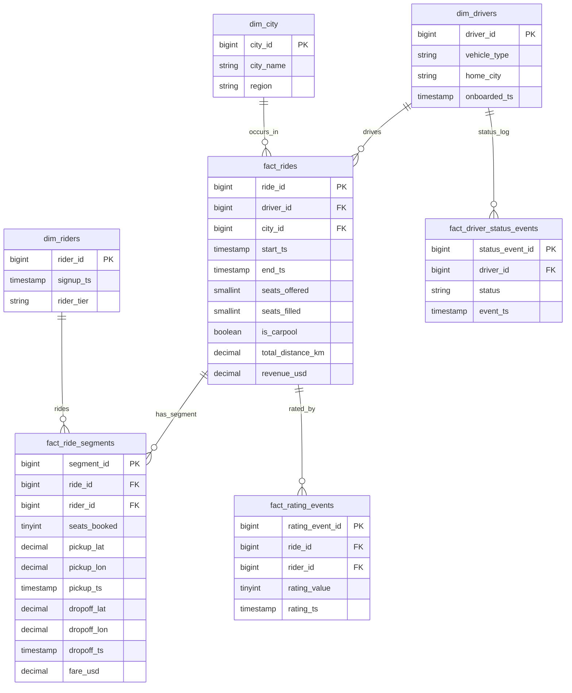

# Solution to Question 1: Rideshare Schema Data Model

## Question

How should the data model be designed to support carpool rides where a single ride (ride_id) can involve multiple passengers picked up and dropped off at potentially different locations and times within the same driver's trip? Discuss trade-offs.

## Solution

The data model provided is a well-designed star schema for rideshare data with specific support for carpooling, where multiple passengers can share a single ride. Let me explain the key aspects and trade-offs:

### Core Structure

The model uses two fact tables with a one-to-many relationship:

1. **fact_rides**: Represents the overall trip taken by the driver with a single record per ride.
   - Contains driver-level metrics (total_fare, total_distance, total_duration)
   - Links to driver information, vehicle, overall start/end locations, and time dimensions
   - Each record has a unique ride_id

2. **fact_ride_segments**: Represents individual passenger journeys within a carpool ride.
   - Multiple segments can belong to a single ride_id (one-to-many relationship)
   - Each segment has its own pickup/dropoff locations and timestamps
   - Tracks segment-specific metrics (segment_fare, segment_distance)
   - Includes pickup_sequence_in_ride and dropoff_sequence_in_ride to track ordering

### Dimension Tables

- **dim_users**: Contains both riders and drivers (user_type can distinguish between them)
- **dim_location**: Stores all location information (both ride and segment levels)
- **dim_ride_type**: Identifies the type of ride (e.g., 'Carpool', 'Regular')
- **dim_vehicle**, **dim_date**, **dim_time**: Standard dimensions for analytics

### Benefits of This Approach

1. **Proper Normalization**: The separation of fact_rides and fact_ride_segments follows database normalization principles, avoiding data redundancy.

2. **Analytical Flexibility**: This model allows for analyzing both overall ride metrics and individual passenger experiences.

3. **Query Efficiency**: 
   - Easy to query "how many people shared a ride" (count segments per ride_id)
   - Simple to analyze individual passenger behavior (via fact_ride_segments)
   - Enables driver-focused queries (via fact_rides)

4. **Temporal Analysis**: The segment timestamps allow for analyzing pickup/dropoff patterns within carpool rides.

5. **Scalability**: The model handles any number of passengers in a carpool without structural changes.

### Trade-offs and Considerations

1. **Query Complexity**: Some analyses require joining both fact tables, which can add complexity and potentially impact performance for very large datasets.

2. **Storage Efficiency vs. Query Performance**: 
   - This normalized structure uses less storage but may require more joins for certain queries
   - A denormalized approach (e.g., arrays of passenger details in fact_rides) would use more storage but potentially simplify some queries

3. **Alternative Approach - JSON/Array Fields**:
   - Some databases support JSON or array fields that could store passenger details directly in fact_rides
   - While this might simplify some queries, it would:
     - Make it harder to query or index individual passenger segment details
     - Limit standard SQL operations on passenger data
     - Potentially create update anomalies
     - Reduce analytical flexibility

4. **Sequence Fields vs. Timestamps**:
   - The model includes both explicit sequence fields (pickup_sequence_in_ride) and timestamps
   - This redundancy adds clarity but requires maintaining consistency between these fields

5. **Foreign Key Structure**:
   - Direct link between fact_ride_segments and dim_users (rider_user_key) makes rider queries simple
   - Alternative would be a bridge table for rider-segment relationships, which would add flexibility for multiple riders per segment but at the cost of more complexity

### Implementation in Mermaid Syntax



### Conclusion

This data model represents a standard star schema approach with a bridge table (fact_ride_segments) to handle the many-to-many relationship between rides and riders. The model effectively balances analytical flexibility with reasonable query performance. 

While alternative approaches using arrays or JSON could reduce joins for some queries, they would significantly limit analytical capabilities. For a data warehouse supporting business intelligence and analytics, this normalized approach is generally superior, especially as data volumes grow. 

```mermaid
erDiagram
    %%================ Dimensions =================
    dim_drivers {
        bigint driver_id PK
        string vehicle_type
        string home_city
        timestamp onboarded_ts
    }

    dim_riders {
        bigint rider_id PK
        timestamp signup_ts
        string rider_tier
    }

    dim_city {
        bigint city_id PK
        string city_name
        string region
    }

    %%================ Parent fact ================
    fact_rides {
        bigint  ride_id PK
        bigint  driver_id FK
        bigint  city_id   FK
        timestamp start_ts
        timestamp end_ts
        smallint seats_offered
        smallint seats_filled
        boolean  is_carpool
        decimal  total_distance_km
        decimal  revenue_usd
    }

    %%================ Child fact (segment) =======
    fact_ride_segments {
        bigint  segment_id PK
        bigint  ride_id    FK
        bigint  rider_id   FK
        tinyint seats_booked
        decimal pickup_lat
        decimal pickup_lon
        timestamp pickup_ts
        decimal dropoff_lat
        decimal dropoff_lon
        timestamp dropoff_ts
        decimal fare_usd
    }

    %%================ Mutable event logs =========
    fact_driver_status_events {
        bigint status_event_id PK
        bigint driver_id FK
        string status
        timestamp event_ts
    }

    fact_rating_events {
        bigint rating_event_id PK
        bigint ride_id   FK
        bigint rider_id  FK
        tinyint rating_value
        timestamp rating_ts
    }

    %%================ Relationships ==============
    dim_drivers ||--o{ fact_rides              : drives
    dim_city    ||--o{ fact_rides              : occurs_in
    fact_rides  ||--o{ fact_ride_segments      : has_segment
    dim_riders  ||--o{ fact_ride_segments      : rides
    dim_drivers ||--o{ fact_driver_status_events : status_log
    fact_rides  ||--o{ fact_rating_events      : rated_by