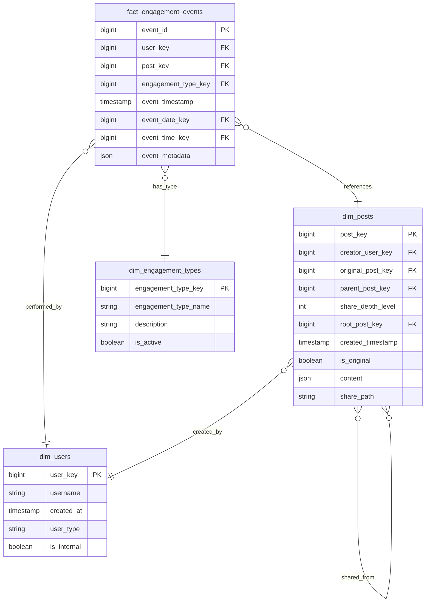

# Solution to Question 2.2.1: Engagement Events Model

## Question

Design a data model for engagement events (like, comment, share, view) that can efficiently handle posts shared potentially thousands or millions of times, across multiple layers (User A shares Post P -> User B shares A's share -> User C shares B's share, etc.). The model must support efficiently counting total shares per original post and identifying the original poster and post time.

## Solution

### Core Structure

I propose a data model that efficiently handles viral content sharing while maintaining share chain relationships. The model consists of these core tables:

1. **fact_engagement_events**: The central fact table tracking all user engagement
2. **dim_posts**: Dimension containing all posts (both original and shared)
3. **dim_users**: User information
4. **dim_engagement_types**: Types of engagement actions

### Table Definitions



### Key Design Features

1. **Share Chain Tracking**:
   - **original_post_key**: References the original root post
   - **parent_post_key**: Direct parent in the share chain (who you shared from)
   - **share_depth_level**: Integer indicating how deep in the share chain (0 for originals)
   - **share_path**: Stores the full path of post keys in the sharing chain (e.g., "1/5/12/45")

2. **Efficient Aggregations**:
   - The model allows for efficient counting of total engagement events by post
   - Can easily identify the original post for any share using original_post_key
   - Supports hierarchy queries through the share_path field

3. **Metadata Flexibility**:
   - JSON fields allow storing additional metadata without schema changes
   - Different engagement types can store different attributes

### Data Access Patterns

1. **Total Shares for Original Post**:
   ```sql
   SELECT COUNT(*)
   FROM dim_posts
   WHERE original_post_key = [target_post_key]
   AND is_original = false;
   ```

2. **Viral Share Chain Analysis**:
   ```sql
   SELECT share_depth_level, COUNT(*) as shares_at_level
   FROM dim_posts
   WHERE original_post_key = [target_post_key]
   GROUP BY share_depth_level
   ORDER BY share_depth_level;
   ```

3. **Finding the Share Path**:
   ```sql
   SELECT share_path
   FROM dim_posts
   WHERE post_key = [shared_post_key];
   ```

### Trade-offs and Considerations

1. **Storage vs. Query Performance**:
   - Storing redundant information (original_post_key, share_depth_level) uses more storage but dramatically improves query performance
   - Denormalized approach avoids expensive recursive CTEs or multiple self-joins

2. **Alternative Approaches**:
   - **Adjacency List Model**: Simple parent-child relationships without redundant fields would save space but require recursive queries
   - **Materialized Path**: The share_path field uses this pattern for efficient hierarchy traversal
   - **Graph Database**: For extremely viral content, a specialized graph database might be more suitable

3. **Scalability Considerations**:
   - Partitioning fact_engagement_events by date reduces query time for recent data
   - Indexing on original_post_key accelerates viral content analysis
   - For extreme scale, summary tables by time periods could further optimize

4. **Event Processing**:
   - When a post is shared, both original_post_key and parent_post_key must be correctly propagated
   - The share_path can be constructed by appending the new post_key to the parent's path

### Implementation Notes

1. **Indexing Strategy**:
   - Index fact_engagement_events on (post_key, engagement_type_key)
   - Index dim_posts on original_post_key, parent_post_key, and share_path
   - Consider partial indexes for is_original=false posts for share analysis

2. **Additional Dimensions**:
   - dim_date and dim_time support time-based analysis
   - dim_platform could track which platform the engagement occurred on
   - dim_content_type could categorize post content (video, image, etc.)

This model provides an excellent balance of storage efficiency and query performance while accommodating the viral nature of shared content. The materialized path approach allows for both upward and downward traversal of the share hierarchy without requiring expensive recursive queries. 