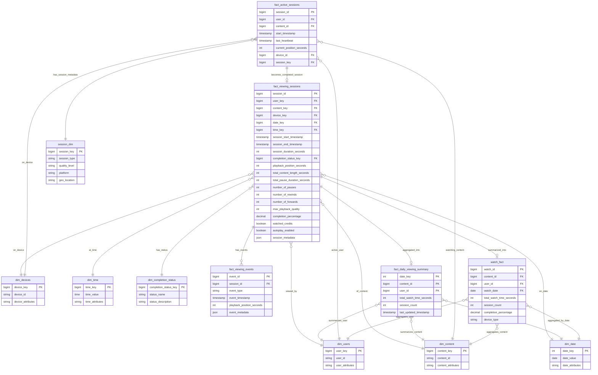

# Solution to Question 3.2.1: Viewing Sessions Table

## Question

Design the fact_viewing_sessions table. What are its key measures and foreign keys? How would you handle tracking view duration, pauses, and completion status?

## Solution

### Core Structure

For a streaming platform like Netflix or Hulu, the `fact_viewing_sessions` table is central to understanding user engagement and content performance. This table records each discrete viewing session of content, capturing detailed metrics about how users interact with videos.

### Table Schema



### Key Measures (Facts)

1. **Duration Metrics**:
   - `session_duration_seconds`: Total time the viewing session lasted
   - `total_content_length_seconds`: Full length of the content
   - `playback_position_seconds`: Where the user stopped watching
   - `completion_percentage`: Calculated as playback_position/total_length
   - `total_pause_duration_seconds`: Cumulative time spent paused

2. **Engagement Metrics**:
   - `number_of_pauses`: How often the user paused
   - `number_of_rewinds`: How often the user rewound
   - `number_of_forwards`: How often the user fast-forwarded
   - `watched_credits`: Whether the user watched the end credits

3. **Technical Metrics**:
   - `max_playback_quality`: Highest quality level achieved (e.g., 4K, HD)
   - `autoplay_enabled`: Whether autoplay was enabled during the session

### Foreign Keys (Dimensions)

1. **Core Dimensions**:
   - `user_key`: References dim_users (who watched)
   - `content_key`: References dim_content (what was watched)
   - `device_key`: References dim_devices (how it was watched)
   - `date_key`, `time_key`: References dim_date and dim_time (when it was watched)

2. **Status Dimensions**:
   - `completion_status_key`: References dim_completion_status (e.g., completed, abandoned)

### Handling Specific Requirements

1. **Tracking View Duration**:
   - `session_duration_seconds` captures total viewing time
   - `session_start_timestamp` and `session_end_timestamp` provide absolute time references
   - For aggregate analysis, pre-calculated `completion_percentage` simplifies queries

2. **Handling Pauses**:
   - `total_pause_duration_seconds` captures cumulative pause time
   - `number_of_pauses` tracks pause frequency
   - For detailed pause analysis, each pause is also recorded in fact_viewing_events

3. **Tracking Completion Status**:
   - `completion_status_key` links to a dimension with standardized status values
   - `playback_position_seconds` provides the exact stopping point
   - `completion_percentage` offers a normalized measure across content of different lengths

### Detailed Event Tracking

For granular analysis, the companion table `fact_viewing_events` records every event:

```
fact_viewing_events {
    event_id PK
    session_id FK (links to fact_viewing_sessions)
    event_type (play, pause, seek, quality_change, etc.)
    event_timestamp
    playback_position_seconds
    event_metadata (JSON)
}
```

This allows detailed reconstruction of the viewing session when needed, while keeping the main fact table optimized for aggregate queries.

### Trade-offs and Considerations

1. **Granularity vs. Storage**:
   - This model balances summary metrics in fact_viewing_sessions with detailed events in fact_viewing_events
   - For extremely high-volume platforms, consider further partitioning by time periods

2. **Alternative Approaches**:
   - **Event-only Model**: Store only events and calculate all metrics at query time (more storage-efficient but higher query costs)
   - **Heavily Denormalized**: Pre-calculate more metrics (faster queries but more storage and less flexibility)
   - **Hybrid Time-series**: Use specialized time-series databases for event data and maintain summary facts in a traditional warehouse

3. **Handling Long-running Series**:
   - For episodic content, link to both the specific episode (content_key) and the series (series_key)
   - Add series completion metrics for binge-watching analysis

### Implementation Notes

1. **Indexing Strategy**:
   - Create indexes on commonly filtered dimensions (user_key, content_key, date_key)
   - Consider partial indexes for recent data to optimize current viewing analysis

2. **Processing Logic**:
   - When sessions are active, maintain state in a session store
   - On session end, calculate summary metrics and insert into fact_viewing_sessions
   - For abandoned sessions (app closed unexpectedly), use a timeout mechanism to close sessions

3. **Analytical Queries**:
   ```sql
   -- Content popularity by completion percentage
   SELECT c.content_name, 
          AVG(vs.completion_percentage) as avg_completion,
          COUNT(*) as session_count
   FROM fact_viewing_sessions vs
   JOIN dim_content c ON vs.content_key = c.content_key
   WHERE vs.date_key BETWEEN [start_date] AND [end_date]
   GROUP BY c.content_name
   ORDER BY avg_completion DESC;
   ```

This design provides a robust foundation for streaming analytics, balancing performance needs with analytical flexibility. The combination of summary metrics and detailed event tracking enables both high-level dashboards and deep-dive analyses. 

---

## Streaming (Netflix) Platform Specific Implementation

### Additional Schema for High-Volume Streaming

For platforms like Netflix with massive scale, consider these additional optimized tables:

```sql
-- Optimized daily snapshot table for incremental updates
CREATE TABLE fact_daily_viewing_summary (
    date_key INT,
    content_id BIGINT,
    user_id BIGINT,
    total_watch_time_seconds INT,
    session_count INT,
    last_updated_timestamp TIMESTAMP,
    PRIMARY KEY (date_key, content_id, user_id)
) PARTITION BY date_key;

-- Current active sessions table for real-time tracking
CREATE TABLE fact_active_sessions (
    session_id BIGINT PRIMARY KEY,
    user_id BIGINT,
    content_id BIGINT,
    start_timestamp TIMESTAMP,
    last_heartbeat TIMESTAMP,
    current_position_seconds INT,
    device_id BIGINT
) PARTITION BY HASH(session_id);

-- Watch fact table for aggregated metrics
CREATE TABLE watch_fact (
    watch_id BIGINT PRIMARY KEY,
    content_id BIGINT,
    user_id BIGINT,
    watch_date DATE,
    total_watch_time_seconds INT,
    session_count INT,
    completion_percentage DECIMAL(5,2),
    device_type VARCHAR(50),
    INDEX idx_content_date (content_id, watch_date),
    INDEX idx_user_date (user_id, watch_date)
) PARTITION BY watch_date;

-- Session dimension table for metadata
CREATE TABLE session_dim (
    session_key BIGINT PRIMARY KEY,
    session_type VARCHAR(50),
    quality_level VARCHAR(20),
    platform VARCHAR(50),
    geo_location VARCHAR(100)
);
```

### SQL Optimization Requirements

#### 1. Incremental Snapshot Merge (No Full Table Scan)

```sql
-- Merge today's viewing data with existing summary table
-- Requirements: 1. No full table scan, 2. Use SELECT syntax

WITH todays_sessions AS (
    SELECT 
        DATE(session_start_timestamp) as view_date,
        content_key as content_id,
        user_key as user_id,
        SUM(session_duration_seconds) as daily_watch_time,
        COUNT(*) as daily_session_count
    FROM fact_viewing_sessions
    WHERE DATE(session_start_timestamp) = CURRENT_DATE
    GROUP BY DATE(session_start_timestamp), content_key, user_key
),
existing_summary AS (
    SELECT 
        view_date,
        content_id,
        user_id,
        total_watch_time_seconds,
        session_count
    FROM fact_daily_viewing_summary
    WHERE view_date = CURRENT_DATE
)
SELECT 
    COALESCE(ts.view_date, es.view_date) as view_date,
    COALESCE(ts.content_id, es.content_id) as content_id,
    COALESCE(ts.user_id, es.user_id) as user_id,
    COALESCE(ts.daily_watch_time, 0) + COALESCE(es.total_watch_time_seconds, 0) as total_watch_time,
    COALESCE(ts.daily_session_count, 0) + COALESCE(es.session_count, 0) as total_sessions,
    CURRENT_TIMESTAMP as last_updated
FROM todays_sessions ts
FULL OUTER JOIN existing_summary es 
    ON ts.content_id = es.content_id 
    AND ts.user_id = es.user_id
    AND ts.view_date = es.view_date;
```

#### 2. Content Performance Analysis (Using Only Fact Table)

```sql
-- Group by content_id: count distinct users, sum total time
-- Using only watch_fact table, optimized with proper indexing

SELECT 
    content_id,
    COUNT(DISTINCT user_id) as unique_viewers,
    SUM(total_watch_time_seconds) as total_viewing_time_seconds,
    AVG(completion_percentage) as avg_completion_rate,
    SUM(session_count) as total_sessions
FROM watch_fact
WHERE watch_date >= CURRENT_DATE - INTERVAL '30 days'
  AND watch_date < CURRENT_DATE
GROUP BY content_id
HAVING COUNT(DISTINCT user_id) >= 100  -- Filter for content with meaningful viewership
ORDER BY total_viewing_time_seconds DESC
LIMIT 1000;

-- Optimized version with date partitioning hint
SELECT /*+ USE_INDEX(watch_fact, idx_content_date) */
    content_id,
    COUNT(DISTINCT user_id) as unique_viewers,
    SUM(total_watch_time_seconds) as total_viewing_time_seconds,
    ROUND(AVG(completion_percentage), 2) as avg_completion_rate
FROM watch_fact
WHERE watch_date BETWEEN DATE_SUB(CURRENT_DATE, INTERVAL 30 DAY) AND CURRENT_DATE
GROUP BY content_id
ORDER BY unique_viewers DESC, total_viewing_time_seconds DESC;
```

### Python Implementation Considerations

#### 1. Real-time Session Processing

```python
# Placeholder for Python implementation considerations:

"""
Key Python Components for Streaming Analytics:

1. Session State Management:
   - Redis/Memcached for active session tracking
   - Async processing for session events
   - Batch processing for session closure

2. Data Pipeline Architecture:
   - Apache Kafka for event streaming
   - Apache Spark for large-scale aggregations
   - Pandas/Polars for analytical processing

3. Performance Optimizations:
   - Connection pooling for database operations
   - Async/await patterns for I/O operations
   - Caching strategies for frequently accessed data

4. Monitoring and Alerting:
   - Real-time metrics dashboards
   - Anomaly detection for viewing patterns
   - Performance monitoring for query optimization
"""
```

### Performance Optimization Notes

1. **Partitioning Strategy**:
   - Partition `watch_fact` by `watch_date` for efficient date range queries
   - Use hash partitioning on `session_id` for active sessions

2. **Indexing Strategy**:
   - Composite indexes on `(content_id, watch_date)` and `(user_id, watch_date)`
   - Covering indexes for frequently accessed columns

3. **Query Optimization**:
   - Use partition pruning for date-based queries
   - Implement query result caching for popular content metrics
   - Consider materialized views for complex aggregations

4. **Scalability Considerations**:
   - Implement horizontal sharding for user-based queries
   - Use read replicas for analytical workloads
   - Consider columnar storage for analytical queries
</rewritten_file> 