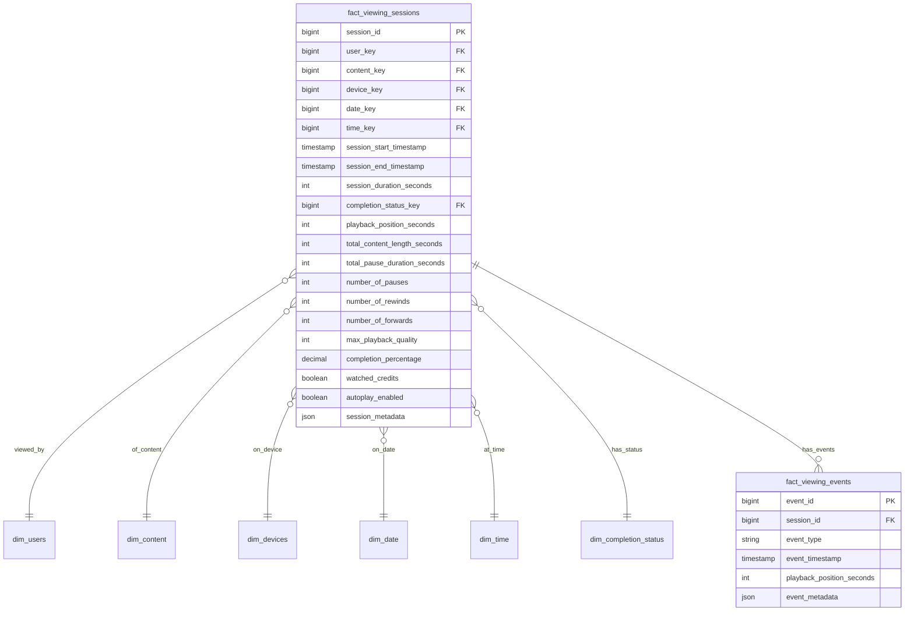

# Solution to Question 3.2.1: Viewing Sessions Table

## Question

Design the fact_viewing_sessions table. What are its key measures and foreign keys? How would you handle tracking view duration, pauses, and completion status?

## Solution

### Core Structure

For a streaming platform like Netflix or Hulu, the `fact_viewing_sessions` table is central to understanding user engagement and content performance. This table records each discrete viewing session of content, capturing detailed metrics about how users interact with videos.

### Table Schema



### Key Measures (Facts)

1. **Duration Metrics**:
   - `session_duration_seconds`: Total time the viewing session lasted
   - `total_content_length_seconds`: Full length of the content
   - `playback_position_seconds`: Where the user stopped watching
   - `completion_percentage`: Calculated as playback_position/total_length
   - `total_pause_duration_seconds`: Cumulative time spent paused

2. **Engagement Metrics**:
   - `number_of_pauses`: How often the user paused
   - `number_of_rewinds`: How often the user rewound
   - `number_of_forwards`: How often the user fast-forwarded
   - `watched_credits`: Whether the user watched the end credits

3. **Technical Metrics**:
   - `max_playback_quality`: Highest quality level achieved (e.g., 4K, HD)
   - `autoplay_enabled`: Whether autoplay was enabled during the session

### Foreign Keys (Dimensions)

1. **Core Dimensions**:
   - `user_key`: References dim_users (who watched)
   - `content_key`: References dim_content (what was watched)
   - `device_key`: References dim_devices (how it was watched)
   - `date_key`, `time_key`: References dim_date and dim_time (when it was watched)

2. **Status Dimensions**:
   - `completion_status_key`: References dim_completion_status (e.g., completed, abandoned)

### Handling Specific Requirements

1. **Tracking View Duration**:
   - `session_duration_seconds` captures total viewing time
   - `session_start_timestamp` and `session_end_timestamp` provide absolute time references
   - For aggregate analysis, pre-calculated `completion_percentage` simplifies queries

2. **Handling Pauses**:
   - `total_pause_duration_seconds` captures cumulative pause time
   - `number_of_pauses` tracks pause frequency
   - For detailed pause analysis, each pause is also recorded in fact_viewing_events

3. **Tracking Completion Status**:
   - `completion_status_key` links to a dimension with standardized status values
   - `playback_position_seconds` provides the exact stopping point
   - `completion_percentage` offers a normalized measure across content of different lengths

### Detailed Event Tracking

For granular analysis, the companion table `fact_viewing_events` records every event:

```
fact_viewing_events {
    event_id PK
    session_id FK (links to fact_viewing_sessions)
    event_type (play, pause, seek, quality_change, etc.)
    event_timestamp
    playback_position_seconds
    event_metadata (JSON)
}
```

This allows detailed reconstruction of the viewing session when needed, while keeping the main fact table optimized for aggregate queries.

### Trade-offs and Considerations

1. **Granularity vs. Storage**:
   - This model balances summary metrics in fact_viewing_sessions with detailed events in fact_viewing_events
   - For extremely high-volume platforms, consider further partitioning by time periods

2. **Alternative Approaches**:
   - **Event-only Model**: Store only events and calculate all metrics at query time (more storage-efficient but higher query costs)
   - **Heavily Denormalized**: Pre-calculate more metrics (faster queries but more storage and less flexibility)
   - **Hybrid Time-series**: Use specialized time-series databases for event data and maintain summary facts in a traditional warehouse

3. **Handling Long-running Series**:
   - For episodic content, link to both the specific episode (content_key) and the series (series_key)
   - Add series completion metrics for binge-watching analysis

### Implementation Notes

1. **Indexing Strategy**:
   - Create indexes on commonly filtered dimensions (user_key, content_key, date_key)
   - Consider partial indexes for recent data to optimize current viewing analysis

2. **Processing Logic**:
   - When sessions are active, maintain state in a session store
   - On session end, calculate summary metrics and insert into fact_viewing_sessions
   - For abandoned sessions (app closed unexpectedly), use a timeout mechanism to close sessions

3. **Analytical Queries**:
   ```sql
   -- Content popularity by completion percentage
   SELECT c.content_name, 
          AVG(vs.completion_percentage) as avg_completion,
          COUNT(*) as session_count
   FROM fact_viewing_sessions vs
   JOIN dim_content c ON vs.content_key = c.content_key
   WHERE vs.date_key BETWEEN [start_date] AND [end_date]
   GROUP BY c.content_name
   ORDER BY avg_completion DESC;
   ```

This design provides a robust foundation for streaming analytics, balancing performance needs with analytical flexibility. The combination of summary metrics and detailed event tracking enables both high-level dashboards and deep-dive analyses. 