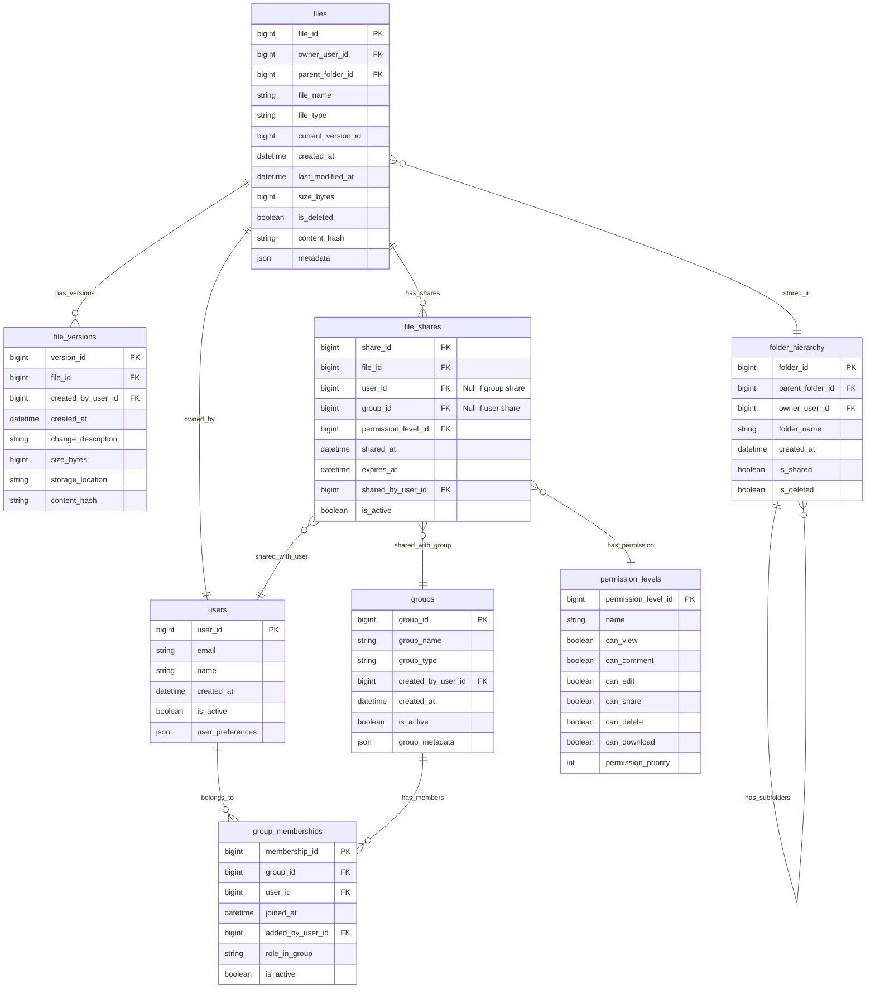

# Solution to Question 4.2.1: File Sharing Model

## Question

Design a data model for a file sharing system that supports different permission levels (view, comment, edit) and both individual and group-based sharing. The model should efficiently support queries like "show all files shared with me" and "who has access to this file?"

## Solution

### Core Structure

For a cloud file storage system like Dropbox or Google Drive, an effective file sharing data model must balance flexibility with query performance. The model below provides a comprehensive approach to managing permissions at both individual and group levels.

### Table Definitions



### Key Design Features

1. **Flexible Permission Model**:
   - `permission_levels` table defines standardized permission sets
   - Granular permissions (view, comment, edit, share, delete, download)
   - Permission priority allows resolving conflicts when multiple permissions apply

2. **Dual Sharing Mechanisms**:
   - `file_shares` supports both user-based and group-based sharing
   - Nullable foreign keys (`user_id` OR `group_id`) allow distinguishing share types
   - `is_active` flag enables quick revocation without deleting records

3. **Folder Hierarchy**:
   - Self-referencing `folder_hierarchy` table tracks parent-child relationships
   - Files reference their containing folder with `parent_folder_id`
   - Enables permission inheritance from parent folders

4. **Versioning Support**:
   - `file_versions` tracks all versions of each file
   - `current_version_id` in the files table points to the latest version
   - Each version has its own storage metadata and content hash

### Query Patterns

1. **"Files Shared With Me" Query**:
   ```sql
   -- Direct shares to user
   SELECT f.*
   FROM files f
   JOIN file_shares fs ON f.file_id = fs.file_id
   WHERE fs.user_id = [current_user_id]
   AND fs.is_active = true
   AND (fs.expires_at IS NULL OR fs.expires_at > CURRENT_TIMESTAMP)
   
   UNION
   
   -- Shares via group membership
   SELECT f.*
   FROM files f
   JOIN file_shares fs ON f.file_id = fs.file_id
   JOIN group_memberships gm ON fs.group_id = gm.group_id
   WHERE gm.user_id = [current_user_id]
   AND fs.is_active = true
   AND gm.is_active = true
   AND (fs.expires_at IS NULL OR fs.expires_at > CURRENT_TIMESTAMP);
   ```

2. **"Who Has Access to This File" Query**:
   ```sql
   -- Direct user access
   SELECT u.user_id, u.name, u.email, pl.name as permission_level,
          'direct' as access_type
   FROM users u
   JOIN file_shares fs ON u.user_id = fs.user_id
   JOIN permission_levels pl ON fs.permission_level_id = pl.permission_level_id
   WHERE fs.file_id = [target_file_id]
   AND fs.is_active = true
   
   UNION
   
   -- Group-based access
   SELECT u.user_id, u.name, u.email, pl.name as permission_level,
          g.group_name as access_via_group
   FROM users u
   JOIN group_memberships gm ON u.user_id = gm.user_id
   JOIN groups g ON gm.group_id = g.group_id
   JOIN file_shares fs ON g.group_id = fs.group_id
   JOIN permission_levels pl ON fs.permission_level_id = pl.permission_level_id
   WHERE fs.file_id = [target_file_id]
   AND fs.is_active = true
   AND gm.is_active = true;
   ```

### Trade-offs and Considerations

1. **Performance vs. Flexibility**:
   - This model handles both individual and group permissions with good query efficiency
   - For very large systems, additional indexes or denormalization may be needed
   - Consider materialized views for common access patterns in high-scale systems

2. **Alternative Approaches**:
   - **ACL-Based Model**: Simpler but less flexible than the permission levels approach
   - **Role-Based Access Control**: Could add a roles table for more complex organizational structures
   - **Inheritance-Only Model**: Relying entirely on folder permissions would be simpler but less flexible

3. **Scalability Considerations**:
   - For large organizations with many groups, the group-based sharing queries may become expensive
   - Consider adding a denormalized `effective_permissions` table that is updated through triggers or batch processes
   - Partition large tables by creation date or owner to improve query performance

4. **Handling Folder Permissions**:
   - This model allows shares at both file and folder levels
   - When determining effective permissions, both must be considered
   - Effective permission is typically the highest permission level from all applicable shares

### Implementation Notes

1. **Indexing Strategy**:
   - Create composite indexes on file_shares (file_id, user_id, is_active)
   - Index group_memberships on (user_id, is_active)
   - Index files on parent_folder_id to optimize folder browsing

2. **Data Integrity**:
   - Ensure only one of user_id OR group_id is set in file_shares (check constraint)
   - Cascade deletes carefully to avoid orphaned records
   - Consider soft deletes throughout for audit history

3. **Security Considerations**:
   - Always verify permissions at the application layer before operations
   - Consider storing a denormalized "last_accessed" timestamp for security monitoring
   - Maintain an access log table for sensitive files

This model provides a robust foundation for cloud file storage systems with sophisticated sharing requirements. It balances normalized design for flexibility with strategic denormalization for query performance. 