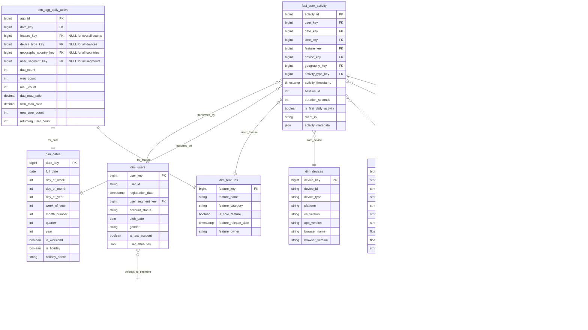

# Solution to Question 5.2.1: User Activity Tracking

## Question

Design a data model to efficiently support DAU, WAU, and MAU calculations across different product features, allowing slicing by user demographics, device types, and geographic regions.

## Solution

### Core Structure

Analyzing Daily Active Users (DAU), Weekly Active Users (WAU), and Monthly Active Users (MAU) requires a data model that balances granular data collection with efficient aggregation. The model below is optimized for high-volume user activity tracking with multi-dimensional analysis capabilities.

### Table Definitions



### Key Design Aspects

1. **Granular Activity Recording**:
   - `fact_user_activity` captures individual user activities with a rich set of dimensions
   - `is_first_daily_activity` flag allows easy counting of unique users per day
   - Activities link to standardized dimensions for consistent analysis

2. **Dimensional Model**:
   - User dimensions include demographic attributes and segmentation
   - Geographic dimensions support region, country, and city-level analysis
   - Feature dimensions allow product-specific analysis
   - Device dimensions enable platform and version analysis

3. **Pre-Aggregation Strategy**:
   - `dim_agg_daily_active` contains pre-calculated DAU, WAU, MAU metrics
   - Aggregations at different granularity levels through nullable dimension keys
   - Daily refresh process updates these aggregations for efficient querying

4. **Flexible Detail Storage**:
   - `fact_activity_details` can store variable, feature-specific data points
   - JSON fields in multiple tables accommodate evolving data requirements

### Analytical Queries

1. **Basic DAU Calculation (from raw data)**:
   ```sql
   -- DAU by feature for a specific date
   SELECT f.feature_name, COUNT(DISTINCT ua.user_key) as dau
   FROM fact_user_activity ua
   JOIN dim_features f ON ua.feature_key = f.feature_key
   JOIN dim_dates d ON ua.date_key = d.date_key
   WHERE d.full_date = '2023-07-15'
   GROUP BY f.feature_name
   ORDER BY dau DESC;
   ```

2. **DAU/MAU Ratio for Product Stickiness**:
   ```sql
   -- Using pre-aggregated data
   SELECT f.feature_name, 
          AVG(agg.dau_mau_ratio) as avg_stickiness,
          MAX(agg.dau_mau_ratio) as max_stickiness,
          MIN(agg.dau_mau_ratio) as min_stickiness
   FROM dim_agg_daily_active agg
   JOIN dim_features f ON agg.feature_key = f.feature_key
   JOIN dim_dates d ON agg.date_key = d.date_key
   WHERE d.full_date BETWEEN '2023-07-01' AND '2023-07-31'
   GROUP BY f.feature_name
   ORDER BY avg_stickiness DESC;
   ```

3. **Demographic Breakdown of MAU**:
   ```sql
   -- MAU by user segment and geography
   SELECT us.segment_name, g.country_name, COUNT(DISTINCT ua.user_key) as mau
   FROM fact_user_activity ua
   JOIN dim_users u ON ua.user_key = u.user_key
   JOIN dim_user_segments us ON u.user_segment_key = us.user_segment_key
   JOIN dim_geographies g ON ua.geography_key = g.geography_key
   JOIN dim_dates d ON ua.date_key = d.date_key
   WHERE d.full_date BETWEEN CURRENT_DATE - INTERVAL '30 days' AND CURRENT_DATE
   GROUP BY us.segment_name, g.country_name
   ORDER BY mau DESC;
   ```

### Implementation Considerations

1. **Data Collection**:
   - Event tracking should be implemented client-side (web/mobile) to capture all user interactions
   - Server-side logging as a backup to ensure data completeness
   - Batch processing for fact_user_activity updates

2. **Aggregation Pipeline**:
   - Daily ETL process to update dim_agg_daily_active table
   - Consider materialized views for complex intermediate aggregations
   - Schedule updates during low-traffic periods

3. **Storage Optimization**:
   - Partition fact_user_activity by date for efficient pruning
   - Consider columnar storage for analytical workloads
   - Apply compression on high-cardinality string columns

### Trade-offs and Alternatives

1. **Real-time vs. Batch Processing**:
   - This model favors batch processing for reliable aggregation
   - For real-time dashboards, consider a dual-pipeline approach with streaming analytics

2. **Storage vs. Computation**:
   - The pre-aggregation strategy trades storage for query performance
   - For extremely large datasets, consider:
     - More aggressive pre-aggregation
     - Time-based partitioning and archiving
     - Sampling for approximate query processing

3. **Alternative Architectures**:
   - **Event Streaming Architecture**: Using Kafka/Kinesis with real-time analytics
   - **Data Lake Approach**: Storing raw events in a data lake with a computation layer
   - **Specialized Time-Series Database**: For extremely high-volume activity data

### Scalability Considerations

1. **High-Cardinality Dimensions**:
   - Geographic data can be hierarchical (continent → country → region → city)
   - Consider multi-level aggregations for geographic analysis
   - Create separate summary tables for common high-cardinality queries

2. **Long-Term Historical Analysis**:
   - Store detailed data for recent periods (1-3 months)
   - Aggregate historical data at higher granularity (week/month level)
   - Consider asynchronous query processing for long historical ranges

3. **Test User Filtering**:
   - Use `is_test_account` flag in dim_users to exclude test data
   - Create separate test/production aggregation paths
   - Consider separate test data storage for large-scale systems

This model provides a robust foundation for DAU/WAU/MAU analysis with the flexibility to slice by multiple dimensions while optimizing query performance through strategic pre-aggregation. 