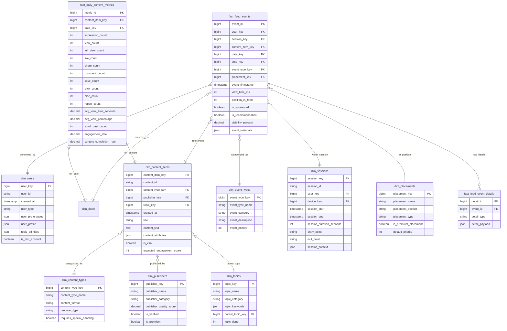

# Solution to Question 6.2.1: Feed Events Logging

## Question

Design a data model for logging user interactions with a news feed, including impressions, views, scrolls, and engagement events. The model should support analyzing content performance and personalizing the feed algorithm.

## Solution

### Core Structure

A comprehensive data model for a news feed must efficiently track multiple event types at high volume while supporting both content performance analytics and personalization algorithms. The proposed model focuses on granular event collection with strategic aggregation points.

### Table Definitions



### Key Design Features

1. **Comprehensive Event Tracking**:
   - `fact_feed_events` captures all user interactions with the feed
   - Covers impressions, views, scrolls, likes, shares, comments, etc.
   - Records both position and visibility information for viewability analysis
   - Tracks whether content was sponsored or algorithmically recommended

2. **Content Performance Metrics**:
   - `fact_daily_content_metrics` pre-aggregates key performance metrics by content item
   - Includes engagement metrics (likes, shares, comments) and view metrics
   - Calculates derived metrics like engagement rates and completion rates
   - Daily aggregation balances analytical flexibility with query performance

3. **Rich Dimensional Context**:
   - User dimension includes preference and profile information for personalization
   - Content dimensions capture publisher, topic, and type attributes
   - Topic dimension supports hierarchical relationships (parent_topic_key)
   - Session dimension provides context for sequential analysis

4. **Flexible Detail Storage**:
   - `fact_feed_event_details` allows storing variable event-specific data
   - JSON fields throughout the model accommodate evolving requirements
   - `event_metadata` captures client-specific context (device, network, etc.)

### Analytical Scenarios

1. **Content Performance Analysis**:
   ```sql
   -- Best performing content by topic
   SELECT t.topic_name, c.title, 
          dm.impression_count,
          dm.engagement_rate,
          dm.avg_view_time_seconds
   FROM fact_daily_content_metrics dm
   JOIN dim_content_items c ON dm.content_item_key = c.content_item_key
   JOIN dim_topics t ON c.topic_key = t.topic_key
   JOIN dim_dates d ON dm.date_key = d.date_key
   WHERE d.full_date BETWEEN '2023-07-01' AND '2023-07-31'
   ORDER BY dm.engagement_rate DESC
   LIMIT 100;
   ```

2. **Feed Position Analysis**:
   ```sql
   -- Engagement rate by feed position
   SELECT fe.position_in_feed,
          COUNT(*) as impressions,
          SUM(CASE WHEN et.event_category = 'engagement' THEN 1 ELSE 0 END) as engagements,
          SUM(CASE WHEN et.event_category = 'engagement' THEN 1 ELSE 0 END) * 100.0 / COUNT(*) as engagement_rate
   FROM fact_feed_events fe
   JOIN dim_event_types et ON fe.event_type_key = et.event_type_key
   JOIN dim_dates d ON fe.date_key = d.date_key
   WHERE d.full_date BETWEEN '2023-07-01' AND '2023-07-31'
   AND fe.position_in_feed <= 20
   GROUP BY fe.position_in_feed
   ORDER BY fe.position_in_feed;
   ```

3. **User Personalization Signals**:
   ```sql
   -- Topic affinity by user based on engagement
   SELECT u.user_id, t.topic_name,
          COUNT(*) as interactions,
          SUM(fe.view_time_ms) / 1000.0 as total_view_time_seconds
   FROM fact_feed_events fe
   JOIN dim_users u ON fe.user_key = u.user_key
   JOIN dim_content_items c ON fe.content_item_key = c.content_item_key
   JOIN dim_topics t ON c.topic_key = t.topic_key
   JOIN dim_event_types et ON fe.event_type_key = et.event_type_key
   WHERE et.event_category IN ('view', 'engagement')
   AND fe.event_timestamp >= CURRENT_TIMESTAMP - INTERVAL '30 days'
   GROUP BY u.user_id, t.topic_name
   HAVING COUNT(*) >= 5
   ORDER BY u.user_id, total_view_time_seconds DESC;
   ```

### Implementation Considerations

1. **Data Volume Strategy**:
   - Impression events will dominate volume
   - Consider partitioning fact_feed_events by date
   - Implement time-based retention policies for raw event data
   - Archive older events to cold storage while maintaining aggregates

2. **Real-time Requirements**:
   - Feed personalization requires low-latency access to recent user behavior
   - Consider a dual-path architecture:
     - Stream processing for real-time personalization features
     - Batch processing for comprehensive analytics and aggregation

3. **Sampling Approach**:
   - For very high-volume feeds, consider sampled logging for impression events
   - Always capture 100% of explicit engagement events
   - Use consistent sampling methodology for accurate extrapolation

### Trade-offs and Alternatives

1. **Event Granularity vs. Storage Concerns**:
   - This model captures granular events (impression per item)
   - Alternative: Log feed_view events with arrays of item_ids for lower storage
   - Trade-off: Reduced storage but more complex query patterns

2. **Aggregation Strategies**:
   - Current model uses daily content-level aggregation
   - Alternatives:
     - Real-time counters for viral content detection
     - User-content interaction matrices for recommendation systems
     - Rolling window aggregations for trending content

3. **Schema Evolution**:
   - The model uses JSON fields strategically for flexibility
   - For frequently accessed fields in JSON, consider column promotion
   - Maintain versioning in ETL processes to handle schema changes

### Personalization Support

The model specifically supports feed personalization through:

1. **User Preference Tracking**:
   - Explicit preferences in `user_preferences`
   - Inferred preferences through interaction patterns
   - Topic affinities calculated from engagement data

2. **Content Performance Signals**:
   - Global performance metrics to identify trending content
   - Cohort-specific performance for targeted recommendations
   - Publisher quality scores to weight content sources

3. **Position and Context Analysis**:
   - Feed position tracking to understand optimal placement
   - Session-based analysis for contextual recommendations
   - View time and visibility metrics to weight true engagement

This comprehensive model balances the needs of analytical reporting, algorithm training, and operational support for a modern news feed product. The design allows for efficient querying of common patterns while maintaining the flexibility needed for evolving feed algorithms. 