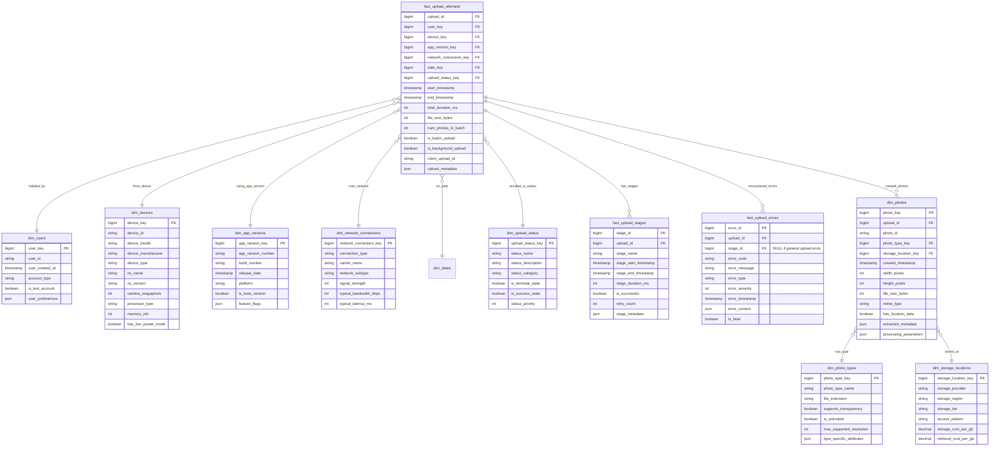

# Solution to Question 7.2.1: Photo Upload Pipeline

## Question

Design a data model to track the photo upload process from initiation to completion, including failure points and metadata extraction. The model should support analyzing upload success rates by device type, network connection, and app version.

## Solution

### Core Structure

An effective data model for tracking photo uploads must capture each stage of the upload process, from initiation to completion, while storing relevant contextual information for performance analysis. The model below is designed to support detailed analytics on upload success rates and diagnostics for failure patterns.

### Table Definitions



### Key Design Features

1. **Upload Lifecycle Tracking**:
   - `fact_upload_attempts` represents the overall upload process
   - `fact_upload_stages` captures each discrete step in the upload pipeline
   - `fact_upload_errors` records detailed error information
   - `dim_upload_status` provides standardized terminal states

2. **Comprehensive Context**:
   - Device details including hardware capabilities
   - Network conditions during upload
   - App version with feature flags
   - Time dimensions for temporal analysis

3. **Photo Metadata Extraction**:
   - `dim_photos` stores metadata extracted during processing
   - Links photos to their originating upload attempts
   - Captures technical details (resolution, size, format)
   - Supports extracted metadata in flexible JSON structure

4. **Error Classification**:
   - Detailed error recording with codes and severity
   - Links errors to specific pipeline stages
   - Categorizes errors for aggregation and analysis

### Analytical Scenarios

1. **Upload Success Rate Analysis**:
   ```sql
   -- Success rate by device type and app version
   SELECT d.device_type, av.app_version_number,
          COUNT(*) as total_attempts,
          SUM(CASE WHEN us.is_success_state THEN 1 ELSE 0 END) as successful_uploads,
          (SUM(CASE WHEN us.is_success_state THEN 1 ELSE 0 END) * 100.0 / COUNT(*)) as success_rate
   FROM fact_upload_attempts ua
   JOIN dim_devices d ON ua.device_key = d.device_key
   JOIN dim_app_versions av ON ua.app_version_key = av.app_version_key
   JOIN dim_upload_status us ON ua.upload_status_key = us.upload_status_key
   JOIN dim_dates dt ON ua.date_key = dt.date_key
   WHERE dt.full_date BETWEEN '2023-07-01' AND '2023-07-31'
   GROUP BY d.device_type, av.app_version_number
   ORDER BY d.device_type, av.app_version_number;
   ```

2. **Failure Analysis by Stage**:
   ```sql
   -- Identify most common failure points in the pipeline
   SELECT us.stage_name,
          COUNT(*) as total_executions,
          SUM(CASE WHEN us.is_successful = false THEN 1 ELSE 0 END) as failures,
          (SUM(CASE WHEN us.is_successful = false THEN 1 ELSE 0 END) * 100.0 / COUNT(*)) as failure_rate,
          AVG(us.stage_duration_ms) as avg_duration_ms
   FROM fact_upload_stages us
   JOIN fact_upload_attempts ua ON us.upload_id = ua.upload_id
   JOIN dim_dates dt ON ua.date_key = dt.date_key
   WHERE dt.full_date BETWEEN '2023-07-01' AND '2023-07-31'
   GROUP BY us.stage_name
   ORDER BY failure_rate DESC;
   ```

3. **Network Impact Analysis**:
   ```sql
   -- Upload success rate by network type and signal strength
   SELECT nc.connection_type,
          CASE
            WHEN nc.signal_strength >= 75 THEN 'Excellent'
            WHEN nc.signal_strength >= 50 THEN 'Good'
            WHEN nc.signal_strength >= 25 THEN 'Fair'
            ELSE 'Poor'
          END as signal_quality,
          COUNT(*) as total_uploads,
          AVG(ua.total_duration_ms) as avg_upload_time_ms,
          (SUM(CASE WHEN us.is_success_state THEN 1 ELSE 0 END) * 100.0 / COUNT(*)) as success_rate
   FROM fact_upload_attempts ua
   JOIN dim_network_connections nc ON ua.network_connection_key = nc.network_connection_key
   JOIN dim_upload_status us ON ua.upload_status_key = us.upload_status_key
   WHERE ua.start_timestamp >= CURRENT_DATE - INTERVAL '30 days'
   GROUP BY nc.connection_type, signal_quality
   ORDER BY nc.connection_type, signal_quality;
   ```

### Implementation Considerations

1. **Data Collection Strategy**:
   - Client-side logging for upload initiation and progress
   - Server-side logging for completion and processing
   - Correlation IDs to link client and server events
   - Background sync for failed upload telemetry

2. **Performance Optimization**:
   - Partition fact tables by date
   - Create indexes on commonly filtered dimensions
   - Consider daily aggregation tables for common metrics
   - Implement retention policies for detailed events

3. **Error Detection and Recovery**:
   - Track retry counts and patterns
   - Identify which upload stages have highest failure rates
   - Support root cause analysis through error_context
   - Flag systematic failures vs. sporadic issues

### Trade-offs and Alternatives

1. **Granularity vs. Volume**:
   - This model captures detailed stage-level information
   - For extremely high volume systems, consider:
     - Sampling approach for common errors
     - Aggregating certain pipeline stages
     - Pre-computing common analytics

2. **Storage Considerations**:
   - JSON fields provide flexibility but at query complexity cost
   - Consider columnar storage for analytical workloads
   - Evaluate cold storage options for historical data

3. **Alternative Approaches**:
   - **Event-Sourcing Model**: Store raw upload events in time-order
   - **Checkpoint Model**: Only record stage transitions
   - **Summary-Only Model**: Focus on final outcomes with minimal detail

### Pipeline Stage Tracking

The model captures these typical stages in the photo upload process:

1. **Client-side Stages**:
   - Capture/Selection: User chooses or takes the photo
   - Preprocessing: Compression, format conversion, EXIF processing
   - Upload Initiation: Beginning the transfer
   - Network Transfer: Actual data transmission
   - Upload Verification: Client-side confirmation

2. **Server-side Stages**:
   - Reception: Initial receipt of the data
   - Validation: Format and content checks
   - Metadata Extraction: EXIF and technical metadata parsing
   - Processing: Transformations, thumbnail generation
   - Storage: Persisting to the storage system
   - Indexing: Adding to search and retrieval systems

Each stage is recorded with timing information, allowing for detailed performance analysis across the entire pipeline.

This comprehensive model provides a robust foundation for monitoring and optimizing photo upload performance, supporting both operational needs (detecting issues) and product improvement (identifying optimization opportunities). 