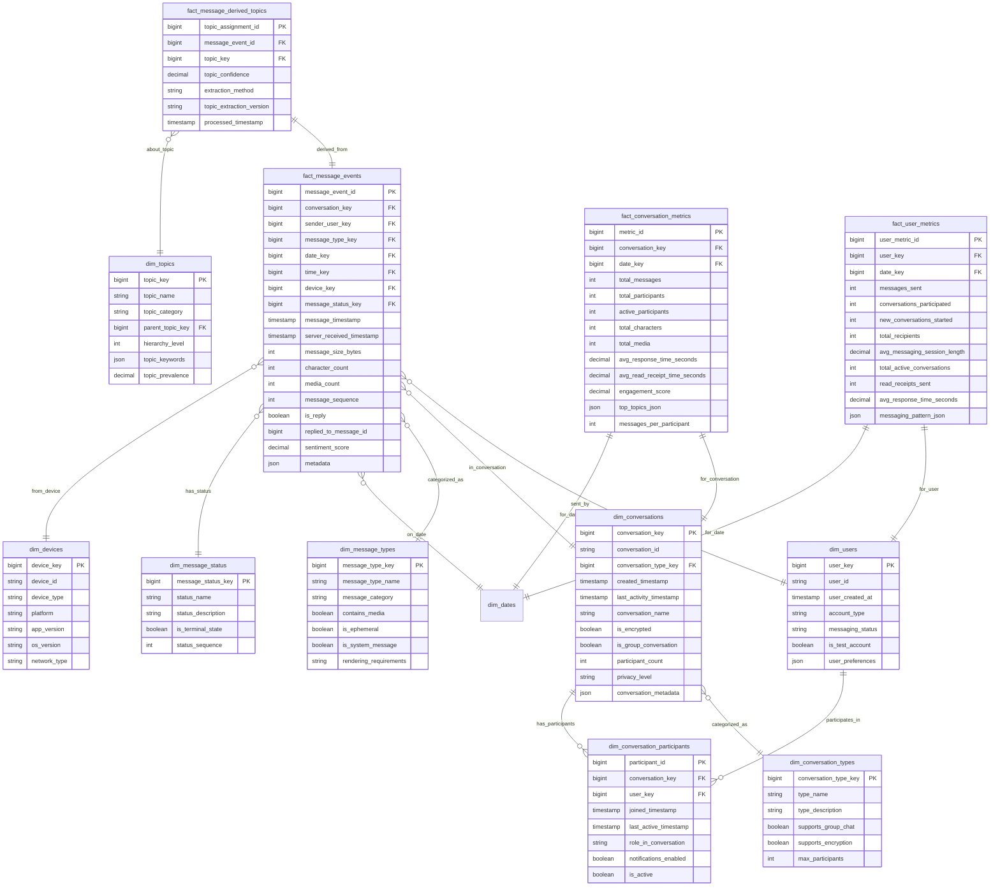

# Solution to Question 8.2.1: Messaging Activity Model

## Question

Design a data model for tracking messaging activity that efficiently supports analytics around user engagement patterns, popular conversation topics, and message delivery performance.

## Solution

### Core Structure

An effective messaging activity data model must balance analytical needs with privacy considerations, collecting meaningful engagement metrics without compromising message content privacy. The model below is optimized for analytical workflows while maintaining appropriate data boundaries.

### Table Definitions



### Key Design Features

1. **Message Event Tracking**:
   - `fact_message_events` captures messaging activity without storing message content
   - Records technical metadata like size, character count, and timestamps
   - Tracks message status through its lifecycle (sent, delivered, read)
   - Supports message threading with reply relationships

2. **Topic Derivation**:
   - `fact_message_derived_topics` stores topics extracted from messages
   - Uses separate table to maintain privacy (no direct content storage)
   - Supports multiple topics per message with confidence scores
   - Tracks extraction method and version for analytical consistency

3. **Multi-level Metrics**:
   - `fact_conversation_metrics` aggregates at the conversation level
   - `fact_user_metrics` captures user engagement patterns
   - Daily aggregation balances detail with query performance
   - JSON fields store complex metrics that don't fit relational model

4. **Conversation Context**:
   - `dim_conversations` tracks conversation metadata and properties
   - `dim_conversation_participants` maintains participant relationships
   - Supports both group and one-on-one conversation analysis
   - Records temporal dynamics (join time, last activity)

### Analytical Scenarios

1. **User Engagement Patterns**:
   ```sql
   -- Daily active messaging users trend
   SELECT d.full_date, COUNT(DISTINCT um.user_key) as daily_active_messengers
   FROM fact_user_metrics um
   JOIN dim_dates d ON um.date_key = d.date_key
   WHERE d.full_date BETWEEN '2023-07-01' AND '2023-07-31'
   AND um.messages_sent > 0
   GROUP BY d.full_date
   ORDER BY d.full_date;
   ```

2. **Conversation Topic Analysis**:
   ```sql
   -- Top conversation topics by message volume
   SELECT t.topic_name, t.topic_category,
          COUNT(*) as message_count,
          COUNT(DISTINCT mdt.message_event_id) as unique_messages,
          COUNT(DISTINCT me.conversation_key) as unique_conversations
   FROM fact_message_derived_topics mdt
   JOIN dim_topics t ON mdt.topic_key = t.topic_key
   JOIN fact_message_events me ON mdt.message_event_id = me.message_event_id
   JOIN dim_dates d ON me.date_key = d.date_key
   WHERE d.full_date BETWEEN '2023-07-01' AND '2023-07-31'
   AND mdt.topic_confidence >= 0.7
   GROUP BY t.topic_name, t.topic_category
   ORDER BY message_count DESC
   LIMIT 20;
   ```

3. **Message Delivery Performance**:
   ```sql
   -- Message delivery performance by device type and network
   SELECT dd.device_type, dd.network_type,
          COUNT(*) as message_count,
          AVG(me.server_received_timestamp - me.message_timestamp) as avg_delivery_latency,
          PERCENTILE_CONT(0.95) WITHIN GROUP (ORDER BY 
             (me.server_received_timestamp - me.message_timestamp)) as p95_latency
   FROM fact_message_events me
   JOIN dim_devices dd ON me.device_key = dd.device_key
   JOIN dim_dates d ON me.date_key = d.date_key
   WHERE d.full_date = CURRENT_DATE - INTERVAL '1 day'
   GROUP BY dd.device_type, dd.network_type
   ORDER BY avg_delivery_latency DESC;
   ```

### Privacy Considerations

1. **Message Content Handling**:
   - No storage of raw message content in the data model
   - Topic derivation performed in a secure pipeline before storage
   - Sentiment scores and other derived fields don't retain original text
   - End-to-end encrypted conversations marked as such for appropriate handling

2. **Data Retention**:
   - Implement appropriate retention policies by table
   - Consider different retention for events vs. aggregates
   - Support purging of individual user data for compliance
   - Aggregate data at higher levels for long-term storage

3. **Access Controls**:
   - Define strict access policies for raw event data
   - Prefer access to aggregated metrics tables for general analytics
   - Implement row-level security for user-specific data
   - Log all access to messaging analytics for audit purposes

### Implementation Considerations

1. **Data Collection Pipeline**:
   - Client-side logging with privacy filtering before transmission
   - Server-side event processing with topic extraction
   - Daily aggregation processes for metrics tables
   - Real-time streams for operational monitoring

2. **Performance Optimization**:
   - Partitioning of fact tables by date
   - Clustered indexes on high-cardinality joins
   - Materialized views for common analytical queries
   - Consider columnar storage for analytical workloads

3. **Sampling Strategy**:
   - For very high volume messaging platforms, consider:
     - 100% capture of metadata but sampled topic extraction
     - Full data for recent periods (7-30 days)
     - Sampled data for historical analysis
     - Stratified sampling to ensure representation

### Trade-offs and Alternatives

1. **Derived Topics Approach**:
   - Current model uses a separate table for derived topics
   - Alternative: Store topic vectors in fact_message_events
   - Trade-off: Simpler queries vs. flexibility for multiple topics

2. **Aggregation Levels**:
   - Current model uses daily aggregation
   - Alternatives:
     - Real-time counters for operational metrics
     - Hourly aggregation for more granular patterns
     - Weekly/monthly rollups for long-term trends

3. **Conversation Hierarchies**:
   - Current model treats each conversation independently
   - Alternative approaches:
     - Model conversation splitting/merging
     - Track conversation groups/folders
     - Implement hierarchical conversation relationships

### Extensibility Considerations

1. **Supporting New Message Types**:
   - Flexible message_type dimension allows adding new types
   - JSON metadata field accommodates type-specific attributes
   - New derived topics can be added without schema changes

2. **International Considerations**:
   - Support for language identification in topic extraction
   - Character count tracking considers multi-byte characters
   - Time fields include timezone information for global analysis

3. **Feature Experimentation**:
   - Device dimension includes app version for feature segmentation
   - Conversation metadata can store experiment assignments
   - User preferences capture feature opt-ins/settings

This comprehensive model balances analytical needs with privacy considerations, providing robust support for messaging pattern analysis, topic identification, and performance monitoring without compromising user privacy by storing message content. 