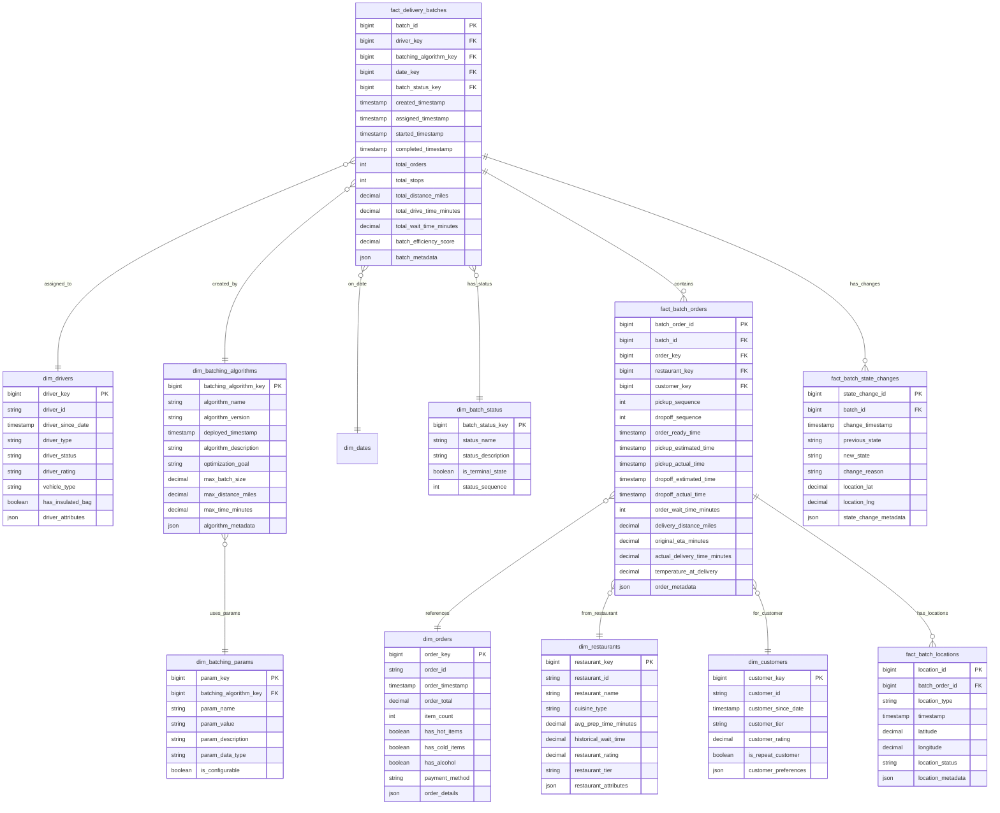

# Solution to Question 9.2.1: Order Batching Model

## Question

Design a data model for order batching that can track orders grouped together for delivery, including pick-up and drop-off sequence, timing data, and driver information. The model should support analyzing the efficiency of different batching algorithms and their impact on delivery times.

## Solution

### Core Structure

An effective data model for food delivery order batching needs to balance operational needs with analytical capabilities. The model below is designed to capture the full lifecycle of order batches, from creation through completion, while enabling comprehensive analysis of batching algorithm performance.

### Table Definitions



### Key Design Features

1. **Batch Tracking**:
   - `fact_delivery_batches` represents the overall batch with aggregate metrics
   - `fact_batch_orders` tracks each order's placement within the batch
   - `fact_batch_state_changes` monitors the lifecycle events of batches
   - `fact_batch_locations` captures detailed geographic data points

2. **Sequencing and Routing**:
   - `pickup_sequence` and `dropoff_sequence` in fact_batch_orders explicitly track routing
   - Timestamp pairs for estimated vs. actual times enable variance analysis
   - Distance and time metrics support route efficiency calculations

3. **Algorithm Performance**:
   - `dim_batching_algorithms` stores algorithm metadata and version history
   - `dim_batching_params` captures detailed algorithm parameters
   - `batch_efficiency_score` provides a calculated metric for comparison

4. **Operational Context**:
   - Driver, restaurant, and customer dimensions provide contextual factors
   - Status dimensions track state transitions and terminal states
   - JSON fields allow for flexible, evolving metadata needs

### Analytical Scenarios

1. **Algorithm Efficiency Comparison**:
   ```sql
   -- Compare performance metrics across batching algorithms
   SELECT ba.algorithm_name, ba.algorithm_version,
          COUNT(db.batch_id) as total_batches,
          AVG(db.total_orders) as avg_orders_per_batch,
          AVG(db.batch_efficiency_score) as avg_efficiency,
          AVG(db.total_drive_time_minutes) as avg_drive_time,
          AVG(db.total_wait_time_minutes) as avg_wait_time
   FROM fact_delivery_batches db
   JOIN dim_batching_algorithms ba ON db.batching_algorithm_key = ba.batching_algorithm_key
   JOIN dim_dates d ON db.date_key = d.date_key
   WHERE d.full_date BETWEEN '2023-07-01' AND '2023-07-31'
   GROUP BY ba.algorithm_name, ba.algorithm_version
   ORDER BY avg_efficiency DESC;
   ```

2. **Delivery Time Impact Analysis**:
   ```sql
   -- Compare estimated vs. actual delivery times
   SELECT ba.algorithm_name,
          AVG(bo.dropoff_actual_time - bo.dropoff_estimated_time) as avg_delivery_time_variance,
          PERCENTILE_CONT(0.5) WITHIN GROUP (ORDER BY 
             (bo.dropoff_actual_time - bo.dropoff_estimated_time)) as median_variance,
          PERCENTILE_CONT(0.95) WITHIN GROUP (ORDER BY 
             (bo.dropoff_actual_time - bo.dropoff_estimated_time)) as p95_variance
   FROM fact_batch_orders bo
   JOIN fact_delivery_batches db ON bo.batch_id = db.batch_id
   JOIN dim_batching_algorithms ba ON db.batching_algorithm_key = ba.batching_algorithm_key
   JOIN dim_dates d ON db.date_key = d.date_key
   WHERE d.full_date BETWEEN '2023-07-01' AND '2023-07-31'
   GROUP BY ba.algorithm_name
   ORDER BY avg_delivery_time_variance;
   ```

3. **Batch Size Optimization Analysis**:
   ```sql
   -- Analyze optimal batch size for efficiency
   SELECT total_orders as batch_size,
          COUNT(*) as num_batches,
          AVG(batch_efficiency_score) as avg_efficiency,
          AVG(bo.dropoff_actual_time - bo.order_ready_time) as avg_total_delivery_time
   FROM fact_delivery_batches db
   JOIN fact_batch_orders bo ON db.batch_id = bo.batch_id
   JOIN dim_dates d ON db.date_key = d.date_key
   WHERE d.full_date BETWEEN '2023-07-01' AND '2023-07-31'
   GROUP BY total_orders
   ORDER BY total_orders;
   ```

### Implementation Considerations

1. **Real-time Operational Support**:
   - The model supports both operational and analytical needs
   - State changes are captured for monitoring active batches
   - Location tracking allows for real-time driver and order tracking
   - Timestamps support SLA monitoring and alerts

2. **Handling Algorithm Variants**:
   - The model accommodates A/B testing of algorithms
   - Parameter tracking enables fine-tuning analysis
   - Version control ensures reproducibility of results
   - Algorithm metadata can store model hyperparameters

3. **Geographic Optimization**:
   - Location data at multiple levels supports geospatial analysis
   - Route efficiency can be analyzed with sequential points
   - Actual vs. optimal routes can be compared using location data
   - Weather and traffic impacts can be correlated with timestamps

### Trade-offs and Considerations

1. **Data Volume Management**:
   - Location data can grow rapidly with frequent updates
   - Consider:
     - Time-based partitioning of fact tables
     - Downsampling location data based on significance
     - Different retention policies for detail vs. summary data

2. **Real-time vs. Analytical Access**:
   - This model serves both needs, but with trade-offs
   - For very high volume systems, consider:
     - Separate operational data store with limited history
     - Analytical copy with full history but delayed updates
     - Streaming analytics for real-time monitoring

3. **Extensibility**:
   - JSON fields provide flexibility for evolving requirements
   - The model can be extended with:
     - More detailed driver analytics (acceptance rates, cancellations)
     - Weather and traffic condition dimensions
     - Time-based model for restaurant preparation predictions

### Batching Algorithm Analysis Support

The model specifically supports batching algorithm analysis through:

1. **Parameter Tracking**:
   - Explicit storage of algorithm parameters enables correlation analysis
   - Version history captures algorithm evolution
   - Allows comparing algorithm variants under similar conditions

2. **Performance Metrics**:
   - Multiple efficiency metrics for multi-dimensional analysis
   - Time-based metrics (wait times, delivery times, variances)
   - Distance-based metrics (total distance, per order distance)
   - Composite scoring (batch_efficiency_score)

3. **Contextual Factors**:
   - Restaurant factors (preparation times, reliability)
   - Driver factors (vehicle type, experience level)
   - Order factors (size, temperature requirements)
   - Geographic factors (density, distance between stops)

### Sequence and Route Optimization

The model explicitly addresses sequence and route optimization through:

1. **Planned vs. Actual Comparison**:
   - Sequence fields record the planned route
   - Timestamp fields capture actual execution
   - Location tracking allows for route reconstruction
   - Variance analysis identifies optimization opportunities

2. **Multi-objective Optimization Support**:
   - The model tracks multiple metrics that may be optimized:
     - Minimize total driving distance/time
     - Minimize customer wait time
     - Maximize driver efficiency
     - Maintain food quality (temperature)

3. **Algorithm Input Capture**:
   - The model records factors that influence batch creation
   - This supports both backward analysis and improvement of future models
   - Complete context allows for simulation of alternative batching strategies

This comprehensive model provides a solid foundation for food delivery operations while enabling sophisticated analysis of batching algorithms, route optimization, and delivery performance. 