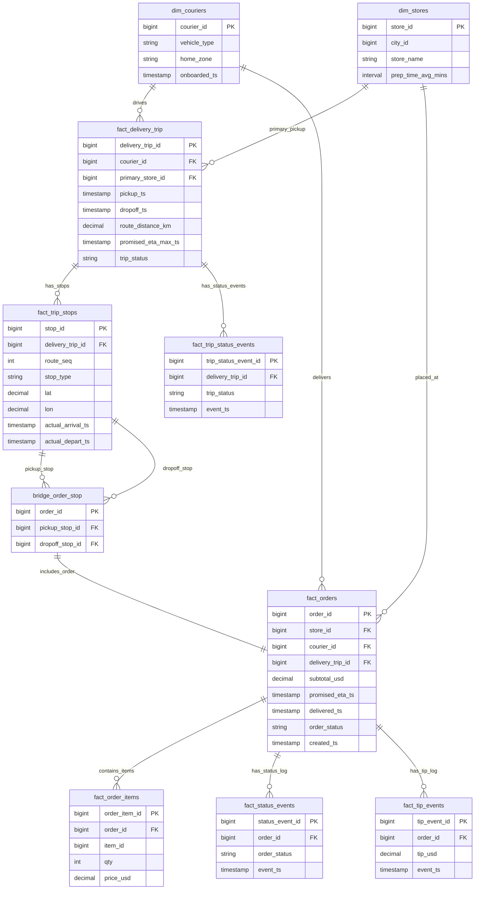

# Solution to Question 9.2.1: Order Batching Model for DoorDash

## Question

Design a data model for order batching that integrates with DoorDash's core delivery infrastructure. The model should track how individual orders are grouped into batches for delivery, including pick-up and drop-off sequences, timing data, and driver information. Support analyzing the efficiency of different batching algorithms and their impact on delivery times.

## Solution Overview

This solution presents a comprehensive data model that extends DoorDash's core delivery infrastructure to support order batching. The model maintains backward compatibility with single-order deliveries while enabling sophisticated batch analytics.

### Architecture Principles

1. **Core-First Design**: Built on top of DoorDash's fundamental order/delivery model
2. **Batch-Optional**: Supports both batched and non-batched deliveries seamlessly  
3. **Algorithm-Agnostic**: Can evaluate multiple batching strategies
4. **Real-time Operational**: Serves both live operations and historical analysis


image.png
## Core DoorDash Data Model Foundation

### Base Delivery Infrastructure

```sql
-- Core order management (exists in DoorDash)
fact_orders (
    order_id BIGINT PRIMARY KEY,
    customer_id BIGINT NOT NULL,
    restaurant_id BIGINT NOT NULL,
    order_timestamp TIMESTAMP NOT NULL,
    order_total_cents INT NOT NULL,
    item_count INT NOT NULL,
    special_instructions TEXT,
    order_status VARCHAR(20), -- 'placed', 'confirmed', 'preparing', 'ready', 'picked_up', 'delivered', 'cancelled'
    
    -- Order characteristics affecting batching
    estimated_prep_time_minutes INT,
    has_hot_items BOOLEAN DEFAULT TRUE,
    has_cold_items BOOLEAN DEFAULT FALSE,
    has_alcohol BOOLEAN DEFAULT FALSE,
    requires_id_check BOOLEAN DEFAULT FALSE,
    
    -- Delivery requirements
    delivery_fee_cents INT,
    tip_amount_cents INT,
    delivery_address_lat DECIMAL(10, 8),
    delivery_address_lng DECIMAL(11, 8),
    delivery_instructions TEXT,
    
    date_partition DATE NOT NULL
)
PARTITION BY date_partition;

-- Core delivery tracking (exists in DoorDash) 
fact_deliveries (
    delivery_id BIGINT PRIMARY KEY,
    order_id BIGINT NOT NULL REFERENCES fact_orders(order_id),
    driver_id BIGINT,
    
    -- Delivery lifecycle timestamps
    delivery_created_at TIMESTAMP NOT NULL,
    assigned_to_driver_at TIMESTAMP,
    driver_arrived_at_restaurant_at TIMESTAMP,
    picked_up_at TIMESTAMP,
    delivered_at TIMESTAMP,
    
    -- Performance metrics
    estimated_delivery_time_minutes INT,
    actual_delivery_time_minutes INT,
    delivery_distance_miles DECIMAL(6,2),
    driver_to_restaurant_distance_miles DECIMAL(6,2),
    restaurant_to_customer_distance_miles DECIMAL(6,2),
    
    -- Delivery status tracking
    delivery_status VARCHAR(20), -- 'created', 'assigned', 'en_route_to_restaurant', 'at_restaurant', 'picked_up', 'en_route_to_customer', 'delivered', 'cancelled'
    cancellation_reason VARCHAR(50),
    
    date_partition DATE NOT NULL,
    FOREIGN KEY (order_id) REFERENCES fact_orders(order_id)
)
PARTITION BY date_partition;

-- Driver information (exists in DoorDash)
dim_drivers (
    driver_id BIGINT PRIMARY KEY,
    driver_external_id VARCHAR(50) UNIQUE NOT NULL,
    driver_since_date DATE NOT NULL,
    driver_status VARCHAR(20), -- 'active', 'inactive', 'suspended'
    
    -- Driver attributes affecting batching
    vehicle_type VARCHAR(20), -- 'car', 'bike', 'scooter', 'walking'
    has_insulated_bag BOOLEAN DEFAULT TRUE,
    max_batch_capacity INT DEFAULT 4,
    driver_tier VARCHAR(10), -- 'new', 'standard', 'premium'
    
    -- Performance metrics
    lifetime_deliveries INT DEFAULT 0,
    avg_delivery_rating DECIMAL(3,2),
    on_time_delivery_rate DECIMAL(5,4),
    acceptance_rate DECIMAL(5,4),
    
    current_lat DECIMAL(10, 8),
    current_lng DECIMAL(11, 8),
    last_location_update TIMESTAMP
);

-- Restaurant information (exists in DoorDash)
dim_restaurants (
    restaurant_id BIGINT PRIMARY KEY,
    restaurant_external_id VARCHAR(50) UNIQUE NOT NULL,
    restaurant_name VARCHAR(200) NOT NULL,
    cuisine_type VARCHAR(50),
    
    -- Location and contact
    restaurant_lat DECIMAL(10, 8) NOT NULL,
    restaurant_lng DECIMAL(11, 8) NOT NULL,
    phone_number VARCHAR(20),
    
    -- Operational characteristics affecting batching
    avg_prep_time_minutes INT DEFAULT 15,
    prep_time_std_dev_minutes INT DEFAULT 5,
    can_handle_batch_pickups BOOLEAN DEFAULT TRUE,
    max_concurrent_orders INT DEFAULT 10,
    
    -- Performance metrics
    on_time_prep_rate DECIMAL(5,4),
    avg_rating DECIMAL(3,2),
    is_partner_restaurant BOOLEAN DEFAULT FALSE
);
```

## Batching Extension Model

### How Batching Integrates with Core Model

The batching system extends the core delivery model by:
1. **Grouping multiple deliveries** into efficient batches
2. **Optimizing routes** across multiple pickup/dropoff points  
3. **Tracking batch-level performance** while maintaining individual delivery metrics
4. **Supporting algorithm experimentation** through configurable batching strategies



### Core Batching Tables

```sql
-- Batch container - groups multiple deliveries
fact_delivery_batches (
    batch_id BIGINT PRIMARY KEY,
    driver_id BIGINT NOT NULL REFERENCES dim_drivers(driver_id),
    batching_algorithm_key BIGINT NOT NULL,
    
    -- Batch lifecycle
    batch_created_at TIMESTAMP NOT NULL,
    batch_assigned_at TIMESTAMP,
    batch_started_at TIMESTAMP,  -- driver starts first pickup
    batch_completed_at TIMESTAMP, -- last delivery completed
    
    -- Batch composition
    total_deliveries INT NOT NULL,
    total_orders INT NOT NULL,  -- can differ if multi-order deliveries exist
    
    -- Routing and performance
    planned_total_distance_miles DECIMAL(8,2),
    actual_total_distance_miles DECIMAL(8,2),
    planned_total_time_minutes INT,
    actual_total_time_minutes INT,
    
    -- Business metrics
    total_delivery_fees_cents BIGINT,
    total_tips_cents BIGINT,
    batch_efficiency_score DECIMAL(5,4), -- algorithm-specific score
    
    -- Status tracking
    batch_status VARCHAR(20), -- 'created', 'assigned', 'in_progress', 'completed', 'cancelled'
    cancellation_reason VARCHAR(100),
    
    date_partition DATE NOT NULL,
    INDEX idx_driver_date (driver_id, date_partition),
    INDEX idx_algorithm_date (batching_algorithm_key, date_partition)
)
PARTITION BY date_partition;

-- Junction table connecting deliveries to batches with sequencing
fact_batch_deliveries (
    batch_delivery_id BIGINT PRIMARY KEY,
    batch_id BIGINT NOT NULL REFERENCES fact_delivery_batches(batch_id),
    delivery_id BIGINT NOT NULL REFERENCES fact_deliveries(delivery_id),
    
    -- Sequencing within batch
    pickup_sequence INT NOT NULL,    -- order for restaurant visits
    dropoff_sequence INT NOT NULL,   -- order for customer deliveries
    
    -- Timing estimates vs actuals
    estimated_pickup_time TIMESTAMP,
    actual_pickup_time TIMESTAMP,
    estimated_dropoff_time TIMESTAMP, 
    actual_dropoff_time TIMESTAMP,
    
    -- Individual delivery performance within batch
    pickup_wait_time_minutes INT,
    delivery_delay_minutes INT, -- vs original single-delivery estimate
    
    -- Food quality impact
    estimated_food_temp_at_delivery DECIMAL(5,2),
    customer_satisfaction_score INT, -- 1-5 rating if available
    
    UNIQUE KEY uk_batch_delivery (batch_id, delivery_id),
    INDEX idx_pickup_sequence (batch_id, pickup_sequence),
    INDEX idx_dropoff_sequence (batch_id, dropoff_sequence)
);

-- Detailed waypoint tracking for route optimization analysis
fact_batch_waypoints (
    waypoint_id BIGINT PRIMARY KEY,
    batch_id BIGINT NOT NULL REFERENCES fact_delivery_batches(batch_id),
    delivery_id BIGINT REFERENCES fact_deliveries(delivery_id), -- NULL for driver start/end
    
    waypoint_type VARCHAR(20), -- 'driver_start', 'restaurant', 'customer', 'driver_end'
    sequence_order INT NOT NULL,
    
    -- Location and timing
    waypoint_lat DECIMAL(10, 8) NOT NULL,
    waypoint_lng DECIMAL(11, 8) NOT NULL,
    estimated_arrival_time TIMESTAMP,
    actual_arrival_time TIMESTAMP,
    estimated_departure_time TIMESTAMP,
    actual_departure_time TIMESTAMP,
    
    -- Distance to next waypoint
    distance_to_next_miles DECIMAL(6,2),
    drive_time_to_next_minutes INT,
    
    INDEX idx_batch_sequence (batch_id, sequence_order)
);

-- Algorithm configuration and A/B testing support
dim_batching_algorithms (
    batching_algorithm_key BIGINT PRIMARY KEY,
    algorithm_name VARCHAR(100) NOT NULL,
    algorithm_version VARCHAR(20) NOT NULL,
    
    -- Algorithm metadata
    algorithm_description TEXT,
    optimization_objectives JSON, -- e.g., ["minimize_drive_time", "maximize_orders_per_batch"]
    
    -- Configuration parameters
    max_batch_size INT DEFAULT 4,
    max_total_distance_miles DECIMAL(6,2) DEFAULT 10.0,
    max_total_time_minutes INT DEFAULT 60,
    max_prep_time_variance_minutes INT DEFAULT 15,
    
    -- Geographic and restaurant constraints
    max_restaurants_per_batch INT DEFAULT 3,
    allow_cross_zone_batching BOOLEAN DEFAULT FALSE,
    
    -- Deployment info
    deployed_at TIMESTAMP NOT NULL,
    deprecated_at TIMESTAMP,
    traffic_percentage DECIMAL(5,4), -- for A/B testing
    
    UNIQUE KEY uk_algorithm_version (algorithm_name, algorithm_version)
);

-- State change tracking for operational monitoring
fact_batch_state_changes (
    state_change_id BIGINT PRIMARY KEY,
    batch_id BIGINT NOT NULL REFERENCES fact_delivery_batches(batch_id),
    
    timestamp TIMESTAMP NOT NULL,
    previous_state VARCHAR(20),
    new_state VARCHAR(20) NOT NULL,
    change_trigger VARCHAR(50), -- 'driver_action', 'system_timeout', 'customer_request', 'restaurant_delay'
    
    -- Context
    driver_lat DECIMAL(10, 8),
    driver_lng DECIMAL(11, 8),
    affected_delivery_id BIGINT REFERENCES fact_deliveries(delivery_id),
    
    INDEX idx_batch_timestamp (batch_id, timestamp)
);
```

## Integration Logic: Single Orders to Batches

### How Orders Flow into Batches

```sql
-- View showing all deliveries with their batch context
CREATE VIEW vw_delivery_batch_context AS
SELECT 
    d.delivery_id,
    d.order_id,
    d.driver_id,
    d.delivery_status,
    
    -- Batch information (NULL if not batched)
    bd.batch_id,
    bd.pickup_sequence,
    bd.dropoff_sequence,
    bd.pickup_wait_time_minutes,
    bd.delivery_delay_minutes,
    
    -- Batch performance
    db.total_deliveries as batch_size,
    db.batch_efficiency_score,
    db.batch_status,
    
    -- Algorithm used (NULL if not batched)
    ba.algorithm_name,
    ba.algorithm_version,
    
    -- Performance comparison
    d.actual_delivery_time_minutes as individual_delivery_time,
    COALESCE(bd.estimated_dropoff_time, d.delivered_at) as batch_delivery_time,
    
    -- Determine if delivery was batched
    CASE WHEN bd.batch_id IS NOT NULL THEN 'batched' ELSE 'individual' END as delivery_type
    
FROM fact_deliveries d
LEFT JOIN fact_batch_deliveries bd ON d.delivery_id = bd.delivery_id
LEFT JOIN fact_delivery_batches db ON bd.batch_id = db.batch_id
LEFT JOIN dim_batching_algorithms ba ON db.batching_algorithm_key = ba.batching_algorithm_key;
```

## Setup Scripts

### Database Schema Creation

   ```sql
-- Create core tables first (simplified for demo)
CREATE TABLE IF NOT EXISTS fact_orders (
    order_id BIGINT PRIMARY KEY,
    customer_id BIGINT NOT NULL,
    restaurant_id BIGINT NOT NULL,
    order_timestamp TIMESTAMP NOT NULL,
    order_total_cents INT NOT NULL,
    delivery_address_lat DECIMAL(10, 8),
    delivery_address_lng DECIMAL(11, 8),
    estimated_prep_time_minutes INT,
    has_hot_items BOOLEAN DEFAULT TRUE,
    date_partition DATE NOT NULL
);

CREATE TABLE IF NOT EXISTS fact_deliveries (
    delivery_id BIGINT PRIMARY KEY,
    order_id BIGINT NOT NULL,
    driver_id BIGINT,
    delivery_created_at TIMESTAMP NOT NULL,
    assigned_to_driver_at TIMESTAMP,
    picked_up_at TIMESTAMP,
    delivered_at TIMESTAMP,
    estimated_delivery_time_minutes INT,
    actual_delivery_time_minutes INT,
    delivery_status VARCHAR(20),
    date_partition DATE NOT NULL
);

CREATE TABLE IF NOT EXISTS dim_drivers (
    driver_id BIGINT PRIMARY KEY,
    driver_external_id VARCHAR(50) UNIQUE NOT NULL,
    vehicle_type VARCHAR(20),
    max_batch_capacity INT DEFAULT 4,
    current_lat DECIMAL(10, 8),
    current_lng DECIMAL(11, 8)
);

CREATE TABLE IF NOT EXISTS dim_restaurants (
    restaurant_id BIGINT PRIMARY KEY,
    restaurant_name VARCHAR(200) NOT NULL,
    restaurant_lat DECIMAL(10, 8) NOT NULL,
    restaurant_lng DECIMAL(11, 8) NOT NULL,
    avg_prep_time_minutes INT DEFAULT 15,
    can_handle_batch_pickups BOOLEAN DEFAULT TRUE
);

-- Create batching extension tables
CREATE TABLE dim_batching_algorithms (
    batching_algorithm_key BIGINT PRIMARY KEY,
    algorithm_name VARCHAR(100) NOT NULL,
    algorithm_version VARCHAR(20) NOT NULL,
    max_batch_size INT DEFAULT 4,
    max_total_distance_miles DECIMAL(6,2) DEFAULT 10.0,
    deployed_at TIMESTAMP NOT NULL,
    traffic_percentage DECIMAL(5,4)
);

CREATE TABLE fact_delivery_batches (
    batch_id BIGINT PRIMARY KEY,
    driver_id BIGINT NOT NULL,
    batching_algorithm_key BIGINT NOT NULL,
    batch_created_at TIMESTAMP NOT NULL,
    batch_started_at TIMESTAMP,
    batch_completed_at TIMESTAMP,
    total_deliveries INT NOT NULL,
    planned_total_distance_miles DECIMAL(8,2),
    actual_total_distance_miles DECIMAL(8,2),
    batch_efficiency_score DECIMAL(5,4),
    batch_status VARCHAR(20),
    date_partition DATE NOT NULL
);

CREATE TABLE fact_batch_deliveries (
    batch_delivery_id BIGINT PRIMARY KEY,
    batch_id BIGINT NOT NULL,
    delivery_id BIGINT NOT NULL,
    pickup_sequence INT NOT NULL,
    dropoff_sequence INT NOT NULL,
    estimated_pickup_time TIMESTAMP,
    actual_pickup_time TIMESTAMP,
    estimated_dropoff_time TIMESTAMP,
    actual_dropoff_time TIMESTAMP,
    pickup_wait_time_minutes INT,
    delivery_delay_minutes INT
);

CREATE TABLE fact_batch_waypoints (
    waypoint_id BIGINT PRIMARY KEY,
    batch_id BIGINT NOT NULL,
    delivery_id BIGINT,
    waypoint_type VARCHAR(20),
    sequence_order INT NOT NULL,
    waypoint_lat DECIMAL(10, 8) NOT NULL,
    waypoint_lng DECIMAL(11, 8) NOT NULL,
    estimated_arrival_time TIMESTAMP,
    actual_arrival_time TIMESTAMP,
    distance_to_next_miles DECIMAL(6,2)
);
```

### Sample Data Generation

   ```sql
-- Insert sample algorithms
INSERT INTO dim_batching_algorithms VALUES
(1, 'nearest_neighbor', 'v1.0', 4, 8.0, '2024-01-01 00:00:00', 0.25),
(2, 'genetic_algorithm', 'v2.1', 5, 12.0, '2024-01-15 00:00:00', 0.25),
(3, 'ml_optimized', 'v1.5', 4, 10.0, '2024-02-01 00:00:00', 0.30),
(4, 'no_batching', 'v1.0', 1, 0.0, '2024-01-01 00:00:00', 0.20);

-- Insert sample drivers
INSERT INTO dim_drivers VALUES
(101, 'DRV001', 'car', 4, 37.7749, -122.4194),
(102, 'DRV002', 'bike', 2, 37.7849, -122.4094),
(103, 'DRV003', 'car', 5, 37.7649, -122.4294);

-- Insert sample restaurants
INSERT INTO dim_restaurants VALUES
(201, 'Pizza Palace', 37.7759, -122.4180, 20, TRUE),
(202, 'Burger Barn', 37.7770, -122.4160, 15, TRUE),
(203, 'Sushi Spot', 37.7740, -122.4200, 25, FALSE);

-- Insert sample orders and deliveries
INSERT INTO fact_orders VALUES
(1001, 301, 201, '2024-01-15 12:00:00', 2500, 37.7800, -122.4100, 20, TRUE, '2024-01-15'),
(1002, 302, 201, '2024-01-15 12:05:00', 1800, 37.7820, -122.4120, 20, TRUE, '2024-01-15'),
(1003, 303, 202, '2024-01-15 12:08:00', 1200, 37.7780, -122.4080, 15, TRUE, '2024-01-15');

INSERT INTO fact_deliveries VALUES
(2001, 1001, 101, '2024-01-15 12:00:00', '2024-01-15 12:10:00', '2024-01-15 12:35:00', '2024-01-15 13:05:00', 45, 48, 'delivered', '2024-01-15'),
(2002, 1002, 101, '2024-01-15 12:05:00', '2024-01-15 12:10:00', '2024-01-15 12:40:00', '2024-01-15 13:15:00', 50, 52, 'delivered', '2024-01-15'),
(2003, 1003, 102, '2024-01-15 12:08:00', '2024-01-15 12:15:00', '2024-01-15 12:45:00', '2024-01-15 13:10:00', 40, 38, 'delivered', '2024-01-15');

-- Insert sample batch (deliveries 2001 and 2002 were batched)
INSERT INTO fact_delivery_batches VALUES
(3001, 101, 1, '2024-01-15 12:10:00', '2024-01-15 12:15:00', '2024-01-15 13:15:00', 2, 5.2, 5.8, 0.85, 'completed', '2024-01-15');

INSERT INTO fact_batch_deliveries VALUES
(4001, 3001, 2001, 1, 1, '2024-01-15 12:30:00', '2024-01-15 12:35:00', '2024-01-15 13:00:00', '2024-01-15 13:05:00', 5, 3),
(4002, 3001, 2002, 1, 2, '2024-01-15 12:35:00', '2024-01-15 12:40:00', '2024-01-15 13:10:00', '2024-01-15 13:15:00', 5, 2);
```

## Analytical SQL Queries

### 1. Batching vs Non-Batching Performance Comparison

   ```sql
-- Compare delivery performance between batched and individual deliveries
WITH delivery_performance AS (
    SELECT 
        vdbc.delivery_type,
        vdbc.algorithm_name,
        COUNT(*) as total_deliveries,
        
        -- Time metrics
        AVG(d.actual_delivery_time_minutes) as avg_delivery_time,
        AVG(CASE 
            WHEN vdbc.delivery_type = 'batched' 
            THEN vdbc.delivery_delay_minutes 
            ELSE 0 
        END) as avg_batch_delay,
        
        -- Efficiency metrics  
        AVG(CASE 
            WHEN vdbc.delivery_type = 'batched'
            THEN vdbc.batch_efficiency_score
            ELSE 1.0 
        END) as avg_efficiency_score,
        
        -- Customer satisfaction proxy
        AVG(CASE WHEN d.actual_delivery_time_minutes <= d.estimated_delivery_time_minutes + 10 
                 THEN 1.0 ELSE 0.0 END) as on_time_rate
        
    FROM vw_delivery_batch_context vdbc
    JOIN fact_deliveries d ON vdbc.delivery_id = d.delivery_id
    WHERE vdbc.date_partition >= CURRENT_DATE - INTERVAL '30 days'
    GROUP BY vdbc.delivery_type, vdbc.algorithm_name
)
SELECT 
    delivery_type,
    COALESCE(algorithm_name, 'N/A') as algorithm,
    total_deliveries,
    ROUND(avg_delivery_time, 1) as avg_delivery_minutes,
    ROUND(avg_batch_delay, 1) as avg_delay_minutes,
    ROUND(avg_efficiency_score, 3) as efficiency_score,
    ROUND(on_time_rate * 100, 1) as on_time_percentage
FROM delivery_performance
ORDER BY delivery_type, total_deliveries DESC;
```

### 2. Algorithm Effectiveness Analysis

```sql
-- Compare different batching algorithms across key metrics
SELECT 
    ba.algorithm_name,
    ba.algorithm_version,
    COUNT(DISTINCT db.batch_id) as total_batches,
    COUNT(DISTINCT bd.delivery_id) as total_deliveries,
    
    -- Batch composition metrics
    AVG(db.total_deliveries) as avg_batch_size,
    AVG(db.actual_total_distance_miles) as avg_total_distance,
    AVG(db.batch_efficiency_score) as avg_efficiency_score,
    
    -- Time performance
    AVG(EXTRACT(EPOCH FROM (db.batch_completed_at - db.batch_started_at))/60) as avg_batch_duration_minutes,
    AVG(bd.delivery_delay_minutes) as avg_delivery_delay,
    
    -- Operational metrics
    AVG(bd.pickup_wait_time_minutes) as avg_pickup_wait,
    COUNT(CASE WHEN db.batch_status = 'cancelled' THEN 1 END) * 100.0 / COUNT(*) as cancellation_rate_pct
    
FROM dim_batching_algorithms ba
JOIN fact_delivery_batches db ON ba.batching_algorithm_key = db.batching_algorithm_key
JOIN fact_batch_deliveries bd ON db.batch_id = bd.batch_id
WHERE db.date_partition >= CURRENT_DATE - INTERVAL '30 days'
  AND ba.algorithm_name != 'no_batching'
GROUP BY ba.algorithm_name, ba.algorithm_version
ORDER BY avg_efficiency_score DESC;
```

### 3. Route Optimization Analysis

```sql
-- Analyze route efficiency using waypoint data
WITH route_analysis AS (
    SELECT 
        db.batch_id,
        ba.algorithm_name,
        db.total_deliveries,
        
        -- Calculate total planned vs actual route metrics
        SUM(bw.distance_to_next_miles) as total_actual_distance,
        db.planned_total_distance_miles,
        
        -- Time variance analysis
        SUM(EXTRACT(EPOCH FROM (bw.actual_arrival_time - bw.estimated_arrival_time))/60) as total_time_variance_minutes,
        
        -- Route efficiency score
        CASE 
            WHEN db.planned_total_distance_miles > 0 
            THEN SUM(bw.distance_to_next_miles) / db.planned_total_distance_miles 
            ELSE 1.0 
        END as route_efficiency_ratio
        
    FROM fact_delivery_batches db
    JOIN fact_batch_waypoints bw ON db.batch_id = bw.batch_id
    JOIN dim_batching_algorithms ba ON db.batching_algorithm_key = ba.batching_algorithm_key
    WHERE db.batch_status = 'completed'
      AND db.date_partition >= CURRENT_DATE - INTERVAL '7 days'
    GROUP BY db.batch_id, ba.algorithm_name, db.total_deliveries, db.planned_total_distance_miles
)
SELECT 
    algorithm_name,
    AVG(total_deliveries) as avg_batch_size,
    AVG(total_actual_distance) as avg_actual_distance_miles,
    AVG(planned_total_distance_miles) as avg_planned_distance_miles,
    AVG(route_efficiency_ratio) as avg_route_efficiency,
    AVG(total_time_variance_minutes) as avg_time_variance_minutes,
    
    -- Identify best and worst performing routes
    MIN(route_efficiency_ratio) as best_route_efficiency,
    MAX(route_efficiency_ratio) as worst_route_efficiency
    
FROM route_analysis
GROUP BY algorithm_name
ORDER BY avg_route_efficiency;
```

### 4. Driver Performance in Batching Context

```sql
-- Analyze how different drivers perform with batching
SELECT 
    d.driver_id,
    d.driver_external_id,
    d.vehicle_type,
    
    -- Delivery volume
    COUNT(CASE WHEN vdbc.delivery_type = 'individual' THEN 1 END) as individual_deliveries,
    COUNT(CASE WHEN vdbc.delivery_type = 'batched' THEN 1 END) as batched_deliveries,
    
    -- Performance comparison
    AVG(CASE WHEN vdbc.delivery_type = 'individual' 
             THEN del.actual_delivery_time_minutes END) as avg_individual_time,
    AVG(CASE WHEN vdbc.delivery_type = 'batched' 
             THEN del.actual_delivery_time_minutes END) as avg_batched_time,
             
    -- Batch-specific metrics
    AVG(CASE WHEN vdbc.delivery_type = 'batched' 
             THEN vdbc.batch_efficiency_score END) as avg_batch_efficiency,
    AVG(CASE WHEN vdbc.delivery_type = 'batched' 
             THEN vdbc.delivery_delay_minutes END) as avg_batch_delay,
             
    -- Driver adaptation score (lower delay = better adaptation)
    CASE 
        WHEN AVG(CASE WHEN vdbc.delivery_type = 'batched' 
                      THEN vdbc.delivery_delay_minutes END) < 5 THEN 'excellent'
        WHEN AVG(CASE WHEN vdbc.delivery_type = 'batched' 
                      THEN vdbc.delivery_delay_minutes END) < 10 THEN 'good'
        ELSE 'needs_improvement'
    END as batch_adaptation_rating
    
FROM dim_drivers d
JOIN fact_deliveries del ON d.driver_id = del.driver_id
JOIN vw_delivery_batch_context vdbc ON del.delivery_id = vdbc.delivery_id
WHERE del.date_partition >= CURRENT_DATE - INTERVAL '30 days'
  AND del.delivery_status = 'delivered'
GROUP BY d.driver_id, d.driver_external_id, d.vehicle_type
HAVING COUNT(*) >= 20  -- Minimum deliveries for statistical significance
ORDER BY avg_batch_efficiency DESC NULLS LAST;
```

### 5. Restaurant Impact Analysis

```sql
-- Analyze how batching affects restaurant operations
SELECT 
    r.restaurant_id,
    r.restaurant_name,
    r.can_handle_batch_pickups,
    
    -- Order volume
    COUNT(DISTINCT o.order_id) as total_orders,
    COUNT(DISTINCT CASE WHEN vdbc.delivery_type = 'batched' 
                        THEN o.order_id END) as batched_orders,
    
    -- Pickup timing analysis
    AVG(CASE WHEN vdbc.delivery_type = 'batched' 
             THEN bd.pickup_wait_time_minutes END) as avg_batch_pickup_wait,
    AVG(CASE WHEN vdbc.delivery_type = 'individual' 
             THEN EXTRACT(EPOCH FROM (del.picked_up_at - del.assigned_to_driver_at))/60 
             END) as avg_individual_pickup_wait,
             
    -- Restaurant efficiency with batching
    AVG(CASE WHEN vdbc.delivery_type = 'batched' AND bd.pickup_sequence = 1
             THEN EXTRACT(EPOCH FROM (bd.actual_pickup_time - bd.estimated_pickup_time))/60
             END) as avg_first_pickup_delay,
    AVG(CASE WHEN vdbc.delivery_type = 'batched' AND bd.pickup_sequence > 1
             THEN EXTRACT(EPOCH FROM (bd.actual_pickup_time - bd.estimated_pickup_time))/60
             END) as avg_subsequent_pickup_delay,
             
    -- Batch pickup success rate
    COUNT(CASE WHEN vdbc.delivery_type = 'batched' AND bd.pickup_wait_time_minutes <= 5 
               THEN 1 END) * 100.0 / 
    NULLIF(COUNT(CASE WHEN vdbc.delivery_type = 'batched' THEN 1 END), 0) as fast_batch_pickup_rate_pct
    
FROM dim_restaurants r
JOIN fact_orders o ON r.restaurant_id = o.restaurant_id
JOIN fact_deliveries del ON o.order_id = del.order_id
JOIN vw_delivery_batch_context vdbc ON del.delivery_id = vdbc.delivery_id
LEFT JOIN fact_batch_deliveries bd ON del.delivery_id = bd.delivery_id
WHERE o.date_partition >= CURRENT_DATE - INTERVAL '30 days'
GROUP BY r.restaurant_id, r.restaurant_name, r.can_handle_batch_pickups
HAVING COUNT(DISTINCT o.order_id) >= 50  -- Restaurants with significant volume
ORDER BY fast_batch_pickup_rate_pct DESC;
```

## Key Integration Benefits

### 1. **Unified Data Model**
- Single source of truth for all delivery data
- Batched and individual deliveries use same core infrastructure
- Enables comprehensive performance analysis across delivery types

### 2. **Algorithm Experimentation**  
- A/B testing framework built into the data model
- Traffic splitting allows for controlled algorithm comparisons
- Historical performance tracking enables data-driven algorithm selection

### 3. **Operational Monitoring**
- Real-time batch status tracking
- Driver, restaurant, and customer impact analysis
- Route optimization feedback loop

### 4. **Business Intelligence**
- Cross-delivery-type performance metrics
- Customer satisfaction impact analysis
- Revenue and efficiency optimization insights

### 5. ERD

This integrated model provides DoorDash with a comprehensive view of their delivery operations while enabling sophisticated optimization of their batching algorithms and overall delivery efficiency. 


